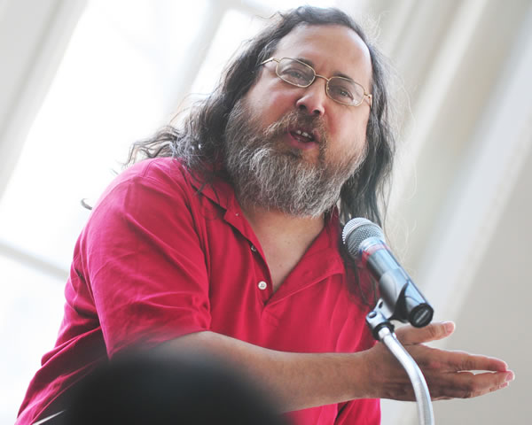

# 第1章 STL基础

## 1.1 C++ STL是什么，有什么用？

在已有 [C++](http://c.biancheng.net/cplus/) 尤其是 C++ 模板的基础上，从本节开始，我们开始系统地学习 [STL](http://c.biancheng.net/stl/) 标准模板库，首先来了解什么是 STL，以及学习 STL 有什么用？

STL，英文全称 s[tan](http://c.biancheng.net/ref/tan.html)dard template library，中文可译为标准模板库或者泛型库，其包含有大量的模板类和模板函数，是 C++ 提供的一个基础模板的集合，用于完成诸如输入/输出、数学计算等功能。

STL 最初由惠普实验室开发，于 1998 年被定为国际标准，正式成为 C++ 程序库的重要组成部分。值得一提的是，如今 STL 已完全被内置到支持 C++ 的编译器中，无需额外安装，这可能也是 STL 被广泛使用的原因之一。

> STL 就位于各个 C++ 的头文件中，即它并非以二进制代码的形式提供，而是以源代码的形式提供。

从根本上说，STL 是一些容器、算法和其他一些组件的集合，所有容器和算法都是总结了几十年来算法和[数据结构](http://c.biancheng.net/data_structure/)的研究成果，汇集了许多计算机专家学者经验的基础上实现的，因此可以说，STL 基本上达到了各种存储方法和相关算法的高度优化。

> 注意，这里提到的容器，本质上就是封装有数据结构的模板类，例如 list、vector、set、map 等，有关这些容器的具体用法，后续章节会做详细介绍。


**学STL能干什么？**

为了让读者清楚地了解 STL 是什么，使用 STL 编程有哪些优势，这里举一个使用 STL 的例子。

以 C++ 定义数组的操作为例，在 C++ 中如果定义一个数组，可以采用如下方式：

```
int a[n];
```

这种定义数组的方法需要事先确定好数组的长度，即 n 必须为常量，这意味着，如果在实际应用中无法确定数组长度，则一般会将数组长度设为可能的最大值，但这极有可能导致存储空间的浪费。

所以除此之外，还可以采用在堆空间中动态申请内存的方法，此时长度可以是变量：

```
int *p = new int[n];
```

这种定义方式可根据变量 n 动态申请内存，不会出现存储空间浪费的问题。但是，如果程序执行过程中出现空间不足的情况时，则需要加大存储空间，此时需要进行如下操作：

1. 新申请一个较大的内存空间，即执行`int* temp = new int[m];`
2. 将原内存空间的数据全部复制到新申请的内存空间中，即执行`memecpy(temp, p, sizeof(int) * n);`
3. 将原来的堆空间释放，即执行`delete [] p; p = temp;`


而完成相同的操作，如果采用 STL 标准库，则会简单很多，因为大多数操作细节将不需要程序员关心。下面是使用向量模板类 vector 实现以上功能的示例：

```
vector<int> a; //定义 a 数组，当前数组长度为 0，但和普通数组不同的是，此数组 a 可以根据存储数据的数量自动变长。

//向数组 a 中添加 10 个元素
for (int i = 0; i < 10 ; i++) {
  a.push_back(i)
}

//还可以手动调整数组 a 的大小
a.resize(100);
a[90] = 100;

//还可以直接删除数组 a 中所有的元素，此时 a 的长度变为 0
a.clear();

//重新调整 a 的大小为 20，并存储 20 个 -1 元素。
a.resize(20, -1)
```

> 注意，初学者只需结合注释，大概了解代码功能即可，有关代码中涉及到具体知识，后续会做详细介绍。

对比以上两种使用数组的方式不难看出，使用 STL 可以更加方便灵活地处理数据。所以，大家只需要系统地学习 STL，便可以集中精力去实现程序的功能，而无需再纠结某些细节如何用代码实现。


## 1.2 C++ STL的发展历程是怎样的？

Alexander Stepanov（后被誉为 [STL](http://c.biancheng.net/stl/) 标准模板库之父，后简称 Stepanov），1950 年出生与前苏联的莫斯科，他曾在莫斯科大学研究数学，此后一直致力于计算机语言和泛型库研究。

在 20 世纪 70 年代，Stepanov 开始考虑，在保证效率的前提下，是否能将算法从诸多具体应用之中抽象出来？为了验证自己的思想，他和纽约州立大学教授 Deepak Kapur 以及伦塞里尔技术学院教授 David Musser 共同开发了一种叫做 Tecton 的语言，尽管这次尝试没有取得实用性的成果，但却给了 Stepanov 很大的启示。

在随后的几年中，他又和 David Musser 等人先后用 Schema 语言（一种 Lisp 语言的变种）和 Ada 语言建立了一些大型程序库。Stepanov 逐渐意识到，在当时的面向对象程序设计思想中存在一些问题，比如抽象数据类型概念所存在的缺陷，他希望通过对软件领域中各组成部分的分类，逐渐形成一种软件设计的概念性框架。

1987 年，在贝尔实验室工作的 Stepanov 开始首次采用 [C++](http://c.biancheng.net/cplus/) 语言进行泛型软件库的研究。由于当时的 C++ 语言还没有引入模板的编程技术，泛型库只能是通过 C++ 的继承机制来开发，代码表达起来非常笨拙。

但尽管如此，Stepanov 还是开发出了一个庞大的算法库。与此同时，在与 Andrew Koenig（前 ISO C++ 标准化委员会主席）和 Bjarne Stroustrup（C++ 语言的创始人）等顶级大师们的共事过程中，Stepanov 开始注意到 C/C++ 语言在实现其泛型思想方面所具有的潜在优势。

就拿 C/C++ 中的[指针](http://c.biancheng.net/c/80/)而言，它的灵活与高效运用使后来的 STL 在实现泛型化的同时更是保持了高效率。另外，在 STL 中占据极其重要地位的迭代器概念便是源自于 C/C++ 中原生指针的一般化推广。

1988 年，Stepanov 开始进入惠普的 Palo Alto 实验室工作，在随后的 4 年中，他从事的是有关磁盘驱动器方面的工作。直到 1992 年，由于参加并主持了实验室主任 Bill Worley 所建立的一个有关算法的研究项目，才使他重新回到了泛型化算法的研究工作上来。

项目自建立之后，参与者从最初的 8 人逐渐减少，最后只剩下 Stepanov 和 Meng Lee 两个人。经过长时间的努力，最终完成了一个包含有大量[数据结构](http://c.biancheng.net/data_structure/)和算法部件的庞大运行库（HP 版本的 C++ STL），这便是现在 STL 的雏形。

1993 年，当时在贝尔实验室的 Andrew Koenig 看到了 Stepanov 的研究成果，在他的鼓励与帮助下，Stepanov 于 1993 年 9 月在圣何塞为 ANSI/ISO C++ 标准委员会做了一个题为“The Science of C++ Programming” 的演讲，向委员们讲述了其观念。然后又于 1994 年 3 月，在圣迭戈会议上向委员会提交了一份建议书，以期将 STL 通用库纳入 C++ 标准。

尽管这一建议十分庞大，以至于降低了被通过的可能性，但其所包含的新思想吸引了许多人的注意力。随后在众人的帮助之下，包括 Bjame Stroustrup 在内，Stepanov 又对 STL 进行了改进，同时加入了一个封装内存模式信息的抽象模块，也就是现在 STL 中的 allocator（内存分配器），它使 STL 的大部分实现都可以独立于具体的内存模式，从而独立于具体平台。

最终在 1994 年的滑铁卢会议上，委员们通过了提案，决定将 STL 正式纳入 C++ 标准化进程之中，随后 STL 便被放进了会议的工作文件中。自此，STL 终于成为 C++ 家族中的重要一员。

此后，随者 C++ 标准的不断改进，STL 也在不断地做着相应的演化。直至 1998 年，ANSI/ISO C++ 标准正式定案，STL 始终是 C++ 标准库不可或缺的重要组成部分。


## 1.3 C++ STL版本有哪些？

自 1998 年 ANSI/ISO [C++](http://c.biancheng.net/cplus/) 标准正式定案，C++ [STL](http://c.biancheng.net/stl/) 规范版本正式通过以后，由于其实开源的，各个 C++ 编译器厂商在此标准的基础上，实现了满足自己需求的 C++ STL 泛型库，主要包括 HP STL、SGI STL、STLport、PJ STL、Rouge Wave STL 等。

### HP STL

HP STL 是 Alexandar Stepanov（STL 标准模板库之父，文章后续简称 Stepanov）在惠普 Palo Alto 实验室工作时，与 Meng Lee 合作完成的。HP STL 是开放源码的，即任何人都可以免费使用、复制、修改、发布和销售该软件以及相关文档，但前提是必须在相关文档中，加入 HP STL 版本信息和授权信息。

HP STL 是 C++ STL 的第一个实现版本，其它版本的 C++ STL 一般是以 HP STL 为蓝本实现出来的。不过，现在已经很少直接使用此版本的 STL 了。

### SGI STL

Stepanov 在离开 HP 之后，就加入到了 SGI 公司，并和 Matt Austern 等人开发了 SGI STL。严格意义上来说，它是 HP STL 的一个继承版本。和 HP STL 一样，SGI STL 也是开源的，其源代码的可读性可非常好，并且任何人都可以修改和销售它。

注意，和 STL 官方版本来说，SGI STL 只能算是一个“民间”版本，因此并不是所有支持 C++ 的编译器都支持使用 SGI STL 模板库，唯一能确定的是，[GCC](http://c.biancheng.net/gcc/)（Linux 下的 C++ 编译器）是支持的，所以 SGI STL 在 Linux 平台上的性能非常出色。


### STLport

为了使 SGI STL 的基本代码都适用于 VC++ 和 C++ Builder 等多种编译器，俄国人 Boris Fomitchev 建立了一个 free 项目来开发 STLport，此版本 STL 是开放源码的。


### PJ STL

PJ STL（全称为 P.J. Plauger STL）是由 P.J.Plauger（美国人，1965 年毕业于普林斯顿大学，物理专业学士）参照 HP STL 实现出来的，也是 HP STL 的一个继承版本，因此该头文件中不仅含有 HP STL 的相关授权信息，同时还有 P.J.Plauger 本人的版权信息。

> 其实 PJ STL 是 P.J.Plauger 公司的产品，尽管该公司当时只有 3 个人。

PJ STL 被 Visual C++ 编译器所采用，但和 PH STL、SGI STL 不同的是，PJ STL 并不是开源。


### Rouge Wave STL

该版本的 STL 是由 Rouge Wave 公司开发的，也是继承 HP STL 的一个版本，它也不是开源的。

Rouge Wave STL 用于 Borland C++ Builder 编译器中，我们可以在 C++ Builder 的 Inculde 子目录中找到该 STL 的所有头文件。

值得一提的是，尽管 Rouge Wave STL 的性能不是很好，但 C++ Builder 对 C++ 语言标准的支持还算不错，所以在一定程度上使 Rouge Wave STL 的表现得以改善。

遗憾的是，由于 Rouge Wave STL 长期没有更新且不完全符合标准，因此 Rouge Wave STL 在 6.0 版本时改用了 STLport 版本（之后的版本也都采用了 STLport），不过考虑到和之前版本的兼容，6.0 版本中依旧保留了 Rouge Wave STL。

> Rouge Wave 公司在 C++ 程序库领域应该说是鼎鼎大名，对 C++ 标准化的过程出力甚多。不过 Rouge Wave STL 版本不仅更新频率慢，费用还高，基于这两个原因，Borland 在 6.0 版本决定弃用 Rouge Wave STL 而改用 STLport。


## 1.4 熟练使用STL标准库是每个C++程序员的必备技能！


## 1.5 泛型是什么，C++泛型编程又是什么？


## 1.6 C++ STL基本组成（6大组件+13个头文件）

通常认为，[STL](http://c.biancheng.net/stl/) 是由容器、算法、迭代器、函数对象、适配器、内存分配器这 6 部分构成，其中后面 4 部分是为前 2 部分服务的，它们各自的含义如表 1 所示。

| STL的组成  | 含义                                                         |
| ---------- | ------------------------------------------------------------ |
| 容器       | 一些封装[数据结构](http://c.biancheng.net/data_structure/)的模板类，例如 vector 向量容器、list 列表容器等。 |
| 算法       | STL 提供了非常多（大约 100 个）的数据结构算法，它们都被设计成一个个的模板函数，这些算法在 std 命名空间中定义，其中大部分算法都包含在头文件 <algorithm> 中，少部分位于头文件 <numeric> 中。 |
| 迭代器     | 在 [C++](http://c.biancheng.net/cplus/) STL 中，对容器中数据的读和写，是通过迭代器完成的，扮演着容器和算法之间的胶合剂。 |
| 函数对象   | 如果一个类将 () 运算符重载为成员函数，这个类就称为函数对象类，这个类的对象就是函数对象（又称仿函数）。 |
| 适配器     | 可以使一个类的接口（模板的参数）适配成用户指定的形式，从而让原本不能在一起工作的两个类工作在一起。值得一提的是，容器、迭代器和函数都有适配器。 |
| 内存分配器 | 为容器类模板提供自定义的内存申请和释放功能，由于往往只有高级用户才有改变内存分配策略的需求，因此内存分配器对于一般用户来说，并不常用。 |

> 关于表 1 中罗列的 STL 的构成，初学者简单了解即可，后续章节将专门对它们做系统的深入讲解。
>
> 

另外，在惠普实验室最初发行的版本中，STL 被组织成 48 个头文件；但在 C++ 标准中，它们被重新组织为 13 个头文件，如表 2 所示。

| <iterator> | <functional> | <vector>  | <deque>  |
| ---------- | ------------ | --------- | -------- |
| <list>     | <queue>      | <stack>   | <set>    |
| <map>      | <algorithm>  | <numeric> | <memory> |
| <utility>  |              |           |          |

> 关于这些头文件的作用和用法，本节不做过多赘述，后续章节会做详细介绍。


按照 C++ 标准库的规定，所有标准头文件都不再有扩展名。以 <vector> 为例，此为无扩展名的形式，而 <vector.h> 为有扩展名的形式。

但是，或许是为了向下兼容，或许是为了内部组织规划，某些 STL 版本同时存储具备扩展名和无扩展名的两份文件（例如 Visual C++ 支持的 Dinkumware 版本同时具备 <vector.h> 和 <vector>）；甚至有些 STL 版本同时拥有 3 种形式的头文件（例如 SGI 版本同时拥有 <vector>、<vector.h> 和 <stl_vector.h>）；但也有个别的 STL 版本只存在包含扩展名的头文件（例如 C++ Builder 的 RaugeWare 版本只有 <vector.h>）。

> 建议读者养成良好的习惯，遵照 C++ 规范，使用无扩展名的头文件。


## 1.7 如何衡量一个算法的执行效率？


## 1.8 GNU开源精神及其发展历程

通过前面对 [STL](http://c.biancheng.net/stl/) 各种“民间”版本的介绍我们知道，全世界所有的 STL 实现版本都源于 Stepanov 和 Meng Lee 完成的原始版本（也就是 HP STL），该版本的每一个头文件中都有一份声明，即允许任何人任意运用、拷贝、修改、传播、贩卖这些代码，无需付费，但唯一的条件是必须将该份声明置于使用者新开发的文件内。

如上所说，这种开放源代码的精神，一般统称为开源精神。本教程既然使用这些免费开放的源代码，自然有义务传承这种开源精神，所以本节将对开源精神及其历史发展做一下简单的介绍。

开放源代码的观念源自美国人 Richard Stallman（理察·史托曼，如图 1 所示），他认为私藏源代码是一种违反人性的罪恶行为，而如果能与他人分享源代码，便可以让其他人从中学习，并回馈给原始创作者。封锁源代码虽然可以程度不一地保障“智慧可能衍生的财富”，却阻碍了使用者从中学习和修正错误的机会。



<center>图 1 Richard Stallman</center>


1984 年，Stallman 离开麻省理工学院，创立自由软件基金会（简称 FSF），并写下著名的 GNU 宣言，开始进行名为 GNU 的开放改革计划。GNU 这个名称所要表达的含义可以理解为“GNU is Not Unix”，还可以译为“革奴”，意思是从此革去被奴役的命运。

要知道，在那个时期 Unix 是计算机界的主流操作系统，AT&T（Unix 的创造者）将它分享给许多研究人员，而当所有的研究和分享使 Unix 越来越好时，AT&T 开始思考追加投资并从中获利，他一方面要求相关研究人员不得公开或透露 Unix 源代码，一方面赞助 Berkeley（伯克利）大学继续强化 Unix，导致后续发展出 BSD 版本，以及更后来的 FreeBSD、OpenBSD、NetBSD 等等。

Stallman 将 AT&T 这种行为视作思想钳制，于是他开始了称之为 GNU 的反奴役计划。GNU 计划中，最著名的软件包括 Emacs（Stallman 开发的一个非常灵活的文本编辑器，允许使用者自行增加新功能）、[GCC](http://c.biancheng.net/gcc/)（C/[C++](http://c.biancheng.net/cplus/) 编译器）以及后来的 Linux 操作系统。

GNU 以所谓的 GPL（广泛开放授权）来保护加入该计划的成员，即使用者可以自由阅读和修改 GPL 软件的源代码，但如果使用者要传播借助 GPL 软件而完成的软件，他们必须也同意 GPL 规范。GPL 对于版权观念带来巨大的挑战，甚至一度被称为“反版权”。GPL 带给使用者强大的道德束缚感，“粘”性极强，导致种种不同的反对意见，包括可能造成经济竞争力薄弱等等。

于是，后来就衍生出各种不同的授权，包括 Library GPL、BSD License 等，这些授权的共同原则就是“开放源代码”，但由于各种授权的用户群众所掺杂的本位主义，再加上精英分子难以妥协的个性，使“开放源代码”阵营中的各个分支发生意见分歧甚至相互对立，其中属 GNU CPL 和 BSD License 的拥护者表现最突出。

1998 年，自由软件社群企图创造出“开源”这个新名词来整合各方，他们组成了一个非财团法人的组织，注册了一个标记，并设立网站。开源的定义共有 9 条，即任何软件只要符合这 9 条，就可称呼自己为开源软件。

> 有关开源的 9 条定义，有兴趣的读者可自行百度搜索了解，这里不做过多赘述。