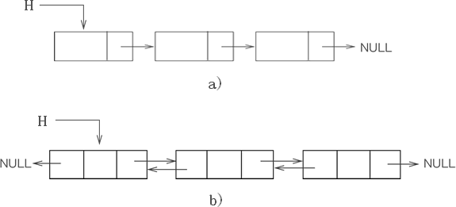

# STL序列式容器（详解版）


本章主要讲解STL标准库中所有的序列式容器，包括 array、vector、deque、list 和 forward_list 容器。

所谓STL序列式容器，其共同的特点是不会对存储的元素进行排序，元素排列的顺序取决于存储它们的顺序。

不同序列式容器的适用场景不同，本章不仅会介绍各个序列容器的特性和功能，还将系统讲解各个容器的具体用法，包括如何创建容器以及如何实现对容器中元素的增删改查等。

本章内容：

1. [C++ STL容器是什么？](http://c.biancheng.net/view/6560.html)

2. [迭代器是什么，C++ STL迭代器（iterator）用法详解](http://c.biancheng.net/view/6675.html)

3. [C++序列式容器（STL序列式容器）是什么](http://c.biancheng.net/view/409.html)

4. [C++ array(STL array)容器用法详解](http://c.biancheng.net/view/6688.html)

5. [C++ STL array随机访问迭代器（精讲版）](http://c.biancheng.net/view/6724.html)

6. [C++ STL array容器访问元素的几种方式](http://c.biancheng.net/view/6710.html)

7. [C++ array容器：普通数组的“升级版”](http://c.biancheng.net/view/vip_7709.html)

8. [C++ STL vector容器详解](http://c.biancheng.net/view/6749.html)

9. [C++ STL vector容器迭代器用法详解](http://c.biancheng.net/view/6803.html)

10. [C++ STL vector容器访问元素的几种方式](http://c.biancheng.net/view/6816.html)

11. [C++ vector容量（capacity）和大小（size）的区别](http://c.biancheng.net/view/vip_7718.html)

12. [深度剖析C++ vector容器的底层实现机制](http://c.biancheng.net/view/vip_7710.html)

13. [C++ STL vector添加元素（push_back()和emplace_back()）详解](http://c.biancheng.net/view/6826.html)

14. [C++ STL vector插入元素（insert()和emplace()）详解](http://c.biancheng.net/view/6834.html)

15. [C++ STL vector删除元素的几种方式（超级详细）](http://c.biancheng.net/view/6846.html)

16. [如何避免vector容器进行不必要的扩容？](http://c.biancheng.net/view/vip_7711.html)

17. [vector swap()成员方法还可以这样用！](http://c.biancheng.net/view/vip_7712.html)

18. [切忌，vector不是存储bool类型元素的vector容器！](http://c.biancheng.net/view/vip_7713.html)

19. [C++ STL deque容器（详解版）](http://c.biancheng.net/view/6860.html)

20. [C++ STL deque容器迭代器用法详解](http://c.biancheng.net/view/6866.html)

21. [深度剖析deque容器底层实现原理](http://c.biancheng.net/view/vip_7714.html)

22. [C++ STL deque容器访问元素（4种方法）](http://c.biancheng.net/view/6869.html)

23. [C++ STL deque容器添加和删除元素方法完全攻略](http://c.biancheng.net/view/6877.html)

24. [C++ list（STL list）容器完全攻略（超级详细）](http://c.biancheng.net/view/6892.html)

25. [C++ STL list迭代器及用法（详解版）](http://c.biancheng.net/view/6922.html)

26. [C++ list容器底层存储结构（详解版）](http://c.biancheng.net/view/vip_7715.html)

27. [C++ list（STL list）访问元素的几种方法](http://c.biancheng.net/view/6939.html)

28. [C++ STL list添加（插入）元素方法详解](http://c.biancheng.net/view/6933.html)

29. [empty()和size()都可以判断容器是否为空，谁更好？](http://c.biancheng.net/view/vip_7716.html)

30. [C++ STL list删除元素详解](http://c.biancheng.net/view/6937.html)

31. [C++ STL forward_list容器完全攻略](http://c.biancheng.net/view/6960.html)


## 2.1 C++ STL容器是什么？

在实际的开发过程中，合理组织数据的存取与选择处理数据的算法同等重要，存取数据的方式往往会直接影响到对它们进行增删改查操作的复杂程度和时间消耗。事实上，当程序中存在对时耗要求很高的部分时，[数据结构](http://c.biancheng.net/data_structure/)的选择就显得尤为重要，有时甚至直接影响程序执行的成败。

值得一提的是，之前我们一直在不断地重复实现一些诸如链表、集合等等这些常见的数据结构，这些代码使用起来往往都十分类似，只是为了适应不同数据的变化，可能需要在一些细节上做不同的处理。

那么大家有没有想过，是不是可以重复利用那些已有的实现来完成当前的任务呢？当然是可行的，有些读者已经亲自编写并实现了动态数组类、链表类、集合类等程序，并精心维护着。其实，[STL](http://c.biancheng.net/stl/) 中提供了专家级的几乎我们所需要的各种容器，功能更好，复用性更高。

简单的理解容器，它就是一些模板类的集合，但和普通模板类不同的是，容器中封装的是组织数据的方法（也就是数据结构）。STL 提供有 3 类标准容器，分别是序列容器、排序容器和哈希容器，其中后两类容器有时也统称为关联容器。它们各自的含义如表 1 所示。

| 容器种类 | 功能                                                         |
| -------- | ------------------------------------------------------------ |
| 序列容器 | 主要包括 vector 向量容器、list 列表容器以及 deque 双端队列容器。之所以被称为序列容器，是因为元素在容器中的位置同元素的值无关，即容器不是排序的。将元素插入容器时，指定在什么位置，元素就会位于什么位置。 |
| 排序容器 | 包括 set 集合容器、multiset多重集合容器、map映射容器以及 multimap 多重映射容器。排序容器中的元素默认是由小到大排序好的，即便是插入元素，元素也会插入到适当位置。所以关联容器在查找时具有非常好的性能。 |
| 哈希容器 | [C++](http://c.biancheng.net/cplus/) 11 新加入 4 种关联式容器，分别是 unordered_set 哈希集合、unordered_multiset 哈希多重集合、unordered_map 哈希映射以及 unordered_multimap 哈希多重映射。和排序容器不同，哈希容器中的元素是未排序的，元素的位置由哈希函数确定。 |

> 注意，由于哈希容器直到 C++ 11 才被正式纳入 C++ 标准程序库，而在此之前，“民间”流传着 hash_set、hash_multiset、hash_map、hash_multimap 版本，不过该版本只能在某些支持 C++ 11 的编译器下使用（如 VS），有些编译器（如 gcc/g++）是不支持的。

另外，以上 3 类容器的存储方式完全不同，因此使用不同容器完成相同操作的效率也大不相同。所以在实际使用时，要善于根据想实现的功能，选择合适的容器。有关这些容器的具体用法，本章后续会逐个进行介绍。


## 2.2 迭代器是什么，C++ STL迭代器（iterator）用法详解

无论是序列容器还是关联容器，最常做的操作无疑是遍历容器中存储的元素，而实现此操作，多数情况会选用“迭代器（iterator）”来实现。那么，迭代器到底是什么呢？

我们知道，尽管不同容器的内部结构各异，但它们本质上都是用来存储大量数据的，换句话说，都是一串能存储多个数据的存储单元。因此，诸如数据的排序、查找、求和等需要对数据进行遍历的操作方法应该是类似的。

既然类似，完全可以利用泛型技术，将它们设计成适用所有容器的通用算法，从而将容器和算法分离开。但实现此目的需要有一个类似中介的装置，它除了要具有对容器进行遍历读写数据的能力之外，还要能对外隐藏容器的内部差异，从而以统一的界面向算法传送数据。

这是泛型思维发展的必然结果，于是迭代器就产生了。简单来讲，迭代器和 [C++](http://c.biancheng.net/cplus/) 的[指针](http://c.biancheng.net/c/80/)非常类似，它可以是需要的任意类型，通过迭代器可以指向容器中的某个元素，如果需要，还可以对该元素进行读/写操作。

### 迭代器类别

[STL](http://c.biancheng.net/stl/) 标准库为每一种标准容器定义了一种迭代器类型，这意味着，不同容器的迭代器也不同，其功能强弱也有所不同。

> 容器的迭代器的功能强弱，决定了该容器是否支持 STL 中的某种算法。

常用的迭代器按功能强弱分为输入迭代器、输出迭代器、前向迭代器、双向迭代器、随机访问迭代器 5 种。本节主要介绍后面的这 3 种迭代器。

> 输入迭代器和输出迭代器比较特殊，它们不是把数组或容器当做操作对象，而是把输入流/输出流作为操作对象。有关这 2 个迭代器，我们会在后续章节做详细介绍。

1) 前向迭代器（forward iterator）
   假设 p 是一个前向迭代器，则 p 支持 ++p，p++，*p 操作，还可以被复制或赋值，可以用 == 和 != 运算符进行比较。此外，两个正向迭代器可以互相赋值。

2) 双向迭代器（bidirectional iterator）
   双向迭代器具有正向迭代器的全部功能，除此之外，假设 p 是一个双向迭代器，则还可以进行 --p 或者 p-- 操作（即一次向后移动一个位置）。

3) 随机访问迭代器（random access iterator）
   随机访问迭代器具有双向迭代器的全部功能。除此之外，假设 p 是一个随机访问迭代器，i 是一个整型变量或常量，则 p 还支持以下操作：

- p+=i：使得 p 往后移动 i 个元素。
- p-=i：使得 p 往前移动 i 个元素。
- p+i：返回 p 后面第 i 个元素的迭代器。
- p-i：返回 p 前面第 i 个元素的迭代器。
- p[i]：返回 p 后面第 i 个元素的引用。


此外，两个随机访问迭代器 p1、p2 还可以用 <、>、<=、>= 运算符进行比较。另外，表达式 p2-p1 也是有定义的，其返回值表示 p2 所指向元素和 p1 所指向元素的序号之差（也可以说是 p2 和 p1 之间的元素个数减一）。

表 1 所示，是 C++ 11 标准中不同容器指定使用的迭代器类型。

| 容器                               | 对应的迭代器类型 |
| ---------------------------------- | ---------------- |
| array                              | 随机访问迭代器   |
| vector                             | 随机访问迭代器   |
| deque                              | 随机访问迭代器   |
| list                               | 双向迭代器       |
| set / multiset                     | 双向迭代器       |
| map / multimap                     | 双向迭代器       |
| forward_list                       | 前向迭代器       |
| unordered_map / unordered_multimap | 前向迭代器       |
| unordered_set / unordered_multiset | 前向迭代器       |
| stack                              | 不支持迭代器     |
| queue                              | 不支持迭代器     |

> 注意，容器适配器 stack 和 queue 没有迭代器，它们包含有一些成员函数，可以用来对元素进行访问。


### 迭代器的定义方式

尽管不同容器对应着不同类别的迭代器，但这些迭代器有着较为统一的定义方式，具体分为 4 种，如表 1 所示。

| 迭代器定义方式 | 具体格式                                   |
| -------------- | ------------------------------------------ |
| 正向迭代器     | 容器类名::iterator 迭代器名;               |
| 常量正向迭代器 | 容器类名::const_iterator 迭代器名;         |
| 反向迭代器     | 容器类名::reverse_iterator 迭代器名;       |
| 常量反向迭代器 | 容器类名::const_reverse_iterator 迭代器名; |

> 值得一提的是，表 2 中的反向迭代器全称为 "反向迭代器适配器"，后续章节会做详细讲解，这里读者只需要知道其用法即可。

通过定义以上几种迭代器，就可以读取它指向的元素，`*迭代器名`就表示迭代器指向的元素。其中，常量迭代器和非常量迭代器的分别在于，通过非常量迭代器还能修改其指向的元素。另外，反向迭代器和正向迭代器的区别在于：

- 对正向迭代器进行 ++ 操作时，迭代器会指向容器中的后一个元素；
- 而对反向迭代器进行 ++ 操作时，迭代器会指向容器中的前一个元素。


注意，以上 4 种定义迭代器的方式，并不是每个容器都适用。有一部分容器同时支持以上 4 种方式，比如 array、deque、vector；而有些容器只支持其中部分的定义方式，例如 forward_list 容器只支持定义正向迭代器，不支持定义反向迭代器。

> 具体容器支持定义迭代器的方式，讲具体容器时会详细说明。另外，读者也可以通过 [C++ STL标准手册](http://www.cplusplus.com/reference/stl/)，查询具体容器迭代器支持的定义方式。


以上对迭代器做了很详细的介绍，下面就以 vector 容器为例，带领大家实际感受迭代器的用法和功能。通过前面的学习，vector 支持随机访问迭代器，因此遍历 vector 容器有以下几种做法。下面的程序中，每个循环演示了一种做法：

```
//遍历 vector 容器。
#include <iostream>
//需要引入 vector 头文件
#include <vector>

using namespace std;

int main(){    
  vector<int> v{1, 2, 3, 4, 5, 6, 7, 8, 9, 10}; //v被初始化成有10个元素    
  cout << "第一种遍历方法：" << endl;    
  //size返回元素个数    
  for (int i = 0; i < v.size(); ++i) {
      cout << v[i] <<" "; //像普通数组一样使用vector容器
  }          
  
  //创建一个正向迭代器，当然，vector也支持其他 3 种定义迭代器的方式           
  cout << endl << "第二种遍历方法：" << endl;       
  vector<int>::iterator i;    
  //用 != 比较两个迭代器    
  for (i = v.begin(); i != v.end(); ++i) {
      cout << *i << " ";   
  }        
  
  cout << endl << "第三种遍历方法：" << endl;    
  for (i = v.begin(); i < v.end(); ++i) {
    //用 < 比较两个迭代器        
    cout << *i << " ";        
  }  
  
  cout << endl << "第四种遍历方法：" << endl;    
  i = v.begin();    
  while (i < v.end()) { 
    //间隔一个输出        
    cout << *i << " ";        
    i += 2; // 随机访问迭代器支持 "+= 整数"  的操作    
  }
}
```

运行结果为：

```
第一种遍历方法：
1 2 3 4 5 6 7 8 9 10
第二种遍历方法：
1 2 3 4 5 6 7 8 9 10
第三种遍历方法：
1 2 3 4 5 6 7 8 9 10
第四种遍历方法：
1 3 5 7 9
```


再举一个例子，我们知道，list 容器的迭代器是双向迭代器。假设 v 和 i 的定义如下：

```
//创建一个 v list容器
list<int> v;

//创建一个常量正向迭代器，同样，list也支持其他三种定义迭代器的方式。
list<int>::const_iterator i;
```

则以下代码是合法的：

```
for(i = v.begin(); i != v.end(); ++i)    cout << *i;
```

以下代码则不合法，因为双向迭代器不支持用“<”进行比较：

```
for(i = v.begin(); i < v.end(); ++i)  cout << *i;
```

以下代码也不合法，因为双向迭代器不支持用下标随机访问元素：

```
for(int i=0; i < v.size(); ++i)    cout << v[i];
```

> 其实在 C++ 中，数组也是容器。数组的迭代器就是指针，而且是随机访问迭代器。例如，对于数组 int a[10]，int * 类型的指针就是其迭代器。则 a、a+1、a+2 都是 a 的迭代器。另外，以上有关 vector、list 容器的具体用法，后续章节会做详细讲解。


## 2.3 C++序列式容器（STL序列式容器）是什么

所谓序列容器，即以线性排列（类似普通数组的存储方式）来存储某一指定类型（例如 int、double 等）的数据，需要特殊说明的是，该类容器并不会自动对存储的元素按照值的大小进行排序。

需要注意的是，序列容器只是一类容器的统称，并不指具体的某个容器，序列容器大致包含以下几类容器：

- array<T, N>（数组容器）：表示可以存储 N 个 T 类型的元素，是 [C++](http://c.biancheng.net/cplus/) 本身提供的一种容器。此类容器一旦建立，其长度就是固定不变的，这意味着不能增加或删除元素，只能改变某个元素的值；
- vector<T>（向量容器）：用来存放 T 类型的元素，是一个长度可变的序列容器，即在存储空间不足时，会自动申请更多的内存。使用此容器，在尾部增加或删除元素的效率最高（时间复杂度为 O(1) 常数阶），在其它位置插入或删除元素效率较差（时间复杂度为 O(n) 线性阶，其中 n 为容器中元素的个数）；
- deque<T>（双端队列容器）：和 vector 非常相似，区别在于使用该容器不仅尾部插入和删除元素高效，在头部插入或删除元素也同样高效，时间复杂度都是 O(1) 常数阶，但是在容器中某一位置处插入或删除元素，时间复杂度为 O(n) 线性阶；
- list<T>（链表容器）：是一个长度可变的、由 T 类型元素组成的序列，它以双向链表的形式组织元素，在这个序列的任何地方都可以高效地增加或删除元素（时间复杂度都为常数阶 O(1)），但访问容器中任意元素的速度要比前三种容器慢，这是因为 list<T> 必须从第一个元素或最后一个元素开始访问，需要沿着链表移动，直到到达想要的元素。
- forward_list<T>（正向链表容器）：和 list 容器非常类似，只不过它以单链表的形式组织元素，它内部的元素只能从第一个元素开始访问，是一类比链表容器快、更节省内存的容器。

> 注意，其实除此之外，stack<T> 和 queue<T> 本质上也属于序列容器，只不过它们都是在 deque 容器的基础上改头换面而成，通常更习惯称它们为容器适配器，有关它们的介绍，会放到后续章节中。

图 1 说明了可供使用的序列容器以及它们之间的区别。


<center>图 1 标准的序列容器</center>


图 1 中每种类型容器的操作都可以高效执行，但进行除此之外的其他操作，效率会稍差一些。在本章的剩余部分，会详细介绍每一类序列容器的具体用法。


## 容器中常见的函数成员

序列容器包含一些相同的成员函数，它们的功能也相同，本教程会在某个容器的上下文中详细介绍下面的每个函数，但对于每种类型的容器不会重复介绍它们的细节。

表 2 展示了 array、vector 和 deque 容器的函数成员，它们中至少有两个容器实现了同样的函数成员。


| 函数成员         | 函数功能                                                     | array<T,N> | vector<T> | deque<T> |
| ---------------- | ------------------------------------------------------------ | ---------- | --------- | -------- |
| begin()          | 返回指向容器中第一个元素的迭代器。                           | 是         | 是        | 是       |
| end()            | 返回指向容器最后一个元素所在位置后一个位置的迭代器，通常和 begin() 结合使用。 | 是         | 是        | 是       |
| rbegin()         | 返回指向最后一个元素的迭代器。                               | 是         | 是        | 是       |
| rend()           | 返回指向第一个元素所在位置前一个位置的迭代器。               | 是         | 是        | 是       |
| cbegin()         | 和 begin() 功能相同，只不过在其基础上，增加了 const 属性，不能用于修改元素。 | 是         | 是        | 是       |
| cend()           | 和 end() 功能相同，只不过在其基础上，增加了 const 属性，不能用于修改元素。 | 是         | 是        | 是       |
| crbegin()        | 和 rbegin() 功能相同，只不过在其基础上，增加了 const 属性，不能用于修改元素。 | 是         | 是        | 是       |
| crend()          | 和 rend() 功能相同，只不过在其基础上，增加了 const 属性，不能用于修改元素。 | 是         | 是        | 是       |
| assign()         | 用新元素替换原有内容。                                       | -          | 是        | 是       |
| operator=()      | 复制同类型容器的元素，或者用初始化列表替换现有内容。         | 是         | 是        | 是       |
| size()           | 返回实际元素个数。                                           | 是         | 是        | 是       |
| max_size()       | 返回元素个数的最大值。这通常是一个很大的值，一般是 232-1，所以我们很少会用到这个函数。 | 是         | 是        | 是       |
| capacity()       | 返回当前容量。                                               | -          | 是        | -        |
| empty()          | 判断容器中是否有元素，若无元素，则返回 true；反之，返回 false。 | 是         | 是        | 是       |
| resize()         | 改变实际元素的个数。                                         | -          | 是        | 是       |
| shrink _to_fit() | 将内存减少到等于当前元素实际所使用的大小。                   | -          | 是        | 是       |
| front()          | 返回第一个元素的引用。                                       | 是         | 是        | 是       |
| back()           | 返回最后一个元素的引用。                                     | 是         | 是        | 是       |
| operator[]()     | 使用索引访问元素。                                           | 是         | 是        | 是       |
| at()             | 使用经过边界检査的索引访问元素。                             | 是         | 是        | 是       |
| push_back()      | 在序列的尾部添加一个元素。                                   | -          | 是        | 是       |
| insert()         | 在指定的位置插入一个或多个元素。                             | -          | 是        | 是       |
| emplace()        | 在指定的位置直接生成一个元素。                               | -          | 是        | 是       |
| emplace_back()   | 在序列尾部生成一个元素。                                     | -          | 是        | 是       |
| pop_back()       | 移出序列尾部的元素。                                         | -          | 是        | 是       |
| erase()          | 移出一个元素或一段元素。                                     | -          | 是        | 是       |
| clear()          | 移出所有的元素，容器大小变为 0。                             | -          | 是        | 是       |
| swap()           | 交换两个容器的所有元素。                                     | 是         | 是        | 是       |
| data()           | 返回指向容器中第一个元素的[指针](http://c.biancheng.net/c/80/)。 | 是         | 是        | -        |

> 列表中 - 表明对应的容器并没有定义这个函数。

list 和 forward_list 容器彼此非常相似，forward_list 中包含了 list 的大部分成员函数，而未包含那些需要反向遍历的函数。表 3 展示了 list 和 forward_list 的函数成员。


| 函数成员        | 函数功能                                                     | list<T> | forward_list<T> |
| --------------- | ------------------------------------------------------------ | ------- | --------------- |
| begin()         | 返回指向容器中第一个元素的迭代器。                           | 是      | 是              |
| end()           | 返回指向容器最后一个元素所在位置后一个位置的迭代器。         | 是      | 是              |
| rbegin()        | 返回指向最后一个元素的迭代器。                               | 是      | -               |
| rend()          | 返回指向第一个元素所在位置前一个位置的迭代器。               | 是      | -               |
| cbegin()        | 和 begin() 功能相同，只不过在其基础上，增加了 const 属性，不能用于修改元素。 | 是      | 是              |
| before_begin()  | 返回指向第一个元素前一个位置的迭代器。                       | -       | 是              |
| cbefore_begin() | 和 before_begin() 功能相同，只不过在其基础上，增加了 const 属性，即不能用该指针修改元素的值。 | -       | 是              |
| cend()          | 和 end() 功能相同，只不过在其基础上，增加了 const 属性，不能用于修改元素。 | 是      | 是              |
| crbegin()       | 和 rbegin() 功能相同，只不过在其基础上，增加了 const 属性，不能用于修改元素。 | 是      | -               |
| crend()         | 和 rend() 功能相同，只不过在其基础上，增加了 const 属性，不能用于修改元素。 | 是      | -               |
| assign()        | 用新元素替换原有内容。                                       | 是      | 是              |
| operator=()     | 复制同类型容器的元素，或者用初始化列表替换现有内容。         | 是      | 是              |
| size()          | 返回实际元素个数。                                           | 是      | -               |
| max_size()      | 返回元素个数的最大值，这通常是一个很大的值，一般是 232-1，所以我们很少会用到这个函数。 | 是      | 是              |
| resize()        | 改变实际元素的个数。                                         | 是      | 是              |
| empty()         | 判断容器中是否有元素，若无元素，则返回 true；反之，返回 false。 | 是      | 是              |
| front()         | 返回容器中第一个元素的引用。                                 | 是      | 是              |
| back()          | 返回容器中最后一个元素的引用。                               | 是      | -               |
| push_back()     | 在序列的尾部添加一个元素。                                   | 是      | -               |
| push_front()    | 在序列的起始位置添加一个元素。                               | 是      | 是              |
| emplace()       | 在指定位置直接生成一个元素。                                 | 是      | -               |
| emplace_after() | 在指定位置的后面直接生成一个元素。                           | -       | 是              |
| emplace_back()  | 在序列尾部生成一个元素。                                     | 是      | -               |
| cmplacc_front() | 在序列的起始位生成一个元索。                                 | 是      | 是              |
| insert()        | 在指定的位置插入一个或多个元素。                             | 是      | -               |
| insert_after()  | 在指定位置的后面插入一个或多个元素。                         | -       | 是              |
| pop_back()      | 移除序列尾部的元素。                                         | 是      | -               |
| pop_front()     | 移除序列头部的元素。                                         | 是      | 是              |
| reverse()       | 反转容器中某一段的元素。                                     | 是      | 是              |
| erase()         | 移除指定位置的一个元素或一段元素。                           | 是      | -               |
| erase_after()   | 移除指定位置后面的一个元素或一段元素。                       | -       | 是              |
| remove()        | 移除所有和参数匹配的元素。                                   | 是      | 是              |
| remove_if()     | 移除满足一元函数条件的所有元素。                             | 是      | 是              |
| unique()        | 移除所有连续重复的元素。                                     | 是      | 是              |
| clear()         | 移除所有的元素，容器大小变为 0。                             | 是      | 是              |
| swap()          | 交换两个容器的所有元素。                                     | 是      | 是              |
| sort()          | 对元素进行排序。                                             | 是      | 是              |
| merge()         | 合并两个有序容器。                                           | 是      | 是              |
| splice()        | 移动指定位置前面的所有元素到另一个同类型的 list 中。         | 是      | -               |
| splice_after()  | 移动指定位置后面的所有元素到另一个同类型的 list 中。         | -       | 是              |

> 注意，大家没有必要死记这些表，它们仅供参考。在深入了解到容器是如何组织元素以后，你会本能地知道哪个容器能使用哪些成员函数。


## 2.4 C++ array(STL array)容器用法详解

array 容器是 [C++](http://c.biancheng.net/cplus/) 11 标准中新增的序列容器，简单地理解，它就是在 C++ 普通数组的基础上，添加了一些成员函数和全局函数。在使用上，它比普通数组更安全（原因后续会讲），且效率并没有因此变差。

和其它容器不同，array 容器的大小是固定的，无法动态的扩展或收缩，这也就意味着，在使用该容器的过程无法借由增加或移除元素而改变其大小，它只允许访问或者替换存储的元素。

> [STL](http://c.biancheng.net/stl/) 还提供有可动态扩展或收缩存储空间的 vector 容器，后续章节会对其做详细介绍。

array 容器以类模板的形式定义在 <array> 头文件，并位于命名空间 std 中，如下所示：

```
namespace std {    
  template <typename T, size_t N>    
  class array;
}
```

因此，在使用该容器之前，代码中需引入 <array> 头文件，并默认使用 std 命令空间，如下所示：

```
#include <array>
using namespace std;
```

在 array<T, N> 类模板中，T 用于指明容器中的存储的具体数据类型，N 用于指明容器的大小，需要注意的是，这里的 N 必须是常量，不能用变量表示。

array 容器有多种初始化方式，如下代码展示了如何创建具有 10 个 double 类型元素的 array 容器：

```
std::array<double, 10> values;
```

> 提示，如果程序中已经默认指定了 std 命令空间，这里可以省略 std::。

由此，就创建好了一个名为 values 的 array 容器，其包含 10 个浮点型元素。但是，由于未显式指定这 10 个元素的值，因此使用这种方式创建的容器中，各个元素的值是不确定的（array 容器不会做默认初始化操作）。

通过如下创建 array 容器的方式，可以将所有的元素初始化为 0 或者和默认元素类型等效的值：

```
std::array<double, 10> values {};
```

使用该语句，容器中所有的元素都会被初始化为 0.0。

当然，在创建 array 容器的实例时，也可以像创建常规数组那样对元素进行初始化：

```
std::array<double, 10> values {0.5,1.0,1.5,,2.0};
```

可以看到，这里只初始化了前 4 个元素，剩余的元素都会被初始化为 0.0。图 1 说明了这一点。


<center>图 1 初始化 array 容器</center>


除此之外，array 容器还提供有很多功能实用的成员函数，如表 2 所示。

| 成员函数            | 功能                                                         |
| ------------------- | ------------------------------------------------------------ |
| begin()             | 返回指向容器中第一个元素的随机访问迭代器。                   |
| end()               | 返回指向容器最后一个元素之后一个位置的随机访问迭代器，通常和 begin() 结合使用。 |
| rbegin()            | 返回指向最后一个元素的随机访问迭代器。                       |
| rend()              | 返回指向第一个元素之前一个位置的随机访问迭代器。             |
| cbegin()            | 和 begin() 功能相同，只不过在其基础上增加了 const 属性，不能用于修改元素。 |
| cend()              | 和 end() 功能相同，只不过在其基础上，增加了 const 属性，不能用于修改元素。 |
| crbegin()           | 和 rbegin() 功能相同，只不过在其基础上，增加了 const 属性，不能用于修改元素。 |
| crend()             | 和 rend() 功能相同，只不过在其基础上，增加了 const 属性，不能用于修改元素。 |
| size()              | 返回容器中当前元素的数量，其值始终等于初始化 array 类的第二个模板参数 N。 |
| max_size()          | 返回容器可容纳元素的最大数量，其值始终等于初始化 array 类的第二个模板参数 N。 |
| empty()             | 判断容器是否为空，和通过 size()==0 的判断条件功能相同，但其效率可能更快。 |
| at(n)               | 返回容器中 n 位置处元素的引用，该函数自动检查 n 是否在有效的范围内，如果不是则抛出 out_of_range 异常。 |
| front()             | 返回容器中第一个元素的直接引用，该函数不适用于空的 array 容器。 |
| back()              | 返回容器中最后一个元素的直接应用，该函数同样不适用于空的 array 容器。 |
| data()              | 返回一个指向容器首个元素的[指针](http://c.biancheng.net/c/80/)。利用该指针，可实现复制容器中所有元素等类似功能。 |
| fill(val)           | 将 val 这个值赋值给容器中的每个元素。                        |
| array1.swap(array2) | 交换 array1 和 array2 容器中的所有元素，但前提是它们具有相同的长度和类型。 |


除此之外，C++ 11 标准库还新增加了 begin() 和 end() 这 2 个函数，和 array 容器包含的 begin() 和 end() 成员函数不同的是，标准库提供的这 2 个函数的操作对象，既可以是容器，还可以是普通数组。当操作对象是容器时，它和容器包含的 begin() 和 end() 成员函数的功能完全相同；如果操作对象是普通数组，则 begin() 函数返回的是指向数组第一个元素的指针，同样 end() 返回指向数组中最后一个元素之后一个位置的指针（注意不是最后一个元素）。

另外，在 <array> 头文件中还重载了 get() 全局函数，该重载函数的功能是访问容器中指定的元素，并返回该元素的引用。

> 正是由于 array 容器中包含了 at() 这样的成员函数，使得操作元素时比普通数组更安全。

例如代码演示了表 2 中一部分成员函数的用法和功能：

```
#include <iostream>
//需要引入 array 头文件
#include <array>

using namespace std;
int main() {    
     std::array<int, 4> values{};    
     //初始化 values 容器为 {0,1,2,3}    
     for (int i = 0; i < values.size(); i++) {        
       values.at(i) = i;    
     }    
     
     //使用 get() 重载函数输出指定位置元素    
     cout << get<3>(values) << endl;    
     
     //如果容器不为空，则输出容器中所有的元素    
     if (!values.empty()) {        
       for (auto val = values.begin(); val < values.end(); val++) {            
         cout << *val << " ";        
       }    
     }
 }
```

注意，代码中的 auto 关键字，可以使编译器自动判定变量的类型。运行这段代码，输出结果为：

```
3
0 1 2 3
```


> 表 2 中其他成员函数的用法，这里不再给出具体实例，有兴趣的读者，可自行根据各个函数的功能描述编写实例代码进行测试。


## 2.5 C++ STL array随机访问迭代器（精讲版）

在《[C++ STL迭代器（iterator）](http://c.biancheng.net/view/6675.html)》一节中，已经对迭代器做了详细的介绍，[STL](http://c.biancheng.net/stl/) 为 array 容器配备了随机访问迭代器，该类迭代器是功能最强大的迭代器。本节将详细介绍 array 容器的迭代器的用法。

在 array 容器的模板类中，和随机访问迭代器相关的成员函数如表 1 所示。

| 成员函数  | 功能                                                         |
| --------- | ------------------------------------------------------------ |
| begin()   | 返回指向容器中第一个元素的正向迭代器；如果是 const 类型容器，在该函数返回的是常量正向迭代器。 |
| end()     | 返回指向容器最后一个元素之后一个位置的正向迭代器；如果是 const 类型容器，在该函数返回的是常量正向迭代器。此函数通常和 begin() 搭配使用。 |
| rbegin()  | 返回指向最后一个元素的反向迭代器；如果是 const 类型容器，在该函数返回的是常量反向迭代器。 |
| rend()    | 返回指向第一个元素之前一个位置的反向迭代器。如果是 const 类型容器，在该函数返回的是常量反向迭代器。此函数通常和 rbegin() 搭配使用。 |
| cbegin()  | 和 begin() 功能类似，只不过其返回的迭代器类型为常量正向迭代器，不能用于修改元素。 |
| cend()    | 和 end() 功能相同，只不过其返回的迭代器类型为常量正向迭代器，不能用于修改元素。 |
| crbegin() | 和 rbegin() 功能相同，只不过其返回的迭代器类型为常量反向迭代器，不能用于修改元素。 |
| crend()   | 和 rend() 功能相同，只不过其返回的迭代器类型为常量反向迭代器，不能用于修改元素。 |

> 除此之外，[C++](http://c.biancheng.net/cplus/) 11 标准新增的 begin() 和 end() 函数，当操作对象为 array 容器时，也和迭代器有关，其功能分别和表 1 中的 begin()、end() 成员函数相同，具有用法本节后续会做详细介绍。

这些成员函数的具体功能如图 2 所示。


<center>图 2 迭代器的具体功能示意图</center>


可以看到，根据它们的功能并结合实际场景的需要，这些成员函数通常是成对使用的，即 begin()/end()、rbegin()/rend()、cbegin()/cend()、crbegin()/crend() 各自成对搭配使用。不仅如此，这 4 对中 begin()/end() 和 cbegin()/cend()、rbegin()/rend() 和 crbegin()/crend() 的功能大致是相同的（如图 2 所示），唯一的区别就在于其返回的迭代器能否用来修改元素值。

> 值得一提的是，以上函数在实际使用时，其返回值类型都可以使用 auto 关键字代替，编译器可以自行判断出该迭代器的类型。

## begin()/end() 和 cbegin()/cend()

array 容器模板类中的 begin() 和 end() 成员函数返回的都是正向迭代器，它们分别指向「首元素」和「尾元素+1」 的位置。在实际使用时，我们可以利用它们实现初始化容器或者遍历容器中元素的操作。

例如，可以在循环中显式地使用迭代器来初始化 values 容器的值：

```
#include <iostream>
//需要引入 array 头文件
#include <array>

using namespace std;
int main() {    
    array<int, 5> values;    
    int h = 1;    
    auto first = values.begin();    
    auto last = values.end();    
    // 初始化 values 容器为{1,2,3,4,5}    
    while (first != last)    {        
      *first = h;        
      ++first;        
      h++;    
    }      
    
    first = values.begin();    
    while (first != last) {       
        cout << *first << " ";        
        ++first;    
    }    
    
    return 0; 
}
```

输出结果为：

```
1 2 3 4 5
```


可以看出，迭代器对象是由 array 对象的成员函数 begin() 和 end() 返回的。我们可以像使用普通[指针](http://c.biancheng.net/c/80/)那样上使用迭代器对象。比如代码中，在保存了元素值后，使用前缀 ++ 运算符对 first 进行自增，当 first 等于 end 时，所有的元素都被设完值，循环结束。

与此同时，还可以使用全局的 begin() 和 end() 函数来从容器中获取迭代器，因为当操作对象为 array 容器时，它们和 begin()/end() 成员函数是通用的。所以上面代码中，first 和 last 还可以像下面这样定义：

```
auto first = std::begin(values);
auto last = std::end(values);
```

这样，容器中的一段元素可以由迭代器指定，这让我们有了对它们使用算法的可能。

> 需要注意的是，STL 标准库，不是只有 array 容器，当迭代器指向容器中的一个特定元素时，它们不会保留任何关于容器本身的信息，所以我们无法从迭代器中判断，它是指向 array 容器还是指向 vector 容器（该容器后续会讲）。


除此之外，array 模板类还提供了 cbegin() 和 cend() 成员函数，它们和 begin()/end() 唯一不同的是，前者返回的是 const 类型的正向迭代器，这就意味着，有 cbegin() 和 cend() 成员函数返回的迭代器，可以用来遍历容器内的元素，也可以访问元素，但是不能对所存储的元素进行修改。

举个例子：

```
#include <iostream>
// 需要引入 array 头文件
#include <array>

using namespace std;
int main() {    
    array<int, 5> values{1, 2, 3, 4, 5};    
    int h = 1;    
    auto first = values.cbegin();    
    auto last = values.cend();       
    // 由于 *first 为 const 类型，不能用来修改元素    
    // *first = 10;       
    // 遍历容器并输出容器中所有元素    
    while (first != last) {        
        //可以使用 const 类型迭代器访问元素        
        cout << *first << " ";        
        ++first;    
    }    
    
    return 0;
 }
```

此程序的第 14 行代码中，我们尝试使用 first 迭代器修改 values 容器中的值，如果取消注释并运行此程序，编译器会提示你“不能给常量赋值”，即 *first 是 const 类型常量，所以这么做是不对的。但 17~22 行代码遍历并访问容器的行为，是允许的。

## rbegin()/rend() 和 crbegin()/crend()

array 模板类中还提供了 rbegin()/rend() 和 crbegin()/crend() 成员函数，它们每对都可以分别得到指向最后一个元素和第一个元素前一个位置的随机访问迭代器，又称它们为反向迭代器（如图 2 所示）。

> 需要注意的是，在使用反向迭代器进行 ++ 或 -- 运算时，++ 指的是迭代器向左移动一位，-- 指的是迭代器向右移动一位，即这两个运算符的功能也“互换”了。

反向迭代器用于以逆序的方式处理元素。例如：

```
#include <iostream>
// 需要引入 array 头文件
#include <array>

using namespace std;
int main() {    
    array<int, 5> values;    
    int h = 1;    
    auto first = values.rbegin();    
    auto last = values.rend();     
    // 初始化 values 容器为 {5,4,3,2,1}    
    while (first != last) {        
        *first = h;        
        ++first;        
        h++;    
    }    
    
    // 重新遍历容器，并输入各个元素    
    first = values.rbegin();    
    while (first != last)    {        
        cout << *first << " ";        
        ++first;    
    }    
    
    return 0;
}
```

运行结果为：

```
1 2 3 4 5
```

可以看到，从最后一个元素开始循环，不仅完成了容器的初始化，还遍历输出了容器中的所有元素。结束迭代器指向第一个元素之前的位置，所以当 first 指向第一个元素并 +1 后，循环就结朿了。

> 在反向迭代器上使用 ++ 递增运算符，会让迭代器用一种和普通正向迭代器移动方向相反的方式移动。

当然，在上面程序中，我们也可以使用 [for 循环](http://c.biancheng.net/view/172.html)：

```
for (auto first = values.rbegin(); first != values.rend(); ++first) {    
    cout << *first << " ";
}
```


crbegin()/crend() 组合和 rbegin()/crend() 组合的功能唯一的区别在于，前者返回的迭代器为 const 类型，即不能用来修改容器中的元素，除此之外在使用上和后者完全相同。

> 有关 crbegin()/crend() 成员函数，这里不再给出具体实例，有兴趣的读者，可自行编写代码进行测试。


## 2.6 C++ STL array容器访问元素的几种方式

当 array 容器创建完成之后，最常做的操作就是获取其中的元素，甚至有时还会通过循环结构获取多个元素。本节就对获取容器中元素的方法做个汇总。

## 访问array容器中单个元素

首先，可以通过`容器名[]`的方式直接访问和使用容器中的元素，这和 [C++](http://c.biancheng.net/cplus/) 标准数组访问元素的方式相同，例如：

```
values[4] = values[3] + 2.O * values[1];
```

此行代码中，第 5 个元素的值被赋值为右边表达式的值。需要注意的是，使用如上这样方式，由于没有做任何边界检查，所以即便使用越界的索引值去访问或存储元素，也不会被检测到。

为了能够有效地避免越界访问的情况，可以使用 array 容器提供的 at() 成员函数，例如 :

```
values.at(4) = values.at(3) + 2.O * values.at(1);
```

这行代码和前一行语句实现的功能相同，其次当传给 at() 的索引是一个越界值时，程序会抛出 std::out_of_range 异常。因此当需要访问容器中某个指定元素时，建议大家使用 at()，除非确定索引没有越界。

> 读者可能有这样一个疑问，即为什么 array 容器在重载 [] 运算符时，没有实现边界检查的功能呢？答案很简单，因为性能。如果每次访问元素，都去检查索引值，无疑会产生很多开销。当不存在越界访问的可能时，就能避免这种开销。

除此之外，array 容器还提供了 get<n> 模板函数，它是一个辅助函数，能够获取到容器的第 n 个元素。需要注意的是，该模板函数中，参数的实参必须是一个在编译时可以确定的常量表达式，所以它不能是一个循环变量。也就是说，它只能访问模板参数指定的元素，编译器在编译时会对它进行检查。

下面代码展示了如何使用 get<n> 模板函数：

```
#include <iostream>
#include <array>
#include <string>

using namespace std;
int main() {    
    array<string, 5> words{ "one", "two", "three", "four", "five" };    
    cout << get<3>(words) << endl; 
    // Output words[3]    
    
    // cout << get<6>(words) << std::endl; 
    // 越界，会发生编译错误    
    return 0;
}
```

运行结果为：

```
four
```


另外，array 容器提供了 data() 成员函数，通过调用该函数可以得到指向容器首个元素的[指针](http://c.biancheng.net/c/80/)。通过该指针，我们可以获得容器中的各个元素，例如：

```
#include <iostream>
#include <array>
using namespace std;

int main() {    
    array<int, 5> words{1, 2, 3, 4, 5};    
    cout << *(words.data() + 1);    
    return 0;
}
```

运行结果为：

```
2
```


## 访问array容器中多个元素

我们知道，array 容器提供的 size() 函数能够返回容器中元素的个数（函数返回值为 size_t 类型），所以能够像下面这样去逐个提取容器中的元素，并计算它们的和：

```
double total = 0;for(size_t i = 0 ; i < values.size() ; ++i){    total += values[i];}
```

size() 函数的存在，为 array 容器提供了标准数组所没有的优势，即能够知道它包含多少元素。

并且，接受数组容器作为参数的函数，只需要通过调用容器的成员函数 size()，就能得到元素的个数。除此之外，通过调用 array 容器的 empty() 成员函数，即可知道容器中有没有元素（如果容器中没有元素，此函数返回 true），如下所示：

```
if(values.empty())    std::cout << "The container has no elements.\n";else    std::cout << "The container has "<< values.size()<<"elements.\n";
```

然而，很少会创建空的 array 容器，因为当生成一个 array 容器时，它的元素个数就固定了，而且无法改变，所以生成空 array 容器的唯一方法是将模板的第二个参数指定为 0，但这种情况基本不可能发生。

> array 容器之所以提供 empty() 成员函数的原因，对于其他元素可变或者元素可删除的容器（例如 vector、deque 等）来说，它们使用 empty() 时的机制是一样的，因此为它们提供了一个一致性的操作。

除了借助 size() 外，对于任何可以使用迭代器的容器，都可以使用基于范围的循环，因此能够更加简便地计算容器中所有元素的和，比如：

```
double total = 0;for(auto&& value : values)    total += value;
```


下面是一个示例，展示了本节关于如何获取 array 容器中元素所讲到的知识：

```
#include <iostream>
#include <iomanip> 
#include <array>

using namespace std;

int main() {    
    array<int, 5> values1;    
    array<int, 5> values2;    
    //初始化 values1 为 {0,1,2,3,4}    
    
    for (size_t i = 0; i < values1.size(); ++i)    {        
      values1.at(i) = i;    
    }    
    
    cout << "values1[0] is : " << values1[0] << endl;    
    cout << "values1[1] is : " << values1.at(1) << endl;    
    cout << "values1[2] is : " << get<2>(values1) << endl;    
    //初始化 values2 为{10，11，12，13，14}    
    int initvalue = 10;    
    for (auto& value : values2)    {        
      value = initvalue;        
      initvalue++;    
    }    
    
    cout <<  "Values1 is : ";    
    for (auto i = values1.begin(); i < values1.end(); i++) {        
        cout << *i << " ";    
    }    
    
    cout << endl << "Values2 is : ";    
    for (auto i = values2.begin(); i < values2.end(); i++) {        
        cout << *i << " ";    
    }    
    
    return 0;
}
```

运行结果为：

```
values1[0] is : 0
values1[1] is : 1
values1[2] is : 2
Values1 is : 0 1 2 3 4
Values2 is : 10 11 12 13 14
```


## 2.7 C++ array容器：普通数组的“升级版”


## 2.8 C++ STL vector容器详解

vector 容器是 [STL](http://c.biancheng.net/stl/) 中最常用的容器之一，它和 array 容器非常类似，都可以看做是对 [C++](http://c.biancheng.net/cplus/) 普通数组的“升级版”。不同之处在于，array 实现的是静态数组（容量固定的数组），而 vector 实现的是一个动态数组，即可以进行元素的插入和删除，在此过程中，vector 会动态调整所占用的内存空间，整个过程无需人工干预。

vector 常被称为向量容器，因为该容器擅长在尾部插入或删除元素，在常量时间内就可以完成，时间复杂度为`O(1)`；而对于在容器头部或者中部插入或删除元素，则花费时间要长一些（移动元素需要耗费时间），时间复杂度为线性阶`O(n)`。

> 有关复杂度，可阅读《[大O表示法](http://c.biancheng.net/view/6636.html)》一节详细了解。

vector 容器以类模板 vector<T>（ T 表示存储元素的类型）的形式定义在 <vector> 头文件中，并位于 std 命名空间中。因此，在创建该容器之前，代码中需包含如下内容：

```
#include <vector>
using namespace std;
```

> 注意，std 命名空间也可以在使用 vector 容器时额外注明，两种方式都可以。

## 创建vector容器的几种方式

创建 vector 容器的方式有很多，大致可分为以下几种。

1) 如下代码展示了如何创建存储 double 类型元素的一个 vector 容器：

```
std::vector<double> values;
```

> 如果程序中已经默认指定了 std 命令空间，这里可以省略 std::。

注意，这是一个空的 vector 容器，因为容器中没有元素，所以没有为其分配空间。当添加第一个元素（比如使用 push_back() 函数）时，vector 会自动分配内存。

在创建好空容器的基础上，还可以像下面这样通过调用 reserve() 成员函数来增加容器的容量：

```
values.reserve(20);
```

这样就设置了容器的内存分配，即至少可以容纳 20 个元素。注意，如果 vector 的容量在执行此语句之前，已经大于或等于 20 个元素，那么这条语句什么也不做；另外，调用 reserve() 不会影响已存储的元素，也不会生成任何元素，即 values 容器内此时仍然没有任何元素。

> 还需注意的是，如果调用 reserve() 来增加容器容量，之前创建好的任何迭代器（例如开始迭代器和结束迭代器）都可能会失效，这是因为，为了增加容器的容量，vector<T> 容器的元素可能已经被复制或移到了新的内存地址。所以后续再使用这些迭代器时，最好重新生成一下。


2) 除了创建空 vector 容器外，还可以在创建的同时指定初始值以及元素个数，比如：

```
std::vector<int> primes {2, 3, 5, 7, 11, 13, 17, 19};
```

这样就创建了一个含有 8 个素数的 vector 容器。

3) 在创建 vector 容器时，也可以指定元素个数：

```
std::vector<double> values(20);
```

如此，values 容器开始时就有 20 个元素，它们的默认初始值都为 0。

> 注意，圆括号 () 和大括号 {} 是有区别的，前者（例如 (20) ）表示元素的个数，而后者（例如 {20} ） 则表示 vector 容器中只有一个元素 20。

如果不想用 0 作为默认值，也可以指定一个其它值，例如：

```
std::vector<double> values(20, 1.0);
```

第二个参数指定了所有元素的初始值，因此这 20 个元素的值都是 1.0。

值得一提的是，圆括号 () 中的 2 个参数，既可以是常量，也可以用变量来表示，例如：

```
int num = 20;
double value = 1.0;
std::vector<double> values(num, value);
```


4) 通过存储元素类型相同的其它 vector 容器，也可以创建新的 vector 容器，例如：

```
std::vector<char> value1(5, 'c');
std::vector<char> value2(value1);
```

由此，value2 容器中也具有 5 个字符 'c'。在此基础上，如果不想复制其它容器中所有的元素，可以用一对[指针](http://c.biancheng.net/c/80/)或者迭代器来指定初始值的范围，例如：

```
int array[] = {1, 2, 3};
std::vector<int> values(array, array + 2); // values 将保存{1, 2}

std::vector<int> value1{1, 2, 3, 4, 5};
std::vector<int> value2(std::begin(value1), std::begin(value1) + 3); // value2保存{1,2,3}
```

由此，value2 容器中就包含了 {1,2,3} 这 3 个元素。

## vector容器包含的成员函数

相比 array 容器，vector 提供了更多了成员函数供我们使用，它们各自的功能如表 1 所示。

| 函数成员         | 函数功能                                                     |
| ---------------- | ------------------------------------------------------------ |
| begin()          | 返回指向容器中第一个元素的迭代器。                           |
| end()            | 返回指向容器最后一个元素所在位置后一个位置的迭代器，通常和 begin() 结合使用。 |
| rbegin()         | 返回指向最后一个元素的迭代器。                               |
| rend()           | 返回指向第一个元素所在位置前一个位置的迭代器。               |
| cbegin()         | 和 begin() 功能相同，只不过在其基础上，增加了 const 属性，不能用于修改元素。 |
| cend()           | 和 end() 功能相同，只不过在其基础上，增加了 const 属性，不能用于修改元素。 |
| crbegin()        | 和 rbegin() 功能相同，只不过在其基础上，增加了 const 属性，不能用于修改元素。 |
| crend()          | 和 rend() 功能相同，只不过在其基础上，增加了 const 属性，不能用于修改元素。 |
| size()           | 返回实际元素个数。                                           |
| max_size()       | 返回元素个数的最大值。这通常是一个很大的值，一般是 232-1，所以我们很少会用到这个函数。 |
| resize()         | 改变实际元素的个数。                                         |
| capacity()       | 返回当前容量。                                               |
| empty()          | 判断容器中是否有元素，若无元素，则返回 true；反之，返回 false。 |
| reserve()        | 增加容器的容量。                                             |
| shrink _to_fit() | 将内存减少到等于当前元素实际所使用的大小。                   |
| operator[ ]      | 重载了 [ ] 运算符，可以向访问数组中元素那样，通过下标即可访问甚至修改 vector 容器中的元素。 |
| at()             | 使用经过边界检查的索引访问元素。                             |
| front()          | 返回第一个元素的引用。                                       |
| back()           | 返回最后一个元素的引用。                                     |
| data()           | 返回指向容器中第一个元素的指针。                             |
| assign()         | 用新元素替换原有内容。                                       |
| push_back()      | 在序列的尾部添加一个元素。                                   |
| pop_back()       | 移出序列尾部的元素。                                         |
| insert()         | 在指定的位置插入一个或多个元素。                             |
| erase()          | 移出一个元素或一段元素。                                     |
| clear()          | 移出所有的元素，容器大小变为 0。                             |
| swap()           | 交换两个容器的所有元素。                                     |
| emplace()        | 在指定的位置直接生成一个元素。                               |
| emplace_back()   | 在序列尾部生成一个元素。                                     |


除此之外，C++ 11 标准库还新增加了 begin() 和 end() 这 2 个函数，和 vector 容器包含的 begin() 和 end() 成员函数不同，**标准库提供的这 2 个函数的操作对象，既可以是容器，还可以是普通数组。**当操作对象是容器时，它和容器包含的 begin() 和 end() 成员函数的功能完全相同；如果操作对象是普通数组，则 begin() 函数返回的是指向数组第一个元素的指针，同样 end() 返回指向数组中最后一个元素之后一个位置的指针（注意不是最后一个元素）。

vector 容器还有一个 std::swap(x , y) 非成员函数（其中 x 和 y 是存储相同类型元素的 vector 容器），它和 swap() 成员函数的功能完全相同，仅使用语法上有差异。

如下代码演示了表 1 中部分成员函数的用法：

```
#include <iostream>
#include <vector>

using namespace std;
int main() {    
    // 初始化一个空vector容量    
    vector<char> value;    
    
    // 向value容器中的尾部依次添加 S、T、L 字符    
    value.push_back('S');    
    value.push_back('T');    
    value.push_back('L');    
    // 调用 size() 成员函数容器中的元素个数    
    printf("元素个数为：%d\n", value.size());    
    
    // 使用迭代器遍历容器    
    for (auto i = value.begin(); i < value.end(); i++) {        
      cout << *i << " ";    
    }    
    
    cout << endl;    
    // 向容器开头插入字符    
    value.insert(value.begin(), 'C');    
    cout << "首个元素为：" << value.at(0) << endl;    
    return 0;
}
```

输出结果为：

```
元素个数为：3
S T L
首个元素为：C
```


> 表 1 中这些成员函数的具体用法，后续学习用到时会具体讲解，感兴趣的读者，也可以通过查阅 [STL手册](http://www.cplusplus.com/reference/stl/)做详细了解。


## 2.9 C++ STL vector容器迭代器用法详解

在《[STL array随机访问迭代器](http://c.biancheng.net/view/6724.html)》一节中，详细介绍了 array 容器迭代器，vector 容器迭代器和前者有很多相同之处。比如，vector 容器的迭代器也是随机访问迭代器，并且 vector 模板类提供的操作迭代器的成员函数也和 array 容器一样（如表 1 所示）。

| 成员函数  | 功能                                                         |
| --------- | ------------------------------------------------------------ |
| begin()   | 返回指向容器中第一个元素的正向迭代器；如果是 const 类型容器，在该函数返回的是常量正向迭代器。 |
| end()     | 返回指向容器最后一个元素之后一个位置的正向迭代器；如果是 const 类型容器，在该函数返回的是常量正向迭代器。此函数通常和 begin() 搭配使用。 |
| rbegin()  | 返回指向最后一个元素的反向迭代器；如果是 const 类型容器，在该函数返回的是常量反向迭代器。 |
| rend()    | 返回指向第一个元素之前一个位置的反向迭代器。如果是 const 类型容器，在该函数返回的是常量反向迭代器。此函数通常和 rbegin() 搭配使用。 |
| cbegin()  | 和 begin() 功能类似，只不过其返回的迭代器类型为常量正向迭代器，不能用于修改元素。 |
| cend()    | 和 end() 功能相同，只不过其返回的迭代器类型为常量正向迭代器，不能用于修改元素。 |
| crbegin() | 和 rbegin() 功能相同，只不过其返回的迭代器类型为常量反向迭代器，不能用于修改元素。 |
| crend()   | 和 rend() 功能相同，只不过其返回的迭代器类型为常量反向迭代器，不能用于修改元素。 |

> 除此之外，[C++](http://c.biancheng.net/cplus/) 11 新添加的 begin() 和 end() 全局函数也同样适用于 vector 容器。即当操作对象为 vector 容器时，其功能分别和表 1 中的 begin()、end() 成员函数相同，具体用法本节后续会做详细介绍。

表 1 中这些成员函数的具体功能如图 2 所示。


<center>图 2 迭代器的具体功能示意图</center>


从图 2 可以看出，这些成员函数通常是成对使用的，即 begin()/end()、rbegin()/rend()、cbegin()/cend()、crbegin()/crend() 各自成对搭配使用。其中，begin()/end() 和 cbegin/cend() 的功能是类似的，同样 rbegin()/rend() 和 crbegin()/crend() 的功能是类似的。

> 值得一提的是，以上函数在实际使用时，其返回值类型都可以使用 auto 关键字代替，编译器可以自行判断出该迭代器的类型。

## vector容器迭代器的基本用法

vector 容器迭代器最常用的功能就是遍历访问容器中存储的元素。

首先来看 begin() 和 end() 成员函数，它们分别用于指向「首元素」和「尾元素+1」 的位置，下面程序演示了如何使用 begin() 和 end() 遍历 vector 容器并输出其中的元素：

```
#include <iostream>
// 需要引入 vector 头文件
#include <vector>

using namespace std;
int main() {    
    vector<int> values{1, 2, 3, 4, 5};    
    auto first = values.begin();    
    auto end = values.end();    
    
    while (first != end)    {        
        cout << *first << " ";        
        ++first;    
    }    
    return 0;
}
```

输出结果为：

```
1 2 3 4 5
```


可以看到，迭代器对象是由 vector 对象的成员函数 begin() 和 end() 返回的。我们可以像使用普通[指针](http://c.biancheng.net/c/80/)那样上使用它们。比如代码中，在保存了元素值后，使用前缀`++`运算符对 first 进行自增，当 first 等于 end 时，所有的元素都被设完值，循环结束。

与此同时，还可以使用全局的 begin() 和 end() 函数来从容器中获取迭代器，比如将上面代码中第 8、9 行代码用如下代码替换：

```
auto first = std::begin(values);
auto end = std::end(values);
```


cbegin()/cend() 成员函数和 begin()/end() 唯一不同的是，前者返回的是 const 类型的正向迭代器，这就意味着，由 cbegin() 和 cend() 成员函数返回的迭代器，可以用来遍历容器内的元素，也可以访问元素，但是不能对所存储的元素进行修改。

举个例子：

```
#include <iostream>
// 需要引入 vector 头文件
#include <vector>

using namespace std;
int main() {    
    vector<int> values{1, 2, 3, 4, 5};    
    auto first = values.cbegin();    
    auto end = values.cend();    
    while (first != end)    {        
        // 不能修改元素
        // *first = 10;
        cout << *first << " "; 
        ++first; 
    }
    
    return 0;
}
```

程序第 12 行，由于 first 是 const 类型的迭代器，因此不能用于修改容器中元素的值。

vector 模板类中还提供了 rbegin() 和 rend() 成员函数，分别表示指向最后一个元素和第一个元素前一个位置的随机访问迭代器，又称它们为反向迭代器（如图 2 所示）。

> 需要注意的是，在使用反向迭代器进行 ++ 或 -- 运算时，++ 指的是迭代器向左移动一位，-- 指的是迭代器向右移动一位，即这两个运算符的功能也“互换”了。

反向迭代器用于以逆序的方式遍历容器中的元素。例如：

```
#include <iostream>
// 需要引入 vector 头文件
#include <vector>

using namespace std;
int main() {    
    vector<int> values{1, 2, 3, 4, 5};
    auto first = values.rbegin();
    auto end = values.rend();
    while (first != end)    {
        cout << *first << " ";
        ++first; 
    } 
    
    return 0;
}
```

运行结果为：

```
5 4 3 2 1
```


可以看到，从最后一个元素开始循环，遍历输出了容器中的所有元素。结束迭代器指向第一个元素之前的位置，所以当 first 指向第一个元素并 +1 后，循环就结朿了。

当然，在上面程序中，我们也可以使用 [for 循环](http://c.biancheng.net/view/172.html)：

```
for (auto first = values.rbegin(); first != values.rend(); ++first) {    
     cout << *first << " ";
}
```


crbegin()/crend() 组合和 rbegin()/crend() 组合唯一的区别在于，前者返回的迭代器为 const 类型，即不能用来修改容器中的元素，除此之外在使用上和后者完全相同。

> 有关 crbegin()/crend() 成员函数，这里不再给出具体实例，有兴趣的读者，可自行编写代码进行测试。

## vector容器迭代器的独特之处

和 array 容器不同，vector 容器可以随着存储元素的增加，自行申请更多的存储空间。因此，在创建 vector 对象时，我们可以直接创建一个空的 vector 容器，并不会影响后续使用该容器。

**但这会产生一个问题，即在初始化空的 vector 容器时，不能使用迭代器。**也就是说，如下初始化 vector 容器的方法是不行的：

```
#include <iostream>
#include <vector>

using namespace std;

int main() {    
    vector<int> values;    
    int val = 1;    
    for (auto first = values.begin(); first < values.end(); ++first, val++) {
        *first = val; 
        // 初始化的同时输出值  
        cout << *first;  
    }   
    return 0;
}
```

运行程序可以看到，什么也没有输出。这是因为，对于空的 vector 容器来说，begin() 和 end() 成员函数返回的迭代器是相等的，即它们指向的是同一个位置。

> 所以，对于空的 vector 容器来说，可以通过调用 push_back() 或者借助 resize() 成员函数实现初始化容器的目的。


除此之外，vector 容器在申请更多内存的同时，容器中的所有元素可能会被复制或移动到新的内存地址，这会导致之前创建的迭代器失效。

举个例子：

```
#include <iostream>
#include <vector>

using namespace std;
int main() {    
    vector<int> values{1, 2, 3};
    cout << "values 容器首个元素的地址：" << values.data() << endl;
    auto first = values.begin();
    auto end = values.end();    
    // 增加 values 的容量    
    values.reserve(20); 
    cout << "values 容器首个元素的地址：" << values.data() << endl;    
    while (first != end) {       
      cout << *first;
      ++first; 
    }
    return 0;
}
```

运行程序，显示如下信息并崩溃：

```
values 容器首个元素的地址：0096DFE8
values 容器首个元素的地址：00965560
```


可以看到，values 容器在增加容量之后，首个元素的存储地址发生了改变，此时再使用先前创建的迭代器，显然是错误的。因此，为了保险起见，每当 vector 容器的容量发生变化时，我们都要对之前创建的迭代器重新初始化一遍：

```
#include <iostream>
#include <vector>

using namespace std;
int main() {    
    vector<int>  values{1, 2, 3};    
    cout << "values 容器首个元素的地址：" << values.data() << endl;    
    auto first = values.begin();    
    auto end = values.end();    
    // 增加 values 的容量    
    values.reserve(20);    
    
    cout << "values 容器首个元素的地址：" << values.data() << endl;    
    first = values.begin();    
    end = values.end();    
    while (first != end) {        
        cout << *first ;       
        ++first;   
    }    
    return 0;
}
```

运行结果为：

```
values 容器首个元素的地址：0164DBE8
values 容器首个元素的地址：01645560
123
```


## 2.10 C++ STL vector容器访问元素的几种方式

学会如何创建并初始化 vector 容器之后，本节继续来学习如何获取（甚至修改）容器中存储的元素。

## 访问vector容器中单个元素

首先，vector 容器可以向普通数组那样访问存储的元素，甚至对指定下标处的元素进行修改，比如：

```
#include <iostream>
#include <vector>

using namespace std;
int main() {   
    vector<int> values{1, 2, 3, 4, 5};    
    // 获取容器中首个元素    
    cout << values[0] << endl;  
    
    //修改容器中下标为 0 的元素的值    
    values[0] = values[1] + values[2] + values[3] + values[4];    
    
    cout << values[0] << endl;    
    return 0;
}
```

运行结果为：

```
1
14
```


> 显然，vector 的索引从 0 开始，这和普通数组一样。通过使用索引，总是可以访问到 vector 容器中现有的元素。

值得一提的是，`容器名[n]`这种获取元素的方式，需要确保下标 n 的值不会超过容器的容量（可以通过 capacity() 成员函数获取），否则会发生越界访问的错误。幸运的是，和 array 容器一样，**vector 容器也提供了 at() 成员函数，当传给 at() 的索引会造成越界时，会抛出`std::out_of_range`异常**。

举个例子：

```
#include <iostream>
#include <vector>

using namespace std;
int main() {    
    vector<int> values{1, 2, 3, 4,5};    
    
    // 获取容器中首个元素    
    cout << values.at(0) << endl;    
    
    // 修改容器中下标为 0 的元素的值    
    values.at(0) = values.at(1) + values.at(2) + values.at(3) + values.at(4);    
    cout << values.at(0) << endl;    
    // 下面这条语句会发生 out_of_range 异常    
    //cout << values.at(5) << endl;    
    return 0;
}
```

运行结果为：

```
1
14
```


> 读者可能有这样一个疑问，即为什么 vector 容器在重载 [] 运算符时，没有实现边界检查的功能呢？答案很简单，因为性能。如果每次访问元素，都去检查索引值，无疑会产生很多开销。当不存在越界访问的可能时，就能避免这种开销。

**除此之外，vector 容器还提供了 2 个成员函数，即 front() 和 back()，它们分别返回 vector 容器中第一个和最后一个元素的引用，通过利用这 2 个函数返回的引用，可以访问（甚至修改）容器中的首尾元素**。

举个例子：

```
#include <iostream>
#include <vector>

using namespace std;
int main() {    
    vector<int> values{1, 2, 3, 4,5};    
    cout << "values 首元素为：" << values.front() << endl;    
    cout << "values 尾元素为：" << values.back() << endl;    
    
    // 修改首元素    
    values.front() = 10;    
    cout <<"values 新的首元素为：" << values.front() << endl;    
    
    // 修改尾元素    
    values.back() = 20;    
    cout << "values 新的尾元素为：" << values.back() << endl;    
    return 0;
}
```

输出结果为：

```
values 首元素为：1
values 尾元素为：5
values 新的首元素为：10
values 新的尾元素为：20
```


另外，vector 容器还提供了 data() 成员函数，该函数的功能是返回指向容器中首个元素的[指针](http://c.biancheng.net/c/80/)。通过该指针也可以访问甚至修改容器中的元素。比如：

```
#include <iostream>
#include <vector>

using namespace std;
int main() {   
    vector<int> values{1, 2, 3, 4, 5};    
    // 输出容器中第 3 个元素的值    
    cout << *(values.data() + 2) << endl;    
    
    //修改容器中第 2 个元素的值    
    *(values.data() + 1) = 10;    
    cout << *(values.data() + 1) << endl;    
    return 0;
}
```

运行结果为：

```
3
10
```


## 访问vector容器中多个元素

如果想访问 vector 容器中多个元素，可以借助 size() 成员函数，该函数可以返回 vector 容器中实际存储的元素个数。例如：

```
#include <iostream>
#include <vector>

using namespace std;
int main() {    
    vector<int> values{1, 2, 3, 4, 5};    
    
    // 从下标 0 一直遍历到 size() -1 处    
    for (int i = 0; i < values.size(); i++) {        
        cout << values[i] << " ";    
    }
    
    return 0;
}
```

运行结果为：

```
1 2 3 4 5
```


**注意，这里不要使用 capacity() 成员函数，因为它返回的是 vector 容器的容量，而不是实际存储元素的个数，这两者是有差别的。**

> 关于 vector 容器 capacity() 和 size() 的差别，可以阅读 《[STL vector容量（capacity）和大小（size）的区别](http://c.biancheng.net/view/6770.html)》一文。

或者也可以使用基于范围的循环，此方式将会逐个遍历容器中的元素。比如：

```
#include <iostream>
#include <vector>

using namespace std;
int main() {    
    vector<int> values{1, 2, 3, 4, 5};    
    for (auto&& value : values) {
      cout << value << " ";
    }    
    return 0;
}
```

运行结果为：

```
1 2 3 4 5
```


另外还可以使用 vector 迭代器遍历 vector 容器，这里以 begin()/end() 为例：

```
#include <iostream>
#include <vector>

using namespace std;
int main() {    
    vector<int> values{1, 2, 3, 4, 5};    
    for (auto first = values.begin(); first < values.end(); ++first) {        
        cout << *first << " ";    
    }
    return 0;
}
```

运行结果为：

1 2 3 4 5

> 当然，这里也可以使用 rbegin()/rend()、cbegin()/cend()、crbegin()/crend() 以及全局函数 begin()/end() ，它们都可以实现对容器中元素的访问。


## 2.11 C++ vector容量（capacity）和大小（size）的区别


## 2.12 深度剖析C++ vector容器的底层实现机制


## 2.13 C++ STL vector添加元素（push_back()和emplace_back()）详解

要知道，向 vector 容器中添加元素的唯一方式就是使用它的成员函数，如果不调用成员函数，非成员函数既不能添加也不能删除元素。这意味着，vector 容器对象必须通过它所允许的函数去访问，迭代器显然不行。

在 《[STL vector容器详解](http://c.biancheng.net/view/6749.html)》一节中，已经给大家列出了 vector 容器提供的所有成员函数，在这些成员函数中，可以用来给容器中添加元素的函数有 2 个，分别是 push_back() 和 emplace_back() 函数。

> 有读者可能认为还有 insert() 和 emplace() 成员函数，严格意义上讲，这 2 个成员函数的功能是向容器中的指定位置插入元素，后续章节会对它们做详细的介绍。

## push_back()

该成员函数的功能是在 vector 容器尾部添加一个元素，用法也非常简单，比如：

```
#include <iostream>
#include <vector>

using namespace std;
int main() {    
    vector<int> values{};    
    values.push_back(1);    
    values.push_back(2);    
    for (int i = 0; i < values.size(); i++) {        
        cout << values[i] << " ";    
    }
    return 0;
}
```

程序中，第 7 行代码表示向 values 容器尾部添加一个元素，但由于当前 values 容器是空的，因此新添加的元素 1 无疑成为了容器中首个元素；第 8 行代码实现的功能是在现有元素 1 的后面，添加元素 2。

运行程序，输出结果为：

```
1 2
```


## emplace_back()

该函数是 [C++](http://c.biancheng.net/cplus/) 11 新增加的，其功能和 push_back() 相同，都是在 vector 容器的尾部添加一个元素。

emplace_back() 成员函数的用法也很简单，这里直接举个例子：

```
#include <iostream>
#include <vector>

using namespace std;
int main() {    
    vector<int> values{};    
    values.emplace_back(1);    
    values.emplace_back(2);    
    for (int i = 0; i < values.size(); i++) {        
        cout << values[i] << " ";    
    }
    return 0;
}
```

运行结果为：

```
1 2
```


读者可能会发现，以上 2 段代码，只是用 emplace_back() 替换了 push_back()，既然它们实现的功能是一样的，那么 C++ 11 标准中为什么要多此一举呢？

## emplace_back()和push_back()的区别

**emplace_back() 和 push_back() 的区别，就在于底层实现的机制不同。push_back() 向容器尾部添加元素时，首先会创建这个元素，然后再将这个元素拷贝或者移动到容器中（如果是拷贝的话，事后会自行销毁先前创建的这个元素）；而 emplace_back() 在实现时，则是直接在容器尾部创建这个元素，省去了拷贝或移动元素的过程。**

为了让大家清楚的了解它们之间的区别，我们创建一个包含类对象的 vector 容器，如下所示：

```
#include <vector> 
#include <iostream> 

using namespace std;
class testDemo {
public:    
    testDemo(int num):num(num) {        
        std::cout << "调用构造函数" << endl;    
    }    
    
    testDemo(const testDemo& other) :num(other.num) {       
        std::cout << "调用拷贝构造函数" << endl;    
    }
    
    testDemo(testDemo&& other) :num(other.num) {        
        std::cout << "调用移动构造函数" << endl;    
    }
    
    private:    
        int num;
};


int main(){    
    cout << "emplace_back:" << endl;    
    std::vector<testDemo> demo1;    
    demo1.emplace_back(2);      
    
    cout << "push_back:" << endl;    
    std::vector<testDemo> demo2;    
    demo2.push_back(2);
}
```

运行结果为：

```
emplace_back:
调用构造函数
push_back:
调用构造函数
调用移动构造函数
```

在此基础上，读者可尝试将 testDemo 类中的移动构造函数注释掉，再运行程序会发现，运行结果变为：

```
emplace_back:
调用构造函数
push_back:
调用构造函数
调用拷贝构造函数
```

由此可以看出，push_back() 在底层实现时，会优先选择调用移动构造函数，如果没有才会调用拷贝构造函数。

**显然完成同样的操作，push_back() 的底层实现过程比 emplace_back() 更繁琐，换句话说，emplace_back() 的执行效率比 push_back() 高。因此，在实际使用时，建议大家优先选用 emplace_back()。**

> 由于 emplace_back() 是 C++ 11 标准新增加的，如果程序要兼顾之前的版本，还是应该使用 push_back()。


## 2.14 C++ STL vector插入元素（insert()和emplace()）详解

vector容器提供了 insert() 和 emplace() 这 2 个成员函数，用来实现在容器指定位置处插入元素，本节将对它们的用法做详细的讲解。

> 另外，如果想实现在 vector 容器尾部添加元素，可阅读《[vector添加元素](http://c.biancheng.net/view/6826.html)》一节。

## insert()

insert() 函数的功能是在 vector 容器的指定位置插入一个或多个元素。该函数的语法格式有多种，如表 1 所示。


| 语法格式                        | 用法说明                                                     |
| ------------------------------- | ------------------------------------------------------------ |
| iterator insert(pos,elem)       | 在迭代器 pos 指定的位置之前插入一个新元素elem，并返回表示新插入元素位置的迭代器。 |
| iterator insert(pos,n,elem)     | 在迭代器 pos 指定的位置之前插入 n 个元素 elem，并返回表示第一个新插入元素位置的迭代器。 |
| iterator insert(pos,first,last) | 在迭代器 pos 指定的位置之前，插入其他容器（不仅限于vector）中位于 [first,last) 区域的所有元素，并返回表示第一个新插入元素位置的迭代器。 |
| iterator insert(pos,initlist)   | 在迭代器 pos 指定的位置之前，插入初始化列表（用大括号{}括起来的多个元素，中间有逗号隔开）中所有的元素，并返回表示第一个新插入元素位置的迭代器。 |


下面的例子，演示了如何使用 insert() 函数向 vector 容器中插入元素。

```
#include <iostream> 
#include <vector> 
#include <array> 

using namespace std;

int main() {    
    std::vector<int> demo{1, 2};    
    // 第一种格式用法    
    demo.insert(demo.begin() + 1, 3); // {1,3,2}
    
    // 第二种格式用法    
    demo.insert(demo.end(), 2, 5);// {1,3,2,5,5}    
    
    // 第三种格式用法    
    std::array<int, 3> test{ 7,8,9 };    
    demo.insert(demo.end(), test.begin(), test.end()); // {1,3,2,5,5,7,8,9}    
    
    // 第四种格式用法    
    demo.insert(demo.end(), { 10,11 }); // {1,3,2,5,5,7,8,9,10,11}    
    
    for (int i = 0; i < demo.size(); i++) {        
        cout << demo[i] << " ";    
    }
    
    return 0;
}
```

运行结果为：

```
1 3 2 5 5 7 8 9 10 11
```


## emplace()

emplace() 是 [C++](http://c.biancheng.net/cplus/) 11 标准新增加的成员函数，用于在 vector 容器指定位置之前插入一个新的元素。

> 再次强调，emplace() 每次只能插入一个元素，而不是多个。

该函数的语法格式如下：

iterator emplace (const_iterator pos, args...);

其中，pos 为指定插入位置的迭代器；args... 表示与新插入元素的构造函数相对应的多个参数；该函数会返回表示新插入元素位置的迭代器。

> 简单的理解 args...，即被插入元素的构造函数需要多少个参数，那么在 emplace() 的第一个参数的后面，就需要传入相应数量的参数。

举个例子：

```
#include <vector>
#include <iostream>
using namespace std;

int main() {    
    std::vector<int> demo1{1, 2};    // emplace() 每次只能插入一个 int 类型元素    
    demo1.emplace(demo1.begin(), 3);    
    for (int i = 0; i < demo1.size(); i++) {        
        cout << demo1[i] << " ";    
    }
    
    return 0;
}
```

运行结果为：

````
3 1 2
````


既然 emplace() 和 insert() 都能完成向 vector 容器中插入新元素，那么谁的运行效率更高呢？答案是 emplace()。在说明原因之前，通过下面这段程序，就可以直观看出两者运行效率的差异：

```
#include <vector>
#include <iostream>
using namespace std;

class testDemo {
public:    
    testDemo(int num) :num(num) {        
      std::cout << "调用构造函数" << endl;    
    }    
    
    testDemo(const testDemo& other) :num(other.num) {        
        std::cout << "调用拷贝构造函数" << endl;    
    }
    
    testDemo(testDemo&& other) :num(other.num) {        
        std::cout << "调用移动构造函数" << endl;    
    }
    testDemo& operator=(const testDemo& other);
private:    
    int num;
};

testDemo& testDemo::operator=(const testDemo& other) {    
  this->num = other.num;    
  return *this;
}

int main() {    
    cout << "insert:" << endl;    
    std::vector<testDemo> demo2{};    
    demo2.insert(demo2.begin(), testDemo(1));    
    cout << "emplace:" << endl;   
    
    std::vector<testDemo> demo1{};    
    demo1.emplace(demo1.begin(), 1);    
    return 0;
}
```

运行结果为：

```
insert:
调用构造函数
调用移动构造函数
emplace:
调用构造函数
```


> 注意，当拷贝构造函数和移动构造函数同时存在时，insert() 会优先调用移动构造函数。

可以看到，通过 insert() 函数向 vector 容器中插入 testDemo 类对象，需要调用类的构造函数和移动构造函数（或拷贝构造函数）；而通过 emplace() 函数实现同样的功能，只需要调用构造函数即可。

简单的理解，就是 emplace() 在插入元素时，是在容器的指定位置直接构造元素，而不是先单独生成，再将其复制（或移动）到容器中。因此，在实际使用中，推荐大家优先使用 emplace()。


 ## 2.15 C++ STL vector删除元素的几种方式（超级详细）

前面提到，无论是向现有 vector 容器中访问元素、添加元素还是插入元素，都只能借助 vector 模板类提供的成员函数，但删除 vector 容器的元素例外，完成此操作除了可以借助本身提供的成员函数，还可以借助一些全局函数。

基于不同场景的需要，删除 vecotr 容器的元素，可以使用表 1 中所示的函数（或者函数组合）。

| 函数                  | 功能                                                         |
| --------------------- | ------------------------------------------------------------ |
| pop_back()            | 删除 vector 容器中最后一个元素，该容器的大小（size）会减 1，但容量（capacity）不会发生改变。 |
| erase(pos)            | 删除 vector 容器中 pos 迭代器指定位置处的元素，并返回指向被删除元素下一个位置元素的迭代器。该容器的大小（size）会减 1，但容量（capacity）不会发生改变。 |
| swap(beg)、pop_back() | 先调用 swap() 函数交换要删除的目标元素和容器最后一个元素的位置，然后使用 pop_back() 删除该目标元素。 |
| erase(beg,end)        | 删除 vector 容器中位于迭代器 [beg,end)指定区域内的所有元素，并返回指向被删除区域下一个位置元素的迭代器。该容器的大小（size）会减小，但容量（capacity）不会发生改变。 |
| remove()              | 删除容器中所有和指定元素值相等的元素，并返回指向最后一个元素下一个位置的迭代器。值得一提的是，调用该函数不会改变容器的大小和容量。 |
| clear()               | 删除 vector 容器中所有的元素，使其变成空的 vector 容器。该函数会改变 vector 的大小（变为 0），但不是改变其容量。 |


下面就表 1 中罗列的这些函数，一一讲解它们的具体用法。

pop_back() 成员函数的用法非常简单，它不需要传入任何的参数，也没有返回值。举个例子：

```
#include <vector>
#include <iostream>

using namespace std;
int main() {    

    vector<int> demo{ 1, 2, 3, 4, 5 };    
    demo.pop_back();    
    
    // 输出 dmeo 容器新的size    
    cout << "size is :" << demo.size() << endl;   
    
    // 输出 demo 容器新的容量    
    cout << "capacity is :" << demo.capacity() << endl;    
    
    for (int i = 0; i < demo.size(); i++) {        
        cout << demo[i] << " ";    
    }
    
    return 0;
}
```

运行结果为：

````
size is :4
capacity is :5
1 2 3 4
````


可以发现，相比原 demo 容器，新的 demo 容器删除了最后一个元素 5，容器的大小减了 1，**但容量没变。**

如果想删除 vector 容器中指定位置处的元素，可以使用 erase() 成员函数，该函数的语法格式为：

```
iterator erase (pos);
```


其中，pos 为指定被删除元素位置的迭代器，同时该函数会返回一个指向删除元素所在位置下一个位置的迭代器。

下面的例子演示了 erase() 函数的具体用法：

```
#include <vector>
#include <iostream>

using namespace std;
int main() {    
    vector<int> demo{ 1, 2, 3, 4, 5 };    
    auto iter = demo.erase(demo.begin() + 1); // 删除元素 2    
    
    // 输出 dmeo 容器新的size    
    cout << "size is :" << demo.size() << endl;    
    
    // 输出 demo 容器新的容量    
    cout << "capacity is :" << demo.capacity() << endl;    
    
    for (int i = 0; i < demo.size(); i++) {        
        cout << demo[i] << " ";    
    }    
    
    //iter 迭代器指向元素 3    
    cout << endl << *iter << endl;    
    
    return 0;
}
```

运行结果为：

```
size is :4
capacity is :5
1 3 4 5
3
```


通过结果不能看出，erase() 函数在删除元素时，会将删除位置后续的元素陆续前移，并将容器的大小减 1。

另外，如果不在意容器中元素的排列顺序，可以结合 swap() 和 pop_back() 函数，同样可以实现删除容器中指定位置元素的目的。

> 注意，swap() 函数在头文件 `<algorithm>` 和 `<utility>` 中都有定义，使用时引入其中一个即可。

例如：

```
#include <vector>
#include <iostream>
#include <algorithm>

using namespace std;

int main() {    
    vector<int> demo{ 1, 2, 3, 4, 5 };    
    
    // 交换要删除元素和最后一个元素的位置    
    swap(*(std::begin(demo)+1),*(std::end(demo)-1));// 等同于 swap(demo[1], demo[4])       
    
    // 交换位置后的demo容器    
    for (int i = 0; i < demo.size(); i++) {        
        cout << demo[i] << " ";    
    }
    
    demo.pop_back();    
    cout << endl << "size is :" << demo.size() << endl;    
    cout << "capacity is :" << demo.capacity() << endl;    
    
    // 输出demo 容器中剩余的元素    
    for (int i = 0; i < demo.size(); i++) {        
        cout << demo[i] << " ";    
    }
    
    return 0;
 }
```

运行结果为：

1 5 3 4 2
size is :4
capacity is :5
1 5 3 4


当然，除了删除容器中单个元素，还可以删除容器中某个指定区域内的所有元素，同样可以使用 erase() 成员函数实现。该函数有 2 种基本格式，前面介绍了一种，这里使用另一种：

```
iterator erase (iterator first, iterator last);
```


其中 first 和 last 是指定被删除元素区域的迭代器，同时该函数会返回指向此区域之后一个位置的迭代器。

举个例子：

```
#include <vector>
#include <iostream>

using namespace std;

int main() {    
    std::vector<int> demo{ 1, 2, 3, 4, 5 };    
    
    //  删除 2、3    
    auto iter = demo.erase(demo.begin()+1, demo.end() - 2);    
    cout << "size is :" << demo.size() << endl;    
    cout << "capacity is :" << demo.capacity() << endl;    
    for (int i = 0; i < demo.size(); i++) {        
      cout << demo[i] << " ";    
    }    
    
    return 0;
}
```

运行结果为：

```
size is :3
capacity is :5
1 4 5
```

可以看到，和删除单个元素一样，删除指定区域内的元素时，也会将该区域后续的元素前移，并缩小容器的大小。

如果要删除容器中和指定元素值相同的所有元素，可以使用 remove() 函数，该函数定义在 `<algorithm>` 头文件中。例如：

```
#include <vector>
#include <iostream>
#include <algorithm>

using namespace std;

int main() {    
    vector<int> demo{ 1, 3, 3, 4, 3, 5 };    
    // 交换要删除元素和最后一个元素的位置    
    auto iter = std::remove(demo.begin(), demo.end(), 3);    
    cout << "size is :" << demo.size() << endl;    
    cout << "capacity is :" << demo.capacity() << endl;   
    
    // 输出剩余的元素    
    for (auto first = demo.begin(); first < iter; ++first) {        
        cout << *first << " ";    
    }    
    
    return 0;
}
```

运行结果为：

````
size is :6
capacity is :6
1 4 5
````


注意，在对容器执行完 remove() 函数之后，由于该函数并没有改变容器原来的大小和容量，因此无法使用之前的方法遍历容器，而是需要向程序中那样，借助 remove() 返回的迭代器完成正确的遍历。

> remove() 的实现原理是，在遍历容器中的元素时，一旦遇到目标元素，就做上标记，然后继续遍历，直到找到一个非目标元素，即用此元素将最先做标记的位置覆盖掉，同时将此非目标元素所在的位置也做上标记，等待找到新的非目标元素将其覆盖。因此，如果将上面程序中 demo 容器的元素全部输出，得到的结果为 `1 4 5 4 3 5`。

另外还可以看到，既然通过 remove() 函数删除掉 demo 容器中的多个指定元素，该容器的大小和容量都没有改变，其剩余位置还保留了之前存储的元素。我们可以使用 erase() 成员函数删掉这些 "无用" 的元素。

比如，修改上面的程序：

```
#include <vector>
#include <iostream>
#include <algorithm>

using namespace std;

int main() {    
    vector<int> demo{ 1, 3, 3, 4, 3, 5 };       
    auto iter = std::remove(demo.begin(), demo.end(), 3);    
    demo.erase(iter, demo.end());    
    cout << "size is :" << demo.size() << endl;    
    cout << "capacity is :" << demo.capacity() << endl;    
    
    // 输出剩余的元素    
    for (int i = 0; i < demo.size(); i++) {        
      cout << demo[i] << " ";    
    }    
    return 0;
}
```

运行结果为：

size is :3
capacity is :6
1 4 5

> remove()用于删除容器中指定元素时，常和 erase() 成员函数搭配使用。


如果想删除容器中所有的元素，则可以使用 clear() 成员函数，例如：

```
#include <vector>
#include <iostream>
#include <algorithm>

using namespace std;

int main() {    
    vector<int> demo{ 1, 3, 3, 4, 3, 5 };    
    // 交换要删除元素和最后一个元素的位置    
    demo.clear();    
    cout << "size is :" << demo.size() << endl;    
    cout << "capacity is :" << demo.capacity() << endl;    
    return 0;
}
```

运行结果为：

```
size is :0
capacity is :6
```


## 2.16 如何避免vector容器进行不必要的扩容？


## 2.17 vector swap()成员方法还可以这样用！


## 2.18 切忌，vector<bool>不是存储bool类型元素的vector容器！


## 2.19 C++ STL deque容器（详解版）

deque 是 double-ended queue 的缩写，又称双端队列容器。

前面章节中，我们已经系统学习了 vector 容器，值得一提的是，deque 容器和 vecotr 容器有很多相似之处，比如：

- deque 容器也擅长在序列尾部添加或删除元素（时间复杂度为`O(1)`），而不擅长在序列中间添加或删除元素。
- deque 容器也可以根据需要修改自身的容量和大小。


和 vector 不同的是，deque 还擅长在序列头部添加或删除元素，所耗费的时间复杂度也为常数阶`O(1)`。并且更重要的一点是，deque 容器中存储元素并不能保证所有元素都存储到连续的内存空间中。

> 当需要向序列两端频繁的添加或删除元素时，应首选 deque 容器。

deque 容器以模板类 deque<T>（T 为存储元素的类型）的形式在 <deque> 头文件中，并位于 std 命名空间中。因此，在使用该容器之前，代码中需要包含下面两行代码：

```
#include <deque>
using namespace std;
```

> 注意，std 命名空间也可以在使用 deque 容器时额外注明，两种方式都可以。

## 创建deque容器的几种方式

创建 deque 容器，根据不同的实际场景，可选择使用如下几种方式。

1) 创建一个没有任何元素的空 deque 容器：

```
std::deque<int> d;
```

和空 array 容器不同，空的 deque 容器在创建之后可以做添加或删除元素的操作，因此这种简单创建 deque 容器的方式比较常见。

2) 创建一个具有 n 个元素的 deque 容器，其中每个元素都采用对应类型的默认值：

```
std::deque<int> d(10);
```

此行代码创建一个具有 10 个元素（默认都为 0）的 deque 容器。

3) 创建一个具有 n 个元素的 deque 容器，并为每个元素都指定初始值，例如：

```
std::deque<int> d(10, 5)
```

如此就创建了一个包含 10 个元素（值都为 5）的 deque 容器。

4) 在已有 deque 容器的情况下，可以通过**拷贝**该容器创建一个新的 deque 容器，例如：

```
std::deque<int> d1(5);
std::deque<int> d2(d1);
```

注意，采用此方式，必须保证新旧容器存储的元素类型一致。

5) 通过拷贝其他类型容器中指定区域内的元素（也可以是普通数组），可以创建一个新容器，例如：

```
//拷贝普通数组，创建deque容器
int a[] = { 1, 2, 3, 4, 5 };
std::deque<int> d(a, a + 5);

//适用于所有类型的容器
std::array<int, 5> arr{ 11, 12, 13, 14, 15 };
std::deque<int> d(arr.begin() + 2, arr.end());//拷贝arr容器中的{13,14,15}
```

## deque容器可利用的成员函数

基于 deque 双端队列的特点，该容器包含一些 array、vector 容器都没有的成员函数。

表 1 中罗列了 deque 容器提供的所有成员函数。

| 函数成员         | 函数功能                                                     |
| ---------------- | ------------------------------------------------------------ |
| begin()          | 返回指向容器中第一个元素的迭代器。                           |
| end()            | 返回指向容器最后一个元素所在位置后一个位置的迭代器，通常和 begin() 结合使用。 |
| rbegin()         | 返回指向最后一个元素的迭代器。                               |
| rend()           | 返回指向第一个元素所在位置前一个位置的迭代器。               |
| cbegin()         | 和 begin() 功能相同，只不过在其基础上，增加了 const 属性，不能用于修改元素。 |
| cend()           | 和 end() 功能相同，只不过在其基础上，增加了 const 属性，不能用于修改元素。 |
| crbegin()        | 和 rbegin() 功能相同，只不过在其基础上，增加了 const 属性，不能用于修改元素。 |
| crend()          | 和 rend() 功能相同，只不过在其基础上，增加了 const 属性，不能用于修改元素。 |
| size()           | 返回实际元素个数。                                           |
| max_size()       | 返回容器所能容纳元素个数的最大值。这通常是一个很大的值，一般是 232-1，我们很少会用到这个函数。 |
| resize()         | 改变实际元素的个数。                                         |
| empty()          | 判断容器中是否有元素，若无元素，则返回 true；反之，返回 false。 |
| shrink _to_fit() | 将内存减少到等于当前元素实际所使用的大小。                   |
| at()             | 使用经过边界检查的索引访问元素。                             |
| front()          | 返回第一个元素的引用。                                       |
| back()           | 返回最后一个元素的引用。                                     |
| assign()         | 用新元素替换原有内容。                                       |
| push_back()      | 在序列的尾部添加一个元素。                                   |
| push_front()     | 在序列的头部添加一个元素。                                   |
| pop_back()       | 移除容器尾部的元素。                                         |
| pop_front()      | 移除容器头部的元素。                                         |
| insert()         | 在指定的位置插入一个或多个元素。                             |
| erase()          | 移除一个元素或一段元素。                                     |
| clear()          | 移出所有的元素，容器大小变为 0。                             |
| swap()           | 交换两个容器的所有元素。                                     |
| emplace()        | 在指定的位置直接生成一个元素。                               |
| emplace_front()  | 在容器头部生成一个元素。和 push_front() 的区别是，该函数直接在容器头部构造元素，省去了复制移动元素的过程。 |
| emplace_back()   | 在容器尾部生成一个元素。和 push_back() 的区别是，该函数直接在容器尾部构造元素，省去了复制移动元素的过程。 |

> 和 vector 相比，额外增加了实现在容器头部添加和删除元素的成员函数，同时删除了 capacity()、reserve() 和 data() 成员函数。

和 array、vector 相同，[C++](http://c.biancheng.net/cplus/) 11 标准库新增的 begin() 和 end() 这 2 个全局函数也适用于 deque 容器。这 2 个函数的操作对象既可以是容器，也可以是普通数组。当操作对象是容器时，它和容器包含的 begin() 和 end() 成员函数的功能完全相同；如果操作对象是普通数组，则 begin() 函数返回的是指向数组第一个元素的[指针](http://c.biancheng.net/c/80/)，同样 end() 返回指向数组中最后一个元素之后一个位置的指针（注意不是最后一个元素）。

deque 容器还有一个`std::swap(x , y)` 非成员函数（其中 x 和 y 是存储相同类型元素的 deque 容器），它和 swap() 成员函数的功能完全相同，仅使用语法上有差异。

如下代码演示了表 1 中部分成员函数的用法：

```
#include <iostream>
#include <deque>
using namespace std;

int main() {    
  // 初始化一个空deque容量    
  deque<int> d;    
  
  // 向d容器中的尾部依次添加 1, 2, 3    
  d.push_back(1); // {1}    
  d.push_back(2); // {1,2}    
  d.push_back(3); // {1, 2, 3}    
  // 向d容器的头部添加 0     
  d.push_front(0); // {0,1,2,3}    
  
  //调用 size() 成员函数输出该容器存储的字符个数。    
  printf("元素个数为：%d\n", d.size());       
  
  //使用迭代器遍历容器    
  for (auto i = d.begin(); i < d.end(); i++) {        
      cout << *i << " ";    
  }
  
  cout << endl;    
  return 0;
}
```

运行结果为：

```
元素个数为：4
0 1 2 3
```

> 表 1 中这些成员函数的具体用法，后续学习用到时会具体讲解，感兴趣的读者，也可以通过查阅 [STL手册](http://www.cplusplus.com/reference/stl/)做详细了解。


## 2.20 C++ STL deque容器迭代器用法详解

deque 容器迭代器的类型为随机访问迭代器，deque 模板类提供了表 1 所示这些成员函数，通过调用这些函数，可以获得表示不同含义的随机访问迭代器。

> 有关迭代器及其类型的介绍，可以阅读《[C++ STL迭代器（iterator）](http://c.biancheng.net/view/6675.html)》一节，本节不再做具体介绍。

| 成员函数  | 功能                                                         |
| --------- | ------------------------------------------------------------ |
| begin()   | 返回指向容器中第一个元素的正向迭代器；如果是 const 类型容器，在该函数返回的是常量正向迭代器。 |
| end()     | 返回指向容器最后一个元素之后一个位置的正向迭代器；如果是 const 类型容器，在该函数返回的是常量正向迭代器。此函数通常和 begin() 搭配使用。 |
| rbegin()  | 返回指向最后一个元素的反向迭代器；如果是 const 类型容器，在该函数返回的是常量反向迭代器。 |
| rend()    | 返回指向第一个元素之前一个位置的反向迭代器。如果是 const 类型容器，在该函数返回的是常量反向迭代器。此函数通常和 rbegin() 搭配使用。 |
| cbegin()  | 和 begin() 功能类似，只不过其返回的迭代器类型为常量正向迭代器，不能用于修改元素。 |
| cend()    | 和 end() 功能相同，只不过其返回的迭代器类型为常量正向迭代器，不能用于修改元素。 |
| crbegin() | 和 rbegin() 功能相同，只不过其返回的迭代器类型为常量反向迭代器，不能用于修改元素。 |
| crend()   | 和 rend() 功能相同，只不过其返回的迭代器类型为常量反向迭代器，不能用于修改元素。 |

> [C++](http://c.biancheng.net/cplus/) 11 新添加的 begin() 和 end() 全局函数也同样适用于 deque 容器。即当操作对象为 deque 容器时，其功能分别和表 1 中的 begin()、end() 成员函数相同，具体用法本节后续会做详细介绍。


表 1 中这些成员函数的具体功能如图 2 所示。


<center>图 2 迭代器的具体功能示意图</center>


从图 2 可以看出，这些成员函数通常是成对使用的，即 begin()/end()、rbegin()/rend()、cbegin()/cend()、crbegin()/crend() 各自成对搭配使用。其中，begin()/end() 和 cbegin/cend() 的功能是类似的，同样 rbegin()/rend() 和 crbegin()/crend() 的功能是类似的。

> 值得一提的是，以上函数在实际使用时，其返回值类型都可以使用 auto 关键字代替，编译器可以自行判断出该迭代器的类型。

### deque容器迭代器的基本用法

deque 容器迭代器常用来遍历容器中存储的各个元素。

begin() 和 end() 分别用于指向「首元素」和「尾元素+1」 的位置，下面程序演示了如何使用 begin() 和 end() 遍历 deque 容器并输出其中的元素：

```
#include <iostream>
#include <deque>

using namespace std;

int main() {    
    deque<int> d{1, 2, 3, 4, 5};    
    // 从容器首元素，遍历至最后一个元素    
    for (auto i = d.begin(); i < d.end(); i++) {       
        cout << *i << " ";    
    }
    
    return 0;
}
```

运行结果为：

```
1 2 3 4 5
```


前面提到，[STL](http://c.biancheng.net/stl/) 还提供有全局的 begin() 和 end() 函数，当操作对象为容器时，它们的功能是上面的 begin()/end() 成员函数一样。例如，将上面程序中的第 8~10 行代码可以用如下代码替换：

```
for (auto i = begin(d); i < end(d); i++) {    
    cout << *i << " ";
}
```

重新编译运行程序，会发现输出结果和上面一致。

cbegin()/cend() 成员函数和 begin()/end() 唯一不同的是，前者返回的是 const 类型的正向迭代器，这就意味着，由 cbegin() 和 cend() 成员函数返回的迭代器，可以用来遍历容器内的元素，也可以访问元素，但是不能对所存储的元素进行修改。

举个例子：

```
#include <iostream>
#include <deque>

using namespace std;
int main() {    
    deque<int> d{1, 2, 3, 4, 5};    
    auto first = d.cbegin();    
    auto end = d.cend();    
    
    // 常量迭代器不能用来修改容器中的元素值    
    // *(first + 1) = 6; // 尝试修改容器中元素 2 的值    
    // *(end - 1) = 10; // 尝试修改容器中元素 5 的值    
    
    // 常量迭代器可以用来遍历容器、访问容器中的元素    
    while (first < end) {        
        cout << *first << " ";        
        ++first;
    }   
    
    return 0;
}
```

运行结果：

```
1 2 3 4 5
```


程序中，由于 first 和 end 都是常量迭代器，因此第 10、11 行修改容器内元素值的操作都是非法的。

deque 模板类中还提供了 rbegin() 和 rend() 成员函数，它们分别表示指向最后一个元素和第一个元素前一个位置的随机访问迭代器，又常称为反向迭代器（如图 2 所示）。

> 需要注意的是，在使用反向迭代器进行 ++ 或 -- 运算时，++ 指的是迭代器向左移动一位，-- 指的是迭代器向右移动一位，即这两个运算符的功能也“互换”了。

反向迭代器用于以逆序的方式遍历容器中的元素。例如：

```
#include <iostream>
#include <deque>

using namespace std;

int main() {    
    deque<int> d{1, 2, 3, 4, 5};    
    for (auto i = d.rbegin(); i < d.rend(); i++) {        
       cout << *i << " ";    
    }
    
    return 0;
}
```

运行结果为：

```
5 4 3 2 1
```


crbegin()/crend() 组合和 rbegin()/crend() 组合唯一的区别在于，前者返回的迭代器为 const 类型迭代器，不能用来修改容器中的元素，除此之外在使用上和后者完全相同。

### deque容器迭代器的使用注意事项

首先需要注意的一点是，迭代器的功能是遍历容器，在遍历的同时可以访问（甚至修改）容器中的元素，但迭代器不能用来初始化空的 deque 容器。

例如，如下代码中注释部分是错误的用法：

```
#include <iostream>
#include <vector>

using namespace std;
int main() {    
    vector<int> values;    
    auto first = values.begin();    
    // *first = 1;    
    
    return 0;
}
```

> 对于空的 deque 容器来说，可以通过 push_back()、push_front() 或者 resize() 成员函数实现向（空）deque 容器中添加元素。


除此之外，当向 deque 容器添加元素时，deque 容器会申请更多的内存空间，同时其包含的所有元素可能会被复制或移动到新的内存地址（原来占用的内存会释放），这会导致之前创建的迭代器失效。

举个例子：

```
#include <iostream>
#include <deque>


using namespace std;

int main() {    
    deque<int> d;    
    d.push_back(1);    
    auto first = d.begin();    
    cout << *first << endl;  
    
    // 添加元素，会导致 first 失效    
    d.push_back(1);    
    cout << *first << endl;    
    
    return 0;
}
```

程序中第 12 行代码，会导致程序运行崩溃，其原因就在于在创建 first 迭代器之后，deque 容器做了添加元素的操作，导致 first 失效。

> 在对容器做添加元素的操作之后，如果仍需要使用之前以创建好的迭代器，为了保险起见，一定要重新生成。


## 2.21 深度剖析deque容器底层实现原理

## 2.22 C++ STL deque容器访问元素（4种方法）

通过《[STL deque容器](http://c.biancheng.net/view/6860.html)》一节，详细介绍了如何创建一个 deque 容器，本节继续讲解如何访问（甚至修改）deque 容器存储的元素。

和 array、vector 容器一样，可以采用普通数组访问存储元素的方式，访问 deque 容器中的元素，比如：

```
#include <iostream>
#include <deque>

using namespace std;

int main() {    
    deque<int> d{ 1, 2, 3, 4 };    
    cout << d[1] << endl;    
    // 修改指定下标位置处的元素    
    d[1] = 5;    
    cout << d[1] << endl;    
    return 0;
}
```

运行结果为：

```
2
5
```


可以看到，`容器名[n]`的这种方式，不仅可以访问容器中的元素，还可以对其进行修改。但需要注意的是，使用此方法需确保下标 n 的值不会超过容器中存储元素的个数，否则会发生越界访问的错误。

如果想有效地避免越界访问，可以使用 deque 模板类提供的 at() 成员函数，由于该函数会返回容器中指定位置处元素的引用形式，因此利用该函数的返回值，既可以访问指定位置处的元素，如果需要还可以对其进行修改。

不仅如此，at() 成员函数会自行判定访问位置是否越界，如果越界则抛出`std::out_of_range`异常。例如：

```
#include <iostream>
#include <deque>

using namespace std;

int main() {    
    deque<int> d{ 1, 2, 3, 4 };
    cout << d.at(1) << endl;    
    d.at(1) = 5;    
    cout << d.at(1) << endl;    
    
    // 下面这条语句会抛出 out_of_range 异常    
    // cout << d.at(10) << endl;    
    
    return 0;
}
```

运行结果为：

```
2
5
```


> 读者可能有这样一个疑问，即为什么 deque 容器在重载 [] 运算符时，没有实现边界检查的功能呢？答案很简单，因为性能。如果每次访问元素，都去检查索引值，无疑会产生很多开销。当不存在越界访问的可能时，就能避免这种开销。


除此之外，deque 容器还提供了 2 个成员函数，即 front() 和 back()，它们分别返回 vector 容器中第一个和最后一个元素的引用，通过利用它们的返回值，可以访问（甚至修改）容器中的首尾元素。

举个例子：

```
#include <iostream>
#include <deque>

using namespace std;

int main() {    
   deque<int> d{ 1, 2, 3, 4, 5 };
   cout << "deque 首元素为：" << d.front() << endl;    
   cout << "deque 尾元素为：" << d.back() << endl;    
   // 修改首元素    
   
   d.front() = 10;    
   cout << "deque 新的首元素为：" << d.front() << endl;    
   // 修改尾元素    
   
   d.back() = 20;    
   cout << "deque 新的尾元素为：" << d.back() << endl;    
   
   return 0;
}
```

运行结果为：

```
deque 首元素为：1
deque 尾元素为：5
deque 新的首元素为：10
deque 新的尾元素为：20
```


注意，和 vector 容器不同，deque 容器没有提供 data() 成员函数，同时 deque 容器在存储元素时，也无法保证其会将元素存储在连续的内存空间中，因此尝试使用[指针](http://c.biancheng.net/c/80/)去访问 deque 容器中指定位置处的元素，是非常危险的。

另外，结合 deque 模板类中和迭代器相关的成员函数，可以实现遍历 deque 容器中指定区域元素的方法。例如：

```
#include <iostream>
#include <deque>

using namespace std;
int main() {    
    deque<int> d{ 1, 2, 3, 4, 5 };    
    // 从元素 2 开始遍历    
    auto first = d.begin() + 1;    
    // 遍历至 5 结束（不包括 5）    
    auto end = d.end() - 1;    
    while (first < end) {        
        cout << *first << " ";        
        ++first;    
    }
    
    return 0;
}
```

运行结果为：

```
2 3 4
```

> 当然，deque 模板类中和迭代器相关的成员函数，还有很多，大家可以阅读《[STL deque容器迭代器](http://c.biancheng.net/view/6866.html)》做详细了解。


## 2.23 C++ STL deque容器添加和删除元素方法完全攻略

deque 容器中，无论是添加元素还是删除元素，都只能借助 deque 模板类提供的成员函数。表 1 中罗列的是所有和添加或删除容器内元素相关的 deque 模板类中的成员函数。

| 成员函数        | 功能                                                         |
| --------------- | ------------------------------------------------------------ |
| push_back()     | 在容器现有元素的尾部添加一个元素，和 emplace_back() 不同，该函数添加新元素的过程是，先构造元素，然后再将该元素移动或复制到容器的尾部。 |
| pop_back()      | 移除容器尾部的一个元素。                                     |
| push_front()    | 在容器现有元素的头部添加一个元素，和 emplace_back() 不同，该函数添加新元素的过程是，先构造元素，然后再将该元素移动或复制到容器的头部。 |
| pop_front()     | 移除容器尾部的一个元素。                                     |
| emplace_back()  | [C++](http://c.biancheng.net/cplus/) 11 新添加的成员函数，其功能是在容器尾部生成一个元素。和 push_back() 不同，该函数直接在容器头部构造元素，省去了复制或移动元素的过程。 |
| emplace_front() | C++ 11 新添加的成员函数，其功能是在容器头部生成一个元素。和 push_front() 不同，该函数直接在容器头部构造元素，省去了复制或移动元素的过程。 |
| insert()        | 在指定的位置直接生成一个元素。和 emplace() 不同的是，该函数添加新元素的过程是，先构造元素，然后再将该元素移动或复制到容器的指定位置。 |
| emplace()       | C++ 11 新添加的成员函数，其功能是 insert() 相同，即在指定的位置直接生成一个元素。和 insert() 不同的是，emplace() 直接在容器指定位置构造元素，省去了复制或移动元素的过程。 |
| erase()         | 移除一个元素或某一区域内的多个元素。                         |
| clear()         | 删除容器中所有的元素。                                       |

> 在实际应用中，常用 emplace()、emplace_front() 和 emplace_back() 分别代替 insert()、push_front() 和 push_back()，具体原因本节后续会讲。

以上这些成员函数中，除了 insert() 函数的语法格式比较多，其他函数都只有一种用法（erase() 有 2 种语法格式），下面这段程序演示了它们的具体用法：

```
#include <deque>
#include <iostream>

using namespace std;

int main() {    
    deque<int> d;    
    
    // 调用push_back()向容器尾部添加数据。    
    d.push_back(2); // {2}    
    
    // 调用pop_back()移除容器尾部的一个数据。    
    d.pop_back(); // {}    
    
    // 调用push_front()向容器头部添加数据。    
    d.push_front(2); // {2}    
    
    // 调用pop_front()移除容器头部的一个数据。    
    d.pop_front(); // {}
    
    // 调用 emplace 系列函数，向容器中直接生成数据。    
    d.emplace_back(2); // {2}    
    d.emplace_front(3); // {3,2}    
    
    // emplace() 需要 2 个参数，第一个为指定插入位置的迭代器，第二个是插入的值。         
    d.emplace(d.begin() + 1, 4); // {3, 4, 2}
    
    for (auto i : d) {        
        cout << i << " ";    
    }
    
    // erase()可以接受一个迭代器表示要删除元素所在位置    
    // 也可以接受 2 个迭代器，表示要删除元素所在的区域。    
    d.erase(d.begin()); // {4,2}    
    
    d.erase(d.begin(), d.end()); // {}，等同于 d.clear()    
    
    return 0;
}
```

运行结果为：

```
3 4 2
```


这里重点讲一下 insert() 函数的用法。insert() 函数的功能是在 deque 容器的指定位置插入一个或多个元素。该函数的语法格式有多种，如表 2 所示。

| 语法格式                        | 功能                                                         |
| ------------------------------- | ------------------------------------------------------------ |
| iterator insert(pos,elem)       | 在迭代器 pos 指定的位置之前插入一个新元素elem，并返回表示新插入元素位置的迭代器。 |
| iterator insert(pos,n,elem)     | 在迭代器 pos 指定的位置之前插入 n 个元素 elem，并返回表示第一个新插入元素位置的迭代器。 |
| iterator insert(pos,first,last) | 在迭代器 pos 指定的位置之前，插入其他容器（不仅限于vector）中位于 [first,last) 区域的所有元素，并返回表示第一个新插入元素位置的迭代器。 |
| iterator insert(pos,initlist)   | 在迭代器 pos 指定的位置之前，插入初始化列表（用大括号{}括起来的多个元素，中间有逗号隔开）中所有的元素，并返回表示第一个新插入元素位置的迭代器。 |


下面的程序演示了 insert() 函数的这几种用法：

```
#include <iostream>
#include <deque>
#include <array>

using namespace std;

int main() {    
    std::deque<int> d{ 1, 2 };    
    // 第一种格式用法    
    d.insert(d.begin() + 1, 3); // {1, 3, 2}    
    
    //第二种格式用法    
    d.insert(d.end(), 2, 5); // {1, 3, 2, 5, 5}    
    
    // 第三种格式用法    
    std::array<int, 3> test{ 7, 8, 9 };    
    d.insert(d.end(), test.begin(), test.end()); // {1, 3, 2, 5, 5, 7, 8, 9}    
    
    // 第四种格式用法    
    d.insert(d.end(), { 10, 11 }); // {1, 3, 2, 5, 5, 7, 8, 9, 10, 11}    
    
    for (int i = 0; i < d.size(); i++) {    
        cout << d[i] << " ";
    }
    
    return 0;
}
```

运行结果为：

```
1, 3, 2, 5, 5, 7, 8, 9, 10, 11
```

#### emplace系列函数的优势

有关 emplace()、emplace_front() 和 emplace_back() 分别和 insert()、push_front() 和 push_back() 在运行效率上的对比，可以通过下面的程序体现出来：

```
#include <deque>
#include <iostream>

using namespace std;

class testDemo{
public:    
    testDemo(int num) :num(num) {        
        std::cout << "调用构造函数" << endl;    
    }    
    
    testDemo(const testDemo& other) :num(other.num) {        
        std::cout << "调用拷贝构造函数" << endl;    
    }
    
    testDemo(testDemo&& other) :num(other.num) {        
        std::cout << "调用移动构造函数" << endl;        
    }    
    
    testDemo& operator=(const testDemo& other);
    
private:    
    int num;
};

testDemo& testDemo::operator=(const testDemo& other) {    
    this->num = other.num;    
    return *this;
}


int main(){    
    // emplace和insert    
    cout << "emplace:" << endl;    
    std::deque<testDemo> demo1;    
    demo1.emplace(demo1.begin(), 2); 
    cout << "insert:" << endl;    
    std::deque<testDemo> demo2;    
    demo2.insert(demo2.begin(), 2);       
    
    
    // emplace_front和push_front    
    cout << "emplace_front:" << endl;    
    std::deque<testDemo> demo3;    
    demo3.emplace_front(2);   
    cout << "push_front:" << endl;    
    std::deque<testDemo> demo4;   
    demo4.push_front(2);    
    
    
    // emplace_back()和push_back()    
    cout << "emplace_back:" << endl;    
    std::deque<testDemo> demo5;    
    demo5.emplace_back(2);    
    cout << "push_back:" << endl;    
    std::deque<testDemo> demo6;    
    demo6.push_back(2);    
    
    return 0;
}
```

运行结果为：

```
emplace:
调用构造函数
insert:
调用构造函数
调用移动构造函数
emplace_front:
调用构造函数
push_front:
调用构造函数
调用移动构造函数
emplace_back:
调用构造函数
push_back:
调用构造函数
调用移动构造函数
```

可以看到，相比和它同功能的函数，emplace 系列函数都只调用了构造函数，而没有调用移动构造函数，这无疑提高了代码的运行效率。


## 2.24 C++ list（STL list）容器完全攻略（超级详细）

[STL](http://c.biancheng.net/stl/) list 容器，又称双向链表容器，即该容器的底层是以双向链表的形式实现的。这意味着，list 容器中的元素可以分散存储在内存空间里，而不是必须存储在一整块连续的内存空间中。

图 1 展示了 list 双向链表容器是如何存储元素的。


<center>图 1 list 双向链表容器的存储结构示意图</center>


可以看到，list 容器中各个元素的前后顺序是靠[指针](http://c.biancheng.net/c/80/)来维系的，每个元素都配备了 2 个指针，分别指向它的前一个元素和后一个元素。其中第一个元素的前向指针总为 null，因为它前面没有元素；同样，尾部元素的后向指针也总为 null。

基于这样的存储结构，list 容器具有一些其它容器（array、vector 和 deque）所不具备的优势，即它可以在序列已知的任何位置快速插入或删除元素（时间复杂度为`O(1)`）。并且在 list 容器中移动元素，也比其它容器的效率高。

使用 list 容器的缺点是，它不能像 array 和 vector 那样，通过位置直接访问元素。举个例子，如果要访问 list 容器中的第 6 个元素，它不支持`容器对象名[6]`这种语法格式，正确的做法是从容器中第一个元素或最后一个元素开始遍历容器，直到找到该位置。

> 实际场景中，如何需要对序列进行大量添加或删除元素的操作，而直接访问元素的需求却很少，这种情况建议使用 list 容器存储序列。

list 容器以模板类 list<T>（T 为存储元素的类型）的形式在`<list>`头文件中，并位于 std 命名空间中。因此，在使用该容器之前，代码中需要包含下面两行代码：

```
#include <list>
using namespace std;
```

> 注意，std 命名空间也可以在使用 list 容器时额外注明，两种方式都可以。

### list容器的创建

根据不同的使用场景，有以下 5 种创建 list 容器的方式供选择。

1) 创建一个没有任何元素的空 list 容器：

```
std::list<int> values;
```

和空 array 容器不同，空的 list 容器在创建之后仍可以添加元素，因此创建 list 容器的方式很常用。

2) 创建一个包含 n 个元素的 list 容器：

```
std::list<int> values(10);
```

通过此方式创建 values 容器，其中包含 10 个元素，每个元素的值都为相应类型的默认值（int类型的默认值为 0）。

3) 创建一个包含 n 个元素的 list 容器，并为每个元素指定初始值。例如：

```
std::list<int> values(10, 5);
```

如此就创建了一个包含 10 个元素并且值都为 5 个 values 容器。

4) 在已有 list 容器的情况下，通过拷贝该容器可以创建新的 list 容器。例如：

```
std::list<int> value1(10);
std::list<int> value2(value1);
```

注意，采用此方式，必须保证新旧容器存储的元素类型一致。

5) 通过拷贝其他类型容器（或者普通数组）中指定区域内的元素，可以创建新的 list 容器。例如：

```
//拷贝普通数组，创建list容器
int a[] = { 1, 2, 3, 4, 5 };
std::list<int> values(a, a + 5);

//拷贝其它类型的容器，创建 list 容器
std::array<int, 5> arr{ 11, 12, 13, 14, 15 };
std::list<int>values(arr.begin() + 2, arr.end());// 拷贝arr容器中的{13, 14, 15}
```

### list容器可用的成员函数

表 2 中罗列出了 list 模板类提供的所有成员函数以及各自的功能。

| 成员函数        | 功能                                                         |
| --------------- | ------------------------------------------------------------ |
| begin()         | 返回指向容器中第一个元素的双向迭代器。                       |
| end()           | 返回指向容器中最后一个元素所在位置的下一个位置的双向迭代器。 |
| rbegin()        | 返回指向最后一个元素的反向双向迭代器。                       |
| rend()          | 返回指向第一个元素所在位置前一个位置的反向双向迭代器。       |
| cbegin()        | 和 begin() 功能相同，只不过在其基础上，增加了 const 属性，不能用于修改元素。 |
| cend()          | 和 end() 功能相同，只不过在其基础上，增加了 const 属性，不能用于修改元素。 |
| crbegin()       | 和 rbegin() 功能相同，只不过在其基础上，增加了 const 属性，不能用于修改元素。 |
| crend()         | 和 rend() 功能相同，只不过在其基础上，增加了 const 属性，不能用于修改元素。 |
| empty()         | 判断容器中是否有元素，若无元素，则返回 true；反之，返回 false。 |
| size()          | 返回当前容器实际包含的元素个数。                             |
| max_size()      | 返回容器所能包含元素个数的最大值。这通常是一个很大的值，一般是 232-1，所以我们很少会用到这个函数。 |
| front()         | 返回第一个元素的引用。                                       |
| back()          | 返回最后一个元素的引用。                                     |
| assign()        | 用新元素替换容器中原有内容。                                 |
| emplace_front() | 在容器头部生成一个元素。该函数和 push_front() 的功能相同，但效率更高。 |
| push_front()    | 在容器头部插入一个元素。                                     |
| pop_front()     | 删除容器头部的一个元素。                                     |
| emplace_back()  | 在容器尾部直接生成一个元素。该函数和 push_back() 的功能相同，但效率更高。 |
| push_back()     | 在容器尾部插入一个元素。                                     |
| pop_back()      | 删除容器尾部的一个元素。                                     |
| emplace()       | 在容器中的指定位置插入元素。该函数和 insert() 功能相同，但效率更高。 |
| insert()        | 在容器中的指定位置插入元素。                                 |
| erase()         | 删除容器中一个或某区域内的元素。                             |
| swap()          | 交换两个容器中的元素，必须保证这两个容器中存储的元素类型是相同的。 |
| resize()        | 调整容器的大小。                                             |
| clear()         | 删除容器存储的所有元素。                                     |
| splice()        | 将一个 list 容器中的元素插入到另一个容器的指定位置。         |
| remove(val)     | 删除容器中所有等于 val 的元素。                              |
| remove_if()     | 删除容器中满足条件的元素。                                   |
| unique()        | 删除容器中相邻的重复元素，只保留一个。                       |
| merge()         | 合并两个事先已排好序的 list 容器，并且合并之后的 list 容器依然是有序的。 |
| sort()          | 通过更改容器中元素的位置，将它们进行排序。                   |
| reverse()       | 反转容器中元素的顺序。                                       |

 
除此之外，[C++](http://c.biancheng.net/cplus/) 11 标准库还新增加了 begin() 和 end() 这 2 个函数，和 list 容器包含的 begin() 和 end() 成员函数不同，标准库提供的这 2 个函数的操作对象，既可以是容器，还可以是普通数组。当操作对象是容器时，它和容器包含的 begin() 和 end() 成员函数的功能完全相同；如果操作对象是普通数组，则 begin() 函数返回的是指向数组第一个元素的指针，同样 end() 返回指向数组中最后一个元素之后一个位置的指针（注意不是最后一个元素）。

list 容器还有一个`std::swap(x , y)`非成员函数（其中 x 和 y 是存储相同类型元素的 list 容器），它和 swap() 成员函数的功能完全相同，仅使用语法上有差异。

如下代码演示了表 2 中部分成员函数的用法：

```
#include <iostream>
#include <list>

using namespace std;
int main() {    
    // 创建空的 list 容器    
    std::list<double> values;    
    
    //向容器中添加元素    
    values.push_back(3.1);    
    values.push_back(2.2);    
    values.push_back(2.9);    
    cout << "values size：" << values.size() << endl;    
    
    // 对容器中的元素进行排序    
    values.sort();    // 使用迭代器输出list容器中的元素    
    for (std::list<double>::iterator it = values.begin(); it != values.end(); ++it) {           
        std::cout << *it << " ";    
    }    
    
    return 0;
}
```

运行结果为：

```
values size：3
2.2 2.9 3.1
```


> 表 2 中这些成员函数的具体用法，后续学习用到时会具体讲解，感兴趣的读者，也可以通过查阅[ STL手册](http://www.cplusplus.com/reference/stl/)做详细了解。


## 2.25 C++ STL list迭代器及用法（详解版）

只有运用迭代器，才能访问 list 容器中存储的各个元素。list 模板类提供了如表 1 所示的这些迭代器函数。


| 迭代器函数 | 功能                                                         |
| ---------- | ------------------------------------------------------------ |
| begin()    | 返回指向容器中第一个元素的双向迭代器（正向迭代器）。         |
| end()      | 返回指向容器中最后一个元素所在位置的下一个位置的双向迭代器。（正向迭代器）。 |
| rbegin()   | 返回指向最后一个元素的反向双向迭代器。                       |
| rend()     | 返回指向第一个元素所在位置前一个位置的反向双向迭代器。       |
| cbegin()   | 和 begin() 功能相同，只不过在其基础上，正向迭代器增加了 const 属性，即不能用于修改元素。 |
| cend()     | 和 end() 功能相同，只不过在其基础上，正向迭代器增加了 const 属性，即不能用于修改元素。 |
| crbegin()  | 和 rbegin() 功能相同，只不过在其基础上，反向迭代器增加了 const 属性，即不能用于修改元素。 |
| crend()    | 和 rend() 功能相同，只不过在其基础上，反向迭代器增加了 const 属性，即不能用于修改元素。 |

> 除此之外，[C++](http://c.biancheng.net/cplus/) 11 新添加的 begin() 和 end() 全局函数也同样适用于 list 容器。即当操作对象为 list 容器时，其功能分别和表 1 中的 begin()、end() 成员函数相同。

表 1 中各个成员函数的功能如图 2 所示。


<center>图 2 list 容器迭代器的功能示意图</center>

> 注意，list 容器的底层实现结构为双向链表，图 2 这种表示仅是为了方便理解各个迭代器函数的功能。

从图 2 可以看出，这些成员函数通常是成对使用的，即 begin()/end()、rbegin()/rend()、cbegin()/cend()、crbegin()/crend() 各自成对搭配使用。其中，begin()/end() 和 cbegin/cend() 的功能是类似的，同样 rbegin()/rend() 和 crbegin()/crend() 的功能是类似的。

前面章节已经详细介绍了 array、vector、deque 容器的迭代器，和它们相比，list 容器迭代器最大的不同在于，其配备的迭代器类型为双向迭代器，而不再是随机访问迭代器。

这意味着，假设 p1 和 p2 都是双向迭代器，则它们支持使用 ++p1、 p1++、 p1--、 p1++、 *p1、 p1==p2 以及 p1!=p2 运算符，但不支持以下操作（其中 i 为整数）：

- p1[i]：不能通过下标访问 list 容器中指定位置处的元素。
- p1-=i、 p1+=i、 p1+i 、p1-i：双向迭代器 p1 不支持使用 -=、+=、+、- 运算符。
- p1<p2、 p1>p2、 p1<=p2、 p1>=p2：双向迭代器 p1、p2 不支持使用 <、 >、 <=、 >= 比较运算符。

> 有关迭代器类别和功能的具体介绍，可阅读 《[C++ STL迭代器](http://c.biancheng.net/view/6675.html)》一节。

下面这个程序演示了如何使用表 1 中的迭代器遍历 list 容器中的各个元素。

```
#include <iostream>
#include <list>

using namespace std;
int main() {    
    // 创建 list 容器    
    std::list<char> values{'h','t','t','p',':','/','/','c','.','b','i','a','n','c','h','e','n','g','.','n','e','t'};    
    
    // 使用begin()/end()迭代器函数对输出list容器中的元素    
    for (std::list<char>::iterator it = values.begin(); it != values.end(); ++it) {        
        std::cout << *it;    
    }    
    cout << endl;    
    
    // 使用 rbegin()/rend()迭代器函数输出 lsit 容器中的元素    
    for (std::list<char>::reverse_iterator it = values.rbegin(); it != values.rend();++it) {        
        std::cout << *it;    
    }
    
    return 0;
}
```

输出结果为：

```
http://c.biancheng.net
ten.gnehcnaib.c//:ptth
```


> 注意，程序中比较迭代器之间的关系，用的是 != 运算符，因为它不支持 < 等运算符。另外在实际场景中，所有迭代器函数的返回值都可以传给使用 auto 关键字定义的变量，因为编译器可以自行判断出该迭代器的类型。


值得一提的是，list 容器在进行插入（insert()）、接合（splice()）等操作时，都不会造成原有的 list 迭代器失效，甚至进行删除操作，而只有指向被删除元素的迭代器失效，其他迭代器不受任何影响。

举个例子：

```
#include <iostream>
#include <list>

using namespace std;
int main() {    
    // 创建 list 容器    
    std::list<char> values{'h','t','t','p',':','/','/','c','.','b','i','a','n','c','h','e','n','g','.','n','e','t'};    
    // 创建 begin 和 end 迭代器    
    std::list<char>::iterator begin = values.begin();   
    std::list<char>::iterator end = values.end();    
    
    // 头部和尾部插入字符 '1'    
    values.insert(begin, '1');    
    values.insert(end, '1');    
    while (begin != end)    {        
        std::cout << *begin;       
        ++begin;    
    }
    
    
    
    return 0;
}
```

运行结果为：

```
http://c.biancheng.net1
```

可以看到，在进行插入操作之后，仍使用先前创建的迭代器遍历容器，虽然程序不会出错，但由于插入位置的不同，可能会遗漏新插入的元素。


## 2.26 C++ list容器底层存储结构（详解版）


## 2.27 C++ list（STL list）访问元素的几种方法

不同于之前学过的 [STL](http://c.biancheng.net/stl/) 容器，访问 list 容器中存储元素的方式很有限，即要么使用 front() 和 back() 成员函数，要么使用 list 容器迭代器。

> list 容器不支持随机访问，未提供下标操作符 [] 和 at() 成员函数，也没有提供 data() 成员函数。

通过 front() 和 back() 成员函数，可以分别获得 list 容器中第一个元素和最后一个元素的引用形式。举个例子：

```
#include <iostream>
#include <list>


using namespace std;
int main() {    
    std::list<int> mylist{ 1, 2, 3, 4 };    
    int &first = mylist.front();    
    int &last = mylist.back();    
    cout << first << " " << last << endl;    
    
    first = 10;    
    last = 20;    
    cout << mylist.front() << " " << mylist.back() << endl;    
    
    return 0;
}
```

输出结果为：

```
1 4
10 20
```

可以看到，通过 front() 和 back() 的返回值，我们不仅能分别获取当前 list 容器中的首尾元素，必要时还能修改它们的值。

除此之外，如果想访问 list 容存储的其他元素，就只能使用 list 容器的迭代器。例如：

```
#include <iostream>
#include <list>

using namespace std;
int main() {   
    const std::list<int> mylist{1, 2, 3, 4, 5};    
    auto it = mylist.begin();    
    cout << *it << " ";    
    ++it;    
    while (it  != mylist.end())    {        
        cout << *it << " ";        
        ++it;      
    }
    
    return 0;
}
```

运行结果为：

```
1 2 3 4 5
```

值得一提的是，对于非 const 类型的 list 容器，迭代器不仅可以访问容器中的元素，也可以对指定元素的值进行修改。

> 当然，对于修改容器指定元素的值，list 模板类提供有专门的成员函数 assign()，感兴趣的读者可自行查找该成员函数的用法


## 2.28 C++ STL list添加（插入）元素方法详解

前面章节介绍了如何创建 list 容器，在此基础上，本节继续讲解如何向现有 list 容器中添加或插入新的元素。

list 模板类中，与“添加或插入新元素”相关的成员方法有如下几个：

- push_front()：向 list 容器首个元素前添加新元素；
- push_back()：向 list 容器最后一个元素后添加新元素；
- emplace_front()：在容器首个元素前直接生成新的元素；
- emplace_back()：在容器最后一个元素后直接生成新的元素；
- emplace()：在容器的指定位置直接生成新的元素；
- insert()：在指定位置插入新元素；
- splice()：将其他 list 容器存储的多个元素添加到当前 list 容器的指定位置处。


以上这些成员方法中，除了 insert() 和 splice() 方法有多种语法格式外，其它成员方法都仅有 1 种语法格式，下面程序演示了它们的具体用法。

```
#include <iostream>
#include <list>

using namespace std;
int main() {    
    std::list<int> values{1, 2, 3};    
    values.push_front(0); // {0, 1, 2, 3}    
    values.push_back(4);  // {0, 1, 2, 3, 4}    
    
    values.emplace_front(-1); // {-1, 0, 1, 2, 3, 4}    
    values.emplace_back(5);  // {-1, 0, 1, 2, 3, 4, 5}       
    // emplace(pos, value), 其中 pos 表示指明位置的迭代器，value为要插入的元素值    
    values.emplace(values.end(), 6); // {-1, 0, 1, 2, 3, 4, 5, 6}   
    
    for (auto p = values.begin(); p != values.end(); ++p) {        
        cout << *p << " ";    
    }
    
    return 0;
 }
```

输出结果为：

```
-1,0,1,2,3,4,5,6
```

### list insert()成员方法

insert() 成员方法的语法格式有 4 种，如表 1 所示。

| 语法格式                        | 用法说明                                                     |
| ------------------------------- | ------------------------------------------------------------ |
| iterator insert(pos,elem)       | 在迭代器 pos 指定的位置之前插入一个新元素 elem，并返回表示新插入元素位置的迭代器。 |
| iterator insert(pos,n,elem)     | 在迭代器 pos 指定的位置之前插入 n 个元素 elem，并返回表示第一个新插入元素位置的迭代器。 |
| iterator insert(pos,first,last) | 在迭代器 pos 指定的位置之前，插入其他容器（例如 array、vector、deque 等）中位于 [first,last) 区域的所有元素，并返回表示第一个新插入元素位置的迭代器。 |
| iterator insert(pos,initlist)   | 在迭代器 pos 指定的位置之前，插入初始化列表（用大括号 { } 括起来的多个元素，中间有逗号隔开）中所有的元素，并返回表示第一个新插入元素位置的迭代器。 |


下面的程序演示了如何使用 insert() 方法向 list 容器中插入元素。

```
#include <iostream>
#include <list>
#include <array>

using namespace std;
int main() {    
    std::list<int> values{ 1, 2 };    
    
    // 第一种格式用法    
    values.insert(values.begin() , 3); // {3, 1, 2}
    
    // 第二种格式用法    
    values.insert(values.end(), 2, 5); // {3, 1, 2, 5, 5}    
    
    // 第三种格式用法    
    std::array<int, 3> test{ 7, 8, 9 };    
    values.insert(values.end(), test.begin(), test.end()); // {3, 1, 2, 5, 5, 7, 8, 9}    
    
    // 第四种格式用法    
    values.insert(values.end(), { 10, 11 }); // {3, 1, 2, 5, 5, 7, 8, 9, 10, 11}    
    
    for (auto p = values.begin(); p != values.end(); ++p) {        
         cout << *p << " ";   
    }
    
    return 0;
}
```

输出结果为：

```
3 1 2 5 5 7 8 9 10 11
```


学到这里，读者有没有发现，同样是实现插入元素的功能，无论是 push_front()、push_back() 还是 insert()，都有以 emplace 为名且功能和前者相同的成员函数。这是因为，后者是 [C++](http://c.biancheng.net/cplus/) 11 标准新添加的，在大多数场景中，都可以完全替代前者实现同样的功能。更重要的是，实现同样的功能，emplace 系列方法的执行效率更高。

> 有关 list 模板类中 emplace 系列函数执行效率更高的原因，前面在讲解 deque 容器模板类中的 emplace 系列函数时已经讲过，读者可阅读《[C++ STL deque容器添加和删除元素](http://c.biancheng.net/view/6877.html)》一节做详细了解。

### list splice()成员方法

和 insert() 成员方法相比，splice() 成员方法的作用对象是其它 list 容器，其功能是将其它 list 容器中的元素添加到当前 list 容器中指定位置处。

splice() 成员方法的语法格式有 3 种，如表 2 所示。

| 语法格式                                                     | 功能                                                         |
| ------------------------------------------------------------ | ------------------------------------------------------------ |
| void splice (iterator position, list& x);                    | position 为迭代器，用于指明插入位置；x 为另一个 list 容器。 此格式的 splice() 方法的功能是，将 x 容器中存储的所有元素全部移动当前 list 容器中 position 指明的位置处。 |
| void splice (iterator position, list& x, iterator i);        | position 为迭代器，用于指明插入位置；x 为另一个 list 容器；i 也是一个迭代器，用于指向 x 容器中某个元素。 此格式的 splice() 方法的功能是将 x 容器中 i 指向的元素移动到当前容器中 position 指明的位置处。 |
| void splice (iterator position, list& x, iterator first, iterator last); | position 为迭代器，用于指明插入位置；x 为另一个 list 容器；first 和 last 都是迭代器，[fist,last) 用于指定 x 容器中的某个区域。 此格式的 splice() 方法的功能是将 x 容器 [first, last) 范围内所有的元素移动到当前容器 position 指明的位置处。 |


我们知道，list 容器底层使用的是链表存储结构，splice() 成员方法移动元素的方式是，将存储该元素的节点从 list 容器底层的链表中摘除，然后再链接到当前 list 容器底层的链表中。这意味着，当使用 splice() 成员方法将 x 容器中的元素添加到当前容器的同时，该元素会从 x 容器中删除。

下面程序演示了 splice() 成员方法的用法：

```
#include <iostream>
#include <list>

using namespace std;
int main() {    
    // 创建并初始化 2 个 list 容器    
    list<int> mylist1{ 1, 2, 3, 4 }, mylist2{ 10, 20, 30 };    
    
    list<int>::iterator it = ++mylist1.begin(); // 指向 mylist1 容器中的元素 2       
    
    // 调用第一种语法格式    
    mylist1.splice(it, mylist2); // mylist1: 1 10 20 30 2 3 4                                 
    
    // mylist2:                                 
    // it 迭代器仍然指向元素 2，只不过容器变为了 mylist1    
    
    // 调用第二种语法格式，将 it 指向的元素 2 移动到 mylist2.begin() 位置处    
    mylist2.splice(mylist2.begin(), mylist1, it);   // mylist1: 1 10 20 30 3 4                                                    
                                                    // mylist2: 2                                                    
                                                    // it 仍然指向元素 2       
                                                    
    // 调用第三种语法格式，将 [mylist1.begin(),mylist1.end())范围内的元素移动到 mylist.begin() 位置处                           
    mylist2.splice(mylist2.begin(), mylist1, mylist1.begin(), mylist1.end());   // mylist1:                                                                                                                           //mylist2:1 10 20 30 3 4 2       
    cout << "mylist1 包含 " << mylist1.size() << "个元素" << endl;    
    cout << "mylist2 包含 " << mylist2.size() << "个元素" << endl;    
    //输出 mylist2 容器中存储的数据    
    cout << "mylist2:";    
    for (auto iter = mylist2.begin(); iter != mylist2.end(); ++iter) {        
        cout << *iter << " ";    
    }
    
    return 0;
}
```

程序执行结果为：

```
mylist1 包含 0个元素
mylist2 包含 7个元素
mylist2:1 10 20 30 3 4 2
```


## 2.29 empty()和size()都可以判断容器是否为空，谁更好？


## 2.30 C++ STL list删除元素详解

对 list 容器存储的元素执行删除操作，需要借助该容器模板类提供的成员函数。幸运的是，相比其它 [STL](http://c.biancheng.net/stl/) 容器模板类，list 模板类提供了更多用来实现此操作的成员函数（如表 1 所示）。

| 成员函数    | 功能                                                         |
| ----------- | ------------------------------------------------------------ |
| pop_front() | 删除位于 list 容器头部的一个元素。                           |
| pop_back()  | 删除位于 list 容器尾部的一个元素。                           |
| erase()     | 该成员函数既可以删除 list 容器中指定位置处的元素，也可以删除容器中某个区域内的多个元素。 |
| clear()     | 删除 list 容器存储的所有元素。                               |
| remove(val) | 删除容器中所有等于 val 的元素。                              |
| unique()    | 删除容器中相邻的重复元素，只保留一份。                       |
| remove_if() | 删除容器中满足条件的元素。                                   |


其中，pop_front()、pop_back() 和 clear() 的用法非常简单，这里仅给出一个样例，不再过多解释：

```
#include <iostream>
#include <list>

using namespace std;

int main() {    
     list<int> values{ 1, 2, 3, 4 };        // 删除当前容器中首个元素    
     values.pop_front(); // {2, 3, 4}       // 删除当前容器最后一个元素    
     values.pop_back();  // {2, 3}           // 清空容器，删除容器中所有的元素    
     values.clear();     // {}       
     
     for (auto begin = values.begin(); begin != values.end(); ++begin) {        
         cout << *begin << " ";    
     }
     
     return 0;
}
```

运行程序，可以看到输出结果为“空”。

erase() 成员函数有以下 2 种语法格式：

```
iterator erase (iterator position);
iterator erase (iterator first, iterator last);
```


利用第一种语法格式，可实现删除 list 容器中 position 迭代器所指位置处的元素，例如：

```
#include <iostream>
#include <list>

using namespace std;
int main() {    
    list<int> values{ 1, 2, 3, 4, 5 };    // 指向元素 1 的迭代器    
    auto del = values.begin();            // 迭代器右移，改为指向元素 2    
    
    ++del;    
    
    values.erase(del); // {1, 3, 4, 5}    
    
    for (auto begin = values.begin(); begin != values.end(); ++begin)    {        
        cout << *begin << " ";    
    }
    
    return 0;
}
```

运行结果为：

```
1 3 4 5
```


利用第二种语法格式，可实现删除 list 容器中 first 迭代器和 last 迭代器限定区域内的所有元素（包括 first 指向的元素，但不包括 last 指向的元素）。例如：

```
#include <iostream>
#include <list>

using namespace std;
int main() {    
    list<int> values{ 1, 2, 3, 4, 5 };    // 指定删除区域的左边界    
    auto first = values.begin();    
    ++first; // 指向元素 2    
    
    // 指向删除区域的右边界    
    auto last = values.end();    
    --last; // 指向元素 5    
    
    // 删除 2、3 和 4    
    values.erase(first, last);    
    for (auto begin = values.begin(); begin != values.end(); ++begin)    {        
        cout << *begin << " ";    
    }
    
    return 0;
}
```

运行结果为：

```
1 5
```


erase() 成员函数是按照被删除元素所在的位置来执行删除操作，如果想根据元素的值来执行删除操作，可以使用 remove() 成员函数。例如：

```
#include <iostream>#include <list>using namespace std;int main(){    list<char>values{'a','b','c','d'};    values.remove('c');    for (auto begin = values.begin(); begin != values.end(); ++begin)    {        cout << *begin << " ";    }    return 0;}
```

运行结果为：

a b d


unique() 函数也有以下 2 种语法格式：

void unique()
void unique（BinaryPredicate）//传入一个二元谓词函数


以上 2 种格式都能实现去除 list 容器中相邻重复的元素，仅保留一份。但第 2 种格式的优势在于，我们能自定义去重的规则，例如：

```
#include <iostream>
#include <list>

using namespace std;
// 二元谓词函数

bool demo(double first, double second) {    
  return (int(first) == int(second));
}

int main() {    
    list<double> mylist{ 1, 1.2, 1.2, 3,4, 4.5, 4.6 };    
    
    // 删除相邻重复的元素，仅保留一份    
    mylist.unique(); // {1, 1.2, 3, 4, 4.5, 4.6}    
    
    for (auto it = mylist.begin(); it != mylist.end(); ++it) {
        cout << *it << ' ';    
    }    
    
    cout << endl;    
    
    // demo 为二元谓词函数，是我们自定义的去重规则    
    mylist.unique(demo);  
    
    for (auto it = mylist.begin(); it != mylist.end(); ++it)  {
       std::cout << *it << ' ';
    } 
    
    return 0;
}
```

运行结果为：

1 1.2 3 4 4.5 4.6
1 3 4

> 注意，除了以上一定谓词函数的方式，还可以使用 [lamba表达式](http://c.biancheng.net/view/433.html)以及[函数对象](http://c.biancheng.net/view/354.html)的方式定义。

可以看到，通过调用无参的 unique()，仅能删除相邻重复（也就是相等）的元素，而通过我们自定义去重的规则，可以更好的满足在不同场景下去重的需求。

除此之外，通过将自定义的谓词函数（不限定参数个数）传给 remove_if() 成员函数，list 容器中能使谓词函数成立的元素都会被删除。举个例子：

```
#include <iostream>
#include <list>

using namespace std;
int main() {   
    std::list<int> mylist{ 15, 36, 7, 17, 20, 39, 4, 1 };   
    // 删除 mylist 容器中能够使 lamba 表达式成立的所有元素。    
    
    mylist.remove_if([](int value) {return (value < 10); }); // {15 36 17 20 39}    
    
    for (auto it = mylist.begin(); it != mylist.end(); ++it) {
        std::cout << ' ' << *it; 
    }   
    
    return 0;
}
```

运行结果为：

```
15 36 17 20 39
```


## 2.31 C++ STL forward_list容器完全攻略

forward_list 是 [C++](http://c.biancheng.net/cplus/) 11 新添加的一类容器，其底层实现和 list 容器一样，采用的也是链表结构，只不过 forward_list 使用的是单链表，而 list 使用的是双向链表（如图 1 所示）。



<center>图 1 单链表（ a) ）和双向链表（ b) )</center>

> 图 1 中，H 表示链表的表头。

通过图 1 不难看出，使用链表存储数据最大的特点在于，其并不会将数据进行集中存储（向数组那样），换句话说，链表中数据的存储位置是分散的、随机的，整个链表中数据的线性关系通过[指针](http://c.biancheng.net/c/80/)来维持。

因此，forward_list 容器具有和 list 容器相同的特性，即擅长在序列的任何位置进行插入元素或删除元素的操作，但对于访问存储的元素，没有其它容器（如 array、vector）的效率高。

另外，由于单链表没有双向链表那样灵活，因此相比 list 容器，forward_list 容器的功能受到了很多限制。比如，由于单链表只能从前向后遍历，而不支持反向遍历，因此 forward_list 容器只提供前向迭代器，而不是双向迭代器。这意味着，forward_list 容器不具有 rbegin()、rend() 之类的成员函数。

> 有关迭代器的具体分类以及各种迭代器的具体功能，可以阅读《[C++ STL迭代器](http://c.biancheng.net/view/6675.html)》一节。


那么，既然 forward_list 容器具有和 list 容器相同的特性，list 容器还可以提供更多的功能函数，forward_list 容器有什么存在的必要呢？

当然有，forward_list 容器底层使用单链表，也不是一无是处。比如，存储相同个数的同类型元素，单链表耗用的内存空间更少，空间利用率更高，并且对于实现某些操作单链表的执行效率也更高。

> 效率高是选用 forward_list 而弃用 list 容器最主要的原因，换句话说，只要是 list 容器和 forward_list 容器都能实现的操作，应优先选择 forward_list 容器。

### forward_list容器的创建

由于 forward_list 容器以模板类 forward_list<T>（T 为存储元素的类型）的形式被包含在<forward_list>头文件中，并定义在 std 命名空间中。因此，在使用该容器之前，代码中需包含下面两行代码：

```
#include <forward_list>
using namespace std;
```

> std 命名空间也可以在使用 forward_list 容器时额外注明，两种方式都可以。

创建 forward_list 容器的方式，大致分为以下 5 种。

1) 创建一个没有任何元素的空 forward_list 容器：

```
std::forward_list<int> values;
```

由于 forward_list 容器在创建后也可以添加元素，因此这种创建方式很常见。

2) 创建一个包含 n 个元素的 forward_list 容器：

```
std::forward_list<int> values(10);
```

通过此方式创建 values 容器，其中包含 10 个元素，每个元素的值都为相应类型的默认值（int类型的默认值为 0）。

3) 创建一个包含 n 个元素的 forward_list 容器，并为每个元素指定初始值。例如：

```
std::forward_list<int> values(10, 5);
```

如此就创建了一个包含 10 个元素并且值都为 5 个 values 容器。

4) 在已有 forward_list 容器的情况下，通过拷贝该容器可以创建新的 forward_list 容器。例如：

```
std::forward_list<int> value1(10);
std::forward_list<int> value2(value1);
```

注意，采用此方式，必须保证新旧容器存储的元素类型一致。

5) 通过拷贝其他类型容器（或者普通数组）中指定区域内的元素，可以创建新的 forward_list 容器。例如：

```
//拷贝普通数组，创建forward_list容器
int a[] = { 1, 2, 3, 4, 5 };
std::forward_list<int> values(a, a + 5);

// 拷贝其它类型的容器，创建forward_list容器
std::array<int, 5> arr{ 11, 12, 13, 14, 15 };

std::forward_list<int> values(arr.begin() + 2, arr.end()); // 拷贝arr容器中的{13, 14, 15}
```

### forward_list容器支持的成员函数

表 2 中罗列出了 forward_list 模板类提供的所有成员函数以及各自的功能。

| 成员函数        | 功能                                                         |
| --------------- | ------------------------------------------------------------ |
| before_begin()  | 返回一个前向迭代器，其指向容器中第一个元素之前的位置。       |
| begin()         | 返回一个前向迭代器，其指向容器中第一个元素的位置。           |
| end()           | 返回一个前向迭代器，其指向容器中最后一个元素之后的位置。     |
| cbefore_begin() | 和 before_begin() 功能相同，只不过在其基础上，增加了 const 属性，不能用于修改元素。 |
| cbegin()        | 和 begin() 功能相同，只不过在其基础上，增加了 const 属性，不能用于修改元素。 |
| cend()          | 和 end() 功能相同，只不过在其基础上，增加了 const 属性，不能用于修改元素。 |
| empty()         | 判断容器中是否有元素，若无元素，则返回 true；反之，返回 false。 |
| max_size()      | 返回容器所能包含元素个数的最大值。这通常是一个很大的值，一般是 232-1，所以我们很少会用到这个函数。 |
| front()         | 返回第一个元素的引用。                                       |
| assign()        | 用新元素替换容器中原有内容。                                 |
| push_front()    | 在容器头部插入一个元素。                                     |
| emplace_front() | 在容器头部生成一个元素。该函数和 push_front() 的功能相同，但效率更高。 |
| pop_front()     | 删除容器头部的一个元素。                                     |
| emplace_after() | 在指定位置之后插入一个新元素，并返回一个指向新元素的迭代器。和 insert_after() 的功能相同，但效率更高。 |
| insert_after()  | 在指定位置之后插入一个新元素，并返回一个指向新元素的迭代器。 |
| erase_after()   | 删除容器中某个指定位置或区域内的所有元素。                   |
| swap()          | 交换两个容器中的元素，必须保证这两个容器中存储的元素类型是相同的。 |
| resize()        | 调整容器的大小。                                             |
| clear()         | 删除容器存储的所有元素。                                     |
| splice_after()  | 将某个 forward_list 容器中指定位置或区域内的元素插入到另一个容器的指定位置之后。 |
| remove(val)     | 删除容器中所有等于 val 的元素。                              |
| remove_if()     | 删除容器中满足条件的元素。                                   |
| unique()        | 删除容器中相邻的重复元素，只保留一个。                       |
| merge()         | 合并两个事先已排好序的 forward_list 容器，并且合并之后的 forward_list 容器依然是有序的。 |
| sort()          | 通过更改容器中元素的位置，将它们进行排序。                   |
| reverse()       | 反转容器中元素的顺序。                                       |


除此之外，C++ 11 标准库还新增加了 begin() 和 end() 这 2 个函数，和 forward_list 容器包含的 begin() 和 end() 成员函数不同，标准库提供的这 2 个函数的操作对象，既可以是容器，还可以是普通数组。当操作对象是容器时，它和容器包含的 begin() 和 end() 成员函数的功能完全相同；如果操作对象是普通数组，则 begin() 函数返回的是指向数组第一个元素的指针，同样 end() 返回指向数组中最后一个元素之后一个位置的指针（注意不是最后一个元素）。

forward_list 容器还有一个`std::swap(x , y)`非成员函数（其中 x 和 y 是存储相同类型元素的 forward_list 容器），它和 swap() 成员函数的功能完全相同，仅使用语法上有差异。

下面的样例演示了表 2 中部分成员函数的用法：

```
#include <iostream>
#include <forward_list>

using namespace std;
int main() {    
    std::forward_list<int> values{1, 2, 3};    
    values.emplace_front(4); // {4, 1, 2, 3}    
    values.emplace_after(values.before_begin(), 5); // {5, 4, 1, 2, 3}    
    
    values.reverse(); // {3, 2, 1, 4, 5}    
    for (auto it = values.begin(); it != values.end(); ++it) {        
        cout << *it << " ";    
    }
    
    return 0;
}
```

运行结果为：

```
3 2 1 4 5
```

> 表 2 中这些成员函数的具体用法，后续学习用到时会具体讲解，感兴趣的读者，也可以通过查阅[ STL手册](http://www.cplusplus.com/reference/stl/)做详细了解。

## 和使用forward_list容器相关的函数

通过表 2 我们知道，forward_list 容器中是不提供 size() 函数的，但如果想要获取 forward_list 容器中存储元素的个数，可以使用头文件 <iterator> 中的 dis[tan](http://c.biancheng.net/ref/tan.html)ce() 函数。举个例子：

```
#include <iostream>
#include <forward_list>
#include <iterator>

using namespace std;
int main() {    
    std::forward_list<int> my_words{1, 2, 3, 4};    
    int count = std::distance(std::begin(my_words), std::end(my_words));    
    
    cout << count;    
    return 0;
}
```

运行结果为：

```
4
```


并且，forward_list 容器迭代器的移动除了使用 ++ 运算符单步移动，还能使用 advance() 函数，比如：

```
纯文本复制
#include <iostream>
#include <forward_list>

using namespace std;
int main() {    
    std::forward_list<int> values{1, 2, 3, 4};    
    auto it = values.begin();    
    advance(it, 2);    
    
    while (it != values.end()) {
        cout << *it << " ";        
        ++it;    
    }
    
    return 0;
}
```

运行结果为：

```
3 4
```

n