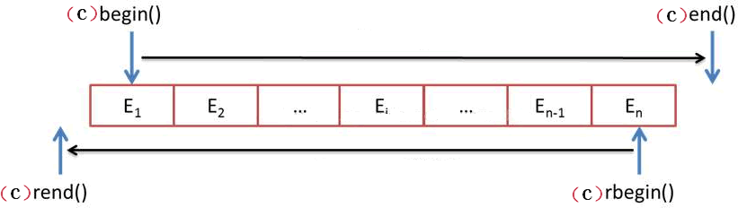

# STL序列式容器（详解版）

## 2.1 C++ STL容器是什么？

在实际的开发过程中，合理组织数据的存取与选择处理数据的算法同等重要，存取数据的方式往往会直接影响到对它们进行增删改查操作的复杂程度和时间消耗。事实上，当程序中存在对时耗要求很高的部分时，[数据结构](http://c.biancheng.net/data_structure/)的选择就显得尤为重要，有时甚至直接影响程序执行的成败。

值得一提的是，之前我们一直在不断地重复实现一些诸如链表、集合等等这些常见的数据结构，这些代码使用起来往往都十分类似，只是为了适应不同数据的变化，可能需要在一些细节上做不同的处理。

那么大家有没有想过，是不是可以重复利用那些已有的实现来完成当前的任务呢？当然是可行的，有些读者已经亲自编写并实现了动态数组类、链表类、集合类等程序，并精心维护着。其实，[STL](http://c.biancheng.net/stl/) 中提供了专家级的几乎我们所需要的各种容器，功能更好，复用性更高。

简单的理解容器，它就是一些模板类的集合，但和普通模板类不同的是，容器中封装的是组织数据的方法（也就是数据结构）。STL 提供有 3 类标准容器，分别是序列容器、排序容器和哈希容器，其中后两类容器有时也统称为关联容器。它们各自的含义如表 1 所示。

| 容器种类 | 功能                                                         |
| -------- | ------------------------------------------------------------ |
| 序列容器 | 主要包括 vector 向量容器、list 列表容器以及 deque 双端队列容器。之所以被称为序列容器，是因为元素在容器中的位置同元素的值无关，即容器不是排序的。将元素插入容器时，指定在什么位置，元素就会位于什么位置。 |
| 排序容器 | 包括 set 集合容器、multiset多重集合容器、map映射容器以及 multimap 多重映射容器。排序容器中的元素默认是由小到大排序好的，即便是插入元素，元素也会插入到适当位置。所以关联容器在查找时具有非常好的性能。 |
| 哈希容器 | [C++](http://c.biancheng.net/cplus/) 11 新加入 4 种关联式容器，分别是 unordered_set 哈希集合、unordered_multiset 哈希多重集合、unordered_map 哈希映射以及 unordered_multimap 哈希多重映射。和排序容器不同，哈希容器中的元素是未排序的，元素的位置由哈希函数确定。 |

> 注意，由于哈希容器直到 C++ 11 才被正式纳入 C++ 标准程序库，而在此之前，“民间”流传着 hash_set、hash_multiset、hash_map、hash_multimap 版本，不过该版本只能在某些支持 C++ 11 的编译器下使用（如 VS），有些编译器（如 gcc/g++）是不支持的。

另外，以上 3 类容器的存储方式完全不同，因此使用不同容器完成相同操作的效率也大不相同。所以在实际使用时，要善于根据想实现的功能，选择合适的容器。有关这些容器的具体用法，本章后续会逐个进行介绍。


## 2.2 迭代器是什么，C++ STL迭代器（iterator）用法详解

无论是序列容器还是关联容器，最常做的操作无疑是遍历容器中存储的元素，而实现此操作，多数情况会选用“迭代器（iterator）”来实现。那么，迭代器到底是什么呢？

我们知道，尽管不同容器的内部结构各异，但它们本质上都是用来存储大量数据的，换句话说，都是一串能存储多个数据的存储单元。因此，诸如数据的排序、查找、求和等需要对数据进行遍历的操作方法应该是类似的。

既然类似，完全可以利用泛型技术，将它们设计成适用所有容器的通用算法，从而将容器和算法分离开。但实现此目的需要有一个类似中介的装置，它除了要具有对容器进行遍历读写数据的能力之外，还要能对外隐藏容器的内部差异，从而以统一的界面向算法传送数据。

这是泛型思维发展的必然结果，于是迭代器就产生了。简单来讲，迭代器和 [C++](http://c.biancheng.net/cplus/) 的[指针](http://c.biancheng.net/c/80/)非常类似，它可以是需要的任意类型，通过迭代器可以指向容器中的某个元素，如果需要，还可以对该元素进行读/写操作。

### 迭代器类别

[STL](http://c.biancheng.net/stl/) 标准库为每一种标准容器定义了一种迭代器类型，这意味着，不同容器的迭代器也不同，其功能强弱也有所不同。

> 容器的迭代器的功能强弱，决定了该容器是否支持 STL 中的某种算法。

常用的迭代器按功能强弱分为输入迭代器、输出迭代器、前向迭代器、双向迭代器、随机访问迭代器 5 种。本节主要介绍后面的这 3 种迭代器。

> 输入迭代器和输出迭代器比较特殊，它们不是把数组或容器当做操作对象，而是把输入流/输出流作为操作对象。有关这 2 个迭代器，我们会在后续章节做详细介绍。

1) 前向迭代器（forward iterator）
   假设 p 是一个前向迭代器，则 p 支持 ++p，p++，*p 操作，还可以被复制或赋值，可以用 == 和 != 运算符进行比较。此外，两个正向迭代器可以互相赋值。

2) 双向迭代器（bidirectional iterator）
   双向迭代器具有正向迭代器的全部功能，除此之外，假设 p 是一个双向迭代器，则还可以进行 --p 或者 p-- 操作（即一次向后移动一个位置）。

3) 随机访问迭代器（random access iterator）
   随机访问迭代器具有双向迭代器的全部功能。除此之外，假设 p 是一个随机访问迭代器，i 是一个整型变量或常量，则 p 还支持以下操作：

- p+=i：使得 p 往后移动 i 个元素。
- p-=i：使得 p 往前移动 i 个元素。
- p+i：返回 p 后面第 i 个元素的迭代器。
- p-i：返回 p 前面第 i 个元素的迭代器。
- p[i]：返回 p 后面第 i 个元素的引用。


此外，两个随机访问迭代器 p1、p2 还可以用 <、>、<=、>= 运算符进行比较。另外，表达式 p2-p1 也是有定义的，其返回值表示 p2 所指向元素和 p1 所指向元素的序号之差（也可以说是 p2 和 p1 之间的元素个数减一）。

表 1 所示，是 C++ 11 标准中不同容器指定使用的迭代器类型。

| 容器                               | 对应的迭代器类型 |
| ---------------------------------- | ---------------- |
| array                              | 随机访问迭代器   |
| vector                             | 随机访问迭代器   |
| deque                              | 随机访问迭代器   |
| list                               | 双向迭代器       |
| set / multiset                     | 双向迭代器       |
| map / multimap                     | 双向迭代器       |
| forward_list                       | 前向迭代器       |
| unordered_map / unordered_multimap | 前向迭代器       |
| unordered_set / unordered_multiset | 前向迭代器       |
| stack                              | 不支持迭代器     |
| queue                              | 不支持迭代器     |

> 注意，容器适配器 stack 和 queue 没有迭代器，它们包含有一些成员函数，可以用来对元素进行访问。


### 迭代器的定义方式

尽管不同容器对应着不同类别的迭代器，但这些迭代器有着较为统一的定义方式，具体分为 4 种，如表 1 所示。

| 迭代器定义方式 | 具体格式                                   |
| -------------- | ------------------------------------------ |
| 正向迭代器     | 容器类名::iterator 迭代器名;               |
| 常量正向迭代器 | 容器类名::const_iterator 迭代器名;         |
| 反向迭代器     | 容器类名::reverse_iterator 迭代器名;       |
| 常量反向迭代器 | 容器类名::const_reverse_iterator 迭代器名; |

> 值得一提的是，表 2 中的反向迭代器全称为 "反向迭代器适配器"，后续章节会做详细讲解，这里读者只需要知道其用法即可。

通过定义以上几种迭代器，就可以读取它指向的元素，`*迭代器名`就表示迭代器指向的元素。其中，常量迭代器和非常量迭代器的分别在于，通过非常量迭代器还能修改其指向的元素。另外，反向迭代器和正向迭代器的区别在于：

- 对正向迭代器进行 ++ 操作时，迭代器会指向容器中的后一个元素；
- 而对反向迭代器进行 ++ 操作时，迭代器会指向容器中的前一个元素。


注意，以上 4 种定义迭代器的方式，并不是每个容器都适用。有一部分容器同时支持以上 4 种方式，比如 array、deque、vector；而有些容器只支持其中部分的定义方式，例如 forward_list 容器只支持定义正向迭代器，不支持定义反向迭代器。

> 具体容器支持定义迭代器的方式，讲具体容器时会详细说明。另外，读者也可以通过 [C++ STL标准手册](http://www.cplusplus.com/reference/stl/)，查询具体容器迭代器支持的定义方式。


以上对迭代器做了很详细的介绍，下面就以 vector 容器为例，带领大家实际感受迭代器的用法和功能。通过前面的学习，vector 支持随机访问迭代器，因此遍历 vector 容器有以下几种做法。下面的程序中，每个循环演示了一种做法：

```
//遍历 vector 容器。
#include <iostream>
//需要引入 vector 头文件
#include <vector>

using namespace std;

int main(){    
  vector<int> v{1, 2, 3, 4, 5, 6, 7, 8, 9, 10}; //v被初始化成有10个元素    
  cout << "第一种遍历方法：" << endl;    
  //size返回元素个数    
  for (int i = 0; i < v.size(); ++i) {
      cout << v[i] <<" "; //像普通数组一样使用vector容器
  }          
  
  //创建一个正向迭代器，当然，vector也支持其他 3 种定义迭代器的方式           
  cout << endl << "第二种遍历方法：" << endl;       
  vector<int>::iterator i;    
  //用 != 比较两个迭代器    
  for (i = v.begin(); i != v.end(); ++i) {
      cout << *i << " ";   
  }        
  
  cout << endl << "第三种遍历方法：" << endl;    
  for (i = v.begin(); i < v.end(); ++i) {
    //用 < 比较两个迭代器        
    cout << *i << " ";        
  }  
  
  cout << endl << "第四种遍历方法：" << endl;    
  i = v.begin();    
  while (i < v.end()) { 
    //间隔一个输出        
    cout << *i << " ";        
    i += 2; // 随机访问迭代器支持 "+= 整数"  的操作    
  }
}
```

运行结果为：

```
第一种遍历方法：
1 2 3 4 5 6 7 8 9 10
第二种遍历方法：
1 2 3 4 5 6 7 8 9 10
第三种遍历方法：
1 2 3 4 5 6 7 8 9 10
第四种遍历方法：
1 3 5 7 9
```


再举一个例子，我们知道，list 容器的迭代器是双向迭代器。假设 v 和 i 的定义如下：

```
//创建一个 v list容器
list<int> v;

//创建一个常量正向迭代器，同样，list也支持其他三种定义迭代器的方式。
list<int>::const_iterator i;
```

则以下代码是合法的：

```
for(i = v.begin(); i != v.end(); ++i)    cout << *i;
```

以下代码则不合法，因为双向迭代器不支持用“<”进行比较：

```
for(i = v.begin(); i < v.end(); ++i)  cout << *i;
```

以下代码也不合法，因为双向迭代器不支持用下标随机访问元素：

```
for(int i=0; i < v.size(); ++i)    cout << v[i];
```

> 其实在 C++ 中，数组也是容器。数组的迭代器就是指针，而且是随机访问迭代器。例如，对于数组 int a[10]，int * 类型的指针就是其迭代器。则 a、a+1、a+2 都是 a 的迭代器。另外，以上有关 vector、list 容器的具体用法，后续章节会做详细讲解。


## 2.3 C++序列式容器（STL序列式容器）是什么

所谓序列容器，即以线性排列（类似普通数组的存储方式）来存储某一指定类型（例如 int、double 等）的数据，需要特殊说明的是，该类容器并不会自动对存储的元素按照值的大小进行排序。

需要注意的是，序列容器只是一类容器的统称，并不指具体的某个容器，序列容器大致包含以下几类容器：

- array<T, N>（数组容器）：表示可以存储 N 个 T 类型的元素，是 [C++](http://c.biancheng.net/cplus/) 本身提供的一种容器。此类容器一旦建立，其长度就是固定不变的，这意味着不能增加或删除元素，只能改变某个元素的值；
- vector<T>（向量容器）：用来存放 T 类型的元素，是一个长度可变的序列容器，即在存储空间不足时，会自动申请更多的内存。使用此容器，在尾部增加或删除元素的效率最高（时间复杂度为 O(1) 常数阶），在其它位置插入或删除元素效率较差（时间复杂度为 O(n) 线性阶，其中 n 为容器中元素的个数）；
- deque<T>（双端队列容器）：和 vector 非常相似，区别在于使用该容器不仅尾部插入和删除元素高效，在头部插入或删除元素也同样高效，时间复杂度都是 O(1) 常数阶，但是在容器中某一位置处插入或删除元素，时间复杂度为 O(n) 线性阶；
- list<T>（链表容器）：是一个长度可变的、由 T 类型元素组成的序列，它以双向链表的形式组织元素，在这个序列的任何地方都可以高效地增加或删除元素（时间复杂度都为常数阶 O(1)），但访问容器中任意元素的速度要比前三种容器慢，这是因为 list<T> 必须从第一个元素或最后一个元素开始访问，需要沿着链表移动，直到到达想要的元素。
- forward_list<T>（正向链表容器）：和 list 容器非常类似，只不过它以单链表的形式组织元素，它内部的元素只能从第一个元素开始访问，是一类比链表容器快、更节省内存的容器。

> 注意，其实除此之外，stack<T> 和 queue<T> 本质上也属于序列容器，只不过它们都是在 deque 容器的基础上改头换面而成，通常更习惯称它们为容器适配器，有关它们的介绍，会放到后续章节中。

图 1 说明了可供使用的序列容器以及它们之间的区别。


<center>图 1 标准的序列容器</center>


图 1 中每种类型容器的操作都可以高效执行，但进行除此之外的其他操作，效率会稍差一些。在本章的剩余部分，会详细介绍每一类序列容器的具体用法。


## 容器中常见的函数成员

序列容器包含一些相同的成员函数，它们的功能也相同，本教程会在某个容器的上下文中详细介绍下面的每个函数，但对于每种类型的容器不会重复介绍它们的细节。

表 2 展示了 array、vector 和 deque 容器的函数成员，它们中至少有两个容器实现了同样的函数成员。


| 函数成员         | 函数功能                                                     | array<T,N> | vector<T> | deque<T> |
| ---------------- | ------------------------------------------------------------ | ---------- | --------- | -------- |
| begin()          | 返回指向容器中第一个元素的迭代器。                           | 是         | 是        | 是       |
| end()            | 返回指向容器最后一个元素所在位置后一个位置的迭代器，通常和 begin() 结合使用。 | 是         | 是        | 是       |
| rbegin()         | 返回指向最后一个元素的迭代器。                               | 是         | 是        | 是       |
| rend()           | 返回指向第一个元素所在位置前一个位置的迭代器。               | 是         | 是        | 是       |
| cbegin()         | 和 begin() 功能相同，只不过在其基础上，增加了 const 属性，不能用于修改元素。 | 是         | 是        | 是       |
| cend()           | 和 end() 功能相同，只不过在其基础上，增加了 const 属性，不能用于修改元素。 | 是         | 是        | 是       |
| crbegin()        | 和 rbegin() 功能相同，只不过在其基础上，增加了 const 属性，不能用于修改元素。 | 是         | 是        | 是       |
| crend()          | 和 rend() 功能相同，只不过在其基础上，增加了 const 属性，不能用于修改元素。 | 是         | 是        | 是       |
| assign()         | 用新元素替换原有内容。                                       | -          | 是        | 是       |
| operator=()      | 复制同类型容器的元素，或者用初始化列表替换现有内容。         | 是         | 是        | 是       |
| size()           | 返回实际元素个数。                                           | 是         | 是        | 是       |
| max_size()       | 返回元素个数的最大值。这通常是一个很大的值，一般是 232-1，所以我们很少会用到这个函数。 | 是         | 是        | 是       |
| capacity()       | 返回当前容量。                                               | -          | 是        | -        |
| empty()          | 判断容器中是否有元素，若无元素，则返回 true；反之，返回 false。 | 是         | 是        | 是       |
| resize()         | 改变实际元素的个数。                                         | -          | 是        | 是       |
| shrink _to_fit() | 将内存减少到等于当前元素实际所使用的大小。                   | -          | 是        | 是       |
| front()          | 返回第一个元素的引用。                                       | 是         | 是        | 是       |
| back()           | 返回最后一个元素的引用。                                     | 是         | 是        | 是       |
| operator[]()     | 使用索引访问元素。                                           | 是         | 是        | 是       |
| at()             | 使用经过边界检査的索引访问元素。                             | 是         | 是        | 是       |
| push_back()      | 在序列的尾部添加一个元素。                                   | -          | 是        | 是       |
| insert()         | 在指定的位置插入一个或多个元素。                             | -          | 是        | 是       |
| emplace()        | 在指定的位置直接生成一个元素。                               | -          | 是        | 是       |
| emplace_back()   | 在序列尾部生成一个元素。                                     | -          | 是        | 是       |
| pop_back()       | 移出序列尾部的元素。                                         | -          | 是        | 是       |
| erase()          | 移出一个元素或一段元素。                                     | -          | 是        | 是       |
| clear()          | 移出所有的元素，容器大小变为 0。                             | -          | 是        | 是       |
| swap()           | 交换两个容器的所有元素。                                     | 是         | 是        | 是       |
| data()           | 返回指向容器中第一个元素的[指针](http://c.biancheng.net/c/80/)。 | 是         | 是        | -        |

> 列表中 - 表明对应的容器并没有定义这个函数。

list 和 forward_list 容器彼此非常相似，forward_list 中包含了 list 的大部分成员函数，而未包含那些需要反向遍历的函数。表 3 展示了 list 和 forward_list 的函数成员。


| 函数成员        | 函数功能                                                     | list<T> | forward_list<T> |
| --------------- | ------------------------------------------------------------ | ------- | --------------- |
| begin()         | 返回指向容器中第一个元素的迭代器。                           | 是      | 是              |
| end()           | 返回指向容器最后一个元素所在位置后一个位置的迭代器。         | 是      | 是              |
| rbegin()        | 返回指向最后一个元素的迭代器。                               | 是      | -               |
| rend()          | 返回指向第一个元素所在位置前一个位置的迭代器。               | 是      | -               |
| cbegin()        | 和 begin() 功能相同，只不过在其基础上，增加了 const 属性，不能用于修改元素。 | 是      | 是              |
| before_begin()  | 返回指向第一个元素前一个位置的迭代器。                       | -       | 是              |
| cbefore_begin() | 和 before_begin() 功能相同，只不过在其基础上，增加了 const 属性，即不能用该指针修改元素的值。 | -       | 是              |
| cend()          | 和 end() 功能相同，只不过在其基础上，增加了 const 属性，不能用于修改元素。 | 是      | 是              |
| crbegin()       | 和 rbegin() 功能相同，只不过在其基础上，增加了 const 属性，不能用于修改元素。 | 是      | -               |
| crend()         | 和 rend() 功能相同，只不过在其基础上，增加了 const 属性，不能用于修改元素。 | 是      | -               |
| assign()        | 用新元素替换原有内容。                                       | 是      | 是              |
| operator=()     | 复制同类型容器的元素，或者用初始化列表替换现有内容。         | 是      | 是              |
| size()          | 返回实际元素个数。                                           | 是      | -               |
| max_size()      | 返回元素个数的最大值，这通常是一个很大的值，一般是 232-1，所以我们很少会用到这个函数。 | 是      | 是              |
| resize()        | 改变实际元素的个数。                                         | 是      | 是              |
| empty()         | 判断容器中是否有元素，若无元素，则返回 true；反之，返回 false。 | 是      | 是              |
| front()         | 返回容器中第一个元素的引用。                                 | 是      | 是              |
| back()          | 返回容器中最后一个元素的引用。                               | 是      | -               |
| push_back()     | 在序列的尾部添加一个元素。                                   | 是      | -               |
| push_front()    | 在序列的起始位置添加一个元素。                               | 是      | 是              |
| emplace()       | 在指定位置直接生成一个元素。                                 | 是      | -               |
| emplace_after() | 在指定位置的后面直接生成一个元素。                           | -       | 是              |
| emplace_back()  | 在序列尾部生成一个元素。                                     | 是      | -               |
| cmplacc_front() | 在序列的起始位生成一个元索。                                 | 是      | 是              |
| insert()        | 在指定的位置插入一个或多个元素。                             | 是      | -               |
| insert_after()  | 在指定位置的后面插入一个或多个元素。                         | -       | 是              |
| pop_back()      | 移除序列尾部的元素。                                         | 是      | -               |
| pop_front()     | 移除序列头部的元素。                                         | 是      | 是              |
| reverse()       | 反转容器中某一段的元素。                                     | 是      | 是              |
| erase()         | 移除指定位置的一个元素或一段元素。                           | 是      | -               |
| erase_after()   | 移除指定位置后面的一个元素或一段元素。                       | -       | 是              |
| remove()        | 移除所有和参数匹配的元素。                                   | 是      | 是              |
| remove_if()     | 移除满足一元函数条件的所有元素。                             | 是      | 是              |
| unique()        | 移除所有连续重复的元素。                                     | 是      | 是              |
| clear()         | 移除所有的元素，容器大小变为 0。                             | 是      | 是              |
| swap()          | 交换两个容器的所有元素。                                     | 是      | 是              |
| sort()          | 对元素进行排序。                                             | 是      | 是              |
| merge()         | 合并两个有序容器。                                           | 是      | 是              |
| splice()        | 移动指定位置前面的所有元素到另一个同类型的 list 中。         | 是      | -               |
| splice_after()  | 移动指定位置后面的所有元素到另一个同类型的 list 中。         | -       | 是              |

> 注意，大家没有必要死记这些表，它们仅供参考。在深入了解到容器是如何组织元素以后，你会本能地知道哪个容器能使用哪些成员函数。


## 2.4 C++ array(STL array)容器用法详解

array 容器是 [C++](http://c.biancheng.net/cplus/) 11 标准中新增的序列容器，简单地理解，它就是在 C++ 普通数组的基础上，添加了一些成员函数和全局函数。在使用上，它比普通数组更安全（原因后续会讲），且效率并没有因此变差。

和其它容器不同，array 容器的大小是固定的，无法动态的扩展或收缩，这也就意味着，在使用该容器的过程无法借由增加或移除元素而改变其大小，它只允许访问或者替换存储的元素。

> [STL](http://c.biancheng.net/stl/) 还提供有可动态扩展或收缩存储空间的 vector 容器，后续章节会对其做详细介绍。

array 容器以类模板的形式定义在 <array> 头文件，并位于命名空间 std 中，如下所示：

```
namespace std {    
  template <typename T, size_t N>    
  class array;
}
```

因此，在使用该容器之前，代码中需引入 <array> 头文件，并默认使用 std 命令空间，如下所示：

```
#include <array>
using namespace std;
```

在 array<T, N> 类模板中，T 用于指明容器中的存储的具体数据类型，N 用于指明容器的大小，需要注意的是，这里的 N 必须是常量，不能用变量表示。

array 容器有多种初始化方式，如下代码展示了如何创建具有 10 个 double 类型元素的 array 容器：

```
std::array<double, 10> values;
```

> 提示，如果程序中已经默认指定了 std 命令空间，这里可以省略 std::。

由此，就创建好了一个名为 values 的 array 容器，其包含 10 个浮点型元素。但是，由于未显式指定这 10 个元素的值，因此使用这种方式创建的容器中，各个元素的值是不确定的（array 容器不会做默认初始化操作）。

通过如下创建 array 容器的方式，可以将所有的元素初始化为 0 或者和默认元素类型等效的值：

```
std::array<double, 10> values {};
```

使用该语句，容器中所有的元素都会被初始化为 0.0。

当然，在创建 array 容器的实例时，也可以像创建常规数组那样对元素进行初始化：

```
std::array<double, 10> values {0.5,1.0,1.5,,2.0};
```

可以看到，这里只初始化了前 4 个元素，剩余的元素都会被初始化为 0.0。图 1 说明了这一点。


<center>图 1 初始化 array 容器</center>


除此之外，array 容器还提供有很多功能实用的成员函数，如表 2 所示。

| 成员函数            | 功能                                                         |
| ------------------- | ------------------------------------------------------------ |
| begin()             | 返回指向容器中第一个元素的随机访问迭代器。                   |
| end()               | 返回指向容器最后一个元素之后一个位置的随机访问迭代器，通常和 begin() 结合使用。 |
| rbegin()            | 返回指向最后一个元素的随机访问迭代器。                       |
| rend()              | 返回指向第一个元素之前一个位置的随机访问迭代器。             |
| cbegin()            | 和 begin() 功能相同，只不过在其基础上增加了 const 属性，不能用于修改元素。 |
| cend()              | 和 end() 功能相同，只不过在其基础上，增加了 const 属性，不能用于修改元素。 |
| crbegin()           | 和 rbegin() 功能相同，只不过在其基础上，增加了 const 属性，不能用于修改元素。 |
| crend()             | 和 rend() 功能相同，只不过在其基础上，增加了 const 属性，不能用于修改元素。 |
| size()              | 返回容器中当前元素的数量，其值始终等于初始化 array 类的第二个模板参数 N。 |
| max_size()          | 返回容器可容纳元素的最大数量，其值始终等于初始化 array 类的第二个模板参数 N。 |
| empty()             | 判断容器是否为空，和通过 size()==0 的判断条件功能相同，但其效率可能更快。 |
| at(n)               | 返回容器中 n 位置处元素的引用，该函数自动检查 n 是否在有效的范围内，如果不是则抛出 out_of_range 异常。 |
| front()             | 返回容器中第一个元素的直接引用，该函数不适用于空的 array 容器。 |
| back()              | 返回容器中最后一个元素的直接应用，该函数同样不适用于空的 array 容器。 |
| data()              | 返回一个指向容器首个元素的[指针](http://c.biancheng.net/c/80/)。利用该指针，可实现复制容器中所有元素等类似功能。 |
| fill(val)           | 将 val 这个值赋值给容器中的每个元素。                        |
| array1.swap(array2) | 交换 array1 和 array2 容器中的所有元素，但前提是它们具有相同的长度和类型。 |


除此之外，C++ 11 标准库还新增加了 begin() 和 end() 这 2 个函数，和 array 容器包含的 begin() 和 end() 成员函数不同的是，标准库提供的这 2 个函数的操作对象，既可以是容器，还可以是普通数组。当操作对象是容器时，它和容器包含的 begin() 和 end() 成员函数的功能完全相同；如果操作对象是普通数组，则 begin() 函数返回的是指向数组第一个元素的指针，同样 end() 返回指向数组中最后一个元素之后一个位置的指针（注意不是最后一个元素）。

另外，在 <array> 头文件中还重载了 get() 全局函数，该重载函数的功能是访问容器中指定的元素，并返回该元素的引用。

> 正是由于 array 容器中包含了 at() 这样的成员函数，使得操作元素时比普通数组更安全。

例如代码演示了表 2 中一部分成员函数的用法和功能：

```
#include <iostream>
//需要引入 array 头文件
#include <array>

using namespace std;
int main() {    
     std::array<int, 4> values{};    
     //初始化 values 容器为 {0,1,2,3}    
     for (int i = 0; i < values.size(); i++) {        
       values.at(i) = i;    
     }    
     
     //使用 get() 重载函数输出指定位置元素    
     cout << get<3>(values) << endl;    
     
     //如果容器不为空，则输出容器中所有的元素    
     if (!values.empty()) {        
       for (auto val = values.begin(); val < values.end(); val++) {            
         cout << *val << " ";        
       }    
     }
 }
```

注意，代码中的 auto 关键字，可以使编译器自动判定变量的类型。运行这段代码，输出结果为：

```
3
0 1 2 3
```


> 表 2 中其他成员函数的用法，这里不再给出具体实例，有兴趣的读者，可自行根据各个函数的功能描述编写实例代码进行测试。


## 2.5 C++ STL array随机访问迭代器（精讲版）

在《[C++ STL迭代器（iterator）](http://c.biancheng.net/view/6675.html)》一节中，已经对迭代器做了详细的介绍，[STL](http://c.biancheng.net/stl/) 为 array 容器配备了随机访问迭代器，该类迭代器是功能最强大的迭代器。本节将详细介绍 array 容器的迭代器的用法。

在 array 容器的模板类中，和随机访问迭代器相关的成员函数如表 1 所示。

| 成员函数  | 功能                                                         |
| --------- | ------------------------------------------------------------ |
| begin()   | 返回指向容器中第一个元素的正向迭代器；如果是 const 类型容器，在该函数返回的是常量正向迭代器。 |
| end()     | 返回指向容器最后一个元素之后一个位置的正向迭代器；如果是 const 类型容器，在该函数返回的是常量正向迭代器。此函数通常和 begin() 搭配使用。 |
| rbegin()  | 返回指向最后一个元素的反向迭代器；如果是 const 类型容器，在该函数返回的是常量反向迭代器。 |
| rend()    | 返回指向第一个元素之前一个位置的反向迭代器。如果是 const 类型容器，在该函数返回的是常量反向迭代器。此函数通常和 rbegin() 搭配使用。 |
| cbegin()  | 和 begin() 功能类似，只不过其返回的迭代器类型为常量正向迭代器，不能用于修改元素。 |
| cend()    | 和 end() 功能相同，只不过其返回的迭代器类型为常量正向迭代器，不能用于修改元素。 |
| crbegin() | 和 rbegin() 功能相同，只不过其返回的迭代器类型为常量反向迭代器，不能用于修改元素。 |
| crend()   | 和 rend() 功能相同，只不过其返回的迭代器类型为常量反向迭代器，不能用于修改元素。 |

> 除此之外，[C++](http://c.biancheng.net/cplus/) 11 标准新增的 begin() 和 end() 函数，当操作对象为 array 容器时，也和迭代器有关，其功能分别和表 1 中的 begin()、end() 成员函数相同，具有用法本节后续会做详细介绍。

这些成员函数的具体功能如图 2 所示。




<center>图 2 迭代器的具体功能示意图</center>


可以看到，根据它们的功能并结合实际场景的需要，这些成员函数通常是成对使用的，即 begin()/end()、rbegin()/rend()、cbegin()/cend()、crbegin()/crend() 各自成对搭配使用。不仅如此，这 4 对中 begin()/end() 和 cbegin()/cend()、rbegin()/rend() 和 crbegin()/crend() 的功能大致是相同的（如图 2 所示），唯一的区别就在于其返回的迭代器能否用来修改元素值。

> 值得一提的是，以上函数在实际使用时，其返回值类型都可以使用 auto 关键字代替，编译器可以自行判断出该迭代器的类型。

## begin()/end() 和 cbegin()/cend()

array 容器模板类中的 begin() 和 end() 成员函数返回的都是正向迭代器，它们分别指向「首元素」和「尾元素+1」 的位置。在实际使用时，我们可以利用它们实现初始化容器或者遍历容器中元素的操作。

例如，可以在循环中显式地使用迭代器来初始化 values 容器的值：

```
#include <iostream>
//需要引入 array 头文件
#include <array>

using namespace std;
int main() {    
    array<int, 5> values;    
    int h = 1;    
    auto first = values.begin();    
    auto last = values.end();    
    // 初始化 values 容器为{1,2,3,4,5}    
    while (first != last)    {        
      *first = h;        
      ++first;        
      h++;    
    }      
    
    first = values.begin();    
    while (first != last) {       
        cout << *first << " ";        
        ++first;    
    }    
    
    return 0; 
}
```

输出结果为：

```
1 2 3 4 5
```


可以看出，迭代器对象是由 array 对象的成员函数 begin() 和 end() 返回的。我们可以像使用普通[指针](http://c.biancheng.net/c/80/)那样上使用迭代器对象。比如代码中，在保存了元素值后，使用前缀 ++ 运算符对 first 进行自增，当 first 等于 end 时，所有的元素都被设完值，循环结束。

与此同时，还可以使用全局的 begin() 和 end() 函数来从容器中获取迭代器，因为当操作对象为 array 容器时，它们和 begin()/end() 成员函数是通用的。所以上面代码中，first 和 last 还可以像下面这样定义：

```
auto first = std::begin(values);
auto last = std::end(values);
```

这样，容器中的一段元素可以由迭代器指定，这让我们有了对它们使用算法的可能。

> 需要注意的是，STL 标准库，不是只有 array 容器，当迭代器指向容器中的一个特定元素时，它们不会保留任何关于容器本身的信息，所以我们无法从迭代器中判断，它是指向 array 容器还是指向 vector 容器（该容器后续会讲）。


除此之外，array 模板类还提供了 cbegin() 和 cend() 成员函数，它们和 begin()/end() 唯一不同的是，前者返回的是 const 类型的正向迭代器，这就意味着，有 cbegin() 和 cend() 成员函数返回的迭代器，可以用来遍历容器内的元素，也可以访问元素，但是不能对所存储的元素进行修改。

举个例子：

```
#include <iostream>
// 需要引入 array 头文件
#include <array>

using namespace std;
int main() {    
    array<int, 5> values{1, 2, 3, 4, 5};    
    int h = 1;    
    auto first = values.cbegin();    
    auto last = values.cend();       
    // 由于 *first 为 const 类型，不能用来修改元素    
    // *first = 10;       
    // 遍历容器并输出容器中所有元素    
    while (first != last) {        
        //可以使用 const 类型迭代器访问元素        
        cout << *first << " ";        
        ++first;    
    }    
    
    return 0;
 }
```

此程序的第 14 行代码中，我们尝试使用 first 迭代器修改 values 容器中的值，如果取消注释并运行此程序，编译器会提示你“不能给常量赋值”，即 *first 是 const 类型常量，所以这么做是不对的。但 17~22 行代码遍历并访问容器的行为，是允许的。

## rbegin()/rend() 和 crbegin()/crend()

array 模板类中还提供了 rbegin()/rend() 和 crbegin()/crend() 成员函数，它们每对都可以分别得到指向最后一个元素和第一个元素前一个位置的随机访问迭代器，又称它们为反向迭代器（如图 2 所示）。

> 需要注意的是，在使用反向迭代器进行 ++ 或 -- 运算时，++ 指的是迭代器向左移动一位，-- 指的是迭代器向右移动一位，即这两个运算符的功能也“互换”了。

反向迭代器用于以逆序的方式处理元素。例如：

```
#include <iostream>
// 需要引入 array 头文件
#include <array>

using namespace std;
int main() {    
    array<int, 5> values;    
    int h = 1;    
    auto first = values.rbegin();    
    auto last = values.rend();     
    // 初始化 values 容器为 {5,4,3,2,1}    
    while (first != last) {        
        *first = h;        
        ++first;        
        h++;    
    }    
    
    // 重新遍历容器，并输入各个元素    
    first = values.rbegin();    
    while (first != last)    {        
        cout << *first << " ";        
        ++first;    
    }    
    
    return 0;
}
```

运行结果为：

```
1 2 3 4 5
```

可以看到，从最后一个元素开始循环，不仅完成了容器的初始化，还遍历输出了容器中的所有元素。结束迭代器指向第一个元素之前的位置，所以当 first 指向第一个元素并 +1 后，循环就结朿了。

> 在反向迭代器上使用 ++ 递增运算符，会让迭代器用一种和普通正向迭代器移动方向相反的方式移动。

当然，在上面程序中，我们也可以使用 [for 循环](http://c.biancheng.net/view/172.html)：

```
for (auto first = values.rbegin(); first != values.rend(); ++first) {    
    cout << *first << " ";
}
```


crbegin()/crend() 组合和 rbegin()/crend() 组合的功能唯一的区别在于，前者返回的迭代器为 const 类型，即不能用来修改容器中的元素，除此之外在使用上和后者完全相同。

> 有关 crbegin()/crend() 成员函数，这里不再给出具体实例，有兴趣的读者，可自行编写代码进行测试。


## 2.6 C++ STL array容器访问元素的几种方式

当 array 容器创建完成之后，最常做的操作就是获取其中的元素，甚至有时还会通过循环结构获取多个元素。本节就对获取容器中元素的方法做个汇总。

## 访问array容器中单个元素

首先，可以通过`容器名[]`的方式直接访问和使用容器中的元素，这和 [C++](http://c.biancheng.net/cplus/) 标准数组访问元素的方式相同，例如：

```
values[4] = values[3] + 2.O * values[1];
```

此行代码中，第 5 个元素的值被赋值为右边表达式的值。需要注意的是，使用如上这样方式，由于没有做任何边界检查，所以即便使用越界的索引值去访问或存储元素，也不会被检测到。

为了能够有效地避免越界访问的情况，可以使用 array 容器提供的 at() 成员函数，例如 :

```
values.at(4) = values.at(3) + 2.O * values.at(1);
```

这行代码和前一行语句实现的功能相同，其次当传给 at() 的索引是一个越界值时，程序会抛出 std::out_of_range 异常。因此当需要访问容器中某个指定元素时，建议大家使用 at()，除非确定索引没有越界。

> 读者可能有这样一个疑问，即为什么 array 容器在重载 [] 运算符时，没有实现边界检查的功能呢？答案很简单，因为性能。如果每次访问元素，都去检查索引值，无疑会产生很多开销。当不存在越界访问的可能时，就能避免这种开销。

除此之外，array 容器还提供了 get<n> 模板函数，它是一个辅助函数，能够获取到容器的第 n 个元素。需要注意的是，该模板函数中，参数的实参必须是一个在编译时可以确定的常量表达式，所以它不能是一个循环变量。也就是说，它只能访问模板参数指定的元素，编译器在编译时会对它进行检查。

下面代码展示了如何使用 get<n> 模板函数：

```
#include <iostream>
#include <array>
#include <string>

using namespace std;
int main() {    
    array<string, 5> words{ "one", "two", "three", "four", "five" };    
    cout << get<3>(words) << endl; 
    // Output words[3]    
    
    // cout << get<6>(words) << std::endl; 
    // 越界，会发生编译错误    
    return 0;
}
```

运行结果为：

```
four
```


另外，array 容器提供了 data() 成员函数，通过调用该函数可以得到指向容器首个元素的[指针](http://c.biancheng.net/c/80/)。通过该指针，我们可以获得容器中的各个元素，例如：

```
#include <iostream>
#include <array>
using namespace std;

int main() {    
    array<int, 5> words{1, 2, 3, 4, 5};    
    cout << *(words.data() + 1);    
    return 0;
}
```

运行结果为：

```
2
```


## 访问array容器中多个元素

我们知道，array 容器提供的 size() 函数能够返回容器中元素的个数（函数返回值为 size_t 类型），所以能够像下面这样去逐个提取容器中的元素，并计算它们的和：

```
double total = 0;for(size_t i = 0 ; i < values.size() ; ++i){    total += values[i];}
```

size() 函数的存在，为 array 容器提供了标准数组所没有的优势，即能够知道它包含多少元素。

并且，接受数组容器作为参数的函数，只需要通过调用容器的成员函数 size()，就能得到元素的个数。除此之外，通过调用 array 容器的 empty() 成员函数，即可知道容器中有没有元素（如果容器中没有元素，此函数返回 true），如下所示：

```
if(values.empty())    std::cout << "The container has no elements.\n";else    std::cout << "The container has "<< values.size()<<"elements.\n";
```

然而，很少会创建空的 array 容器，因为当生成一个 array 容器时，它的元素个数就固定了，而且无法改变，所以生成空 array 容器的唯一方法是将模板的第二个参数指定为 0，但这种情况基本不可能发生。

> array 容器之所以提供 empty() 成员函数的原因，对于其他元素可变或者元素可删除的容器（例如 vector、deque 等）来说，它们使用 empty() 时的机制是一样的，因此为它们提供了一个一致性的操作。

除了借助 size() 外，对于任何可以使用迭代器的容器，都可以使用基于范围的循环，因此能够更加简便地计算容器中所有元素的和，比如：

```
double total = 0;for(auto&& value : values)    total += value;
```


下面是一个示例，展示了本节关于如何获取 array 容器中元素所讲到的知识：

```
#include <iostream>
#include <iomanip> 
#include <array>

using namespace std;

int main() {    
    array<int, 5> values1;    
    array<int, 5> values2;    
    //初始化 values1 为 {0,1,2,3,4}    
    
    for (size_t i = 0; i < values1.size(); ++i)    {        
      values1.at(i) = i;    
    }    
    
    cout << "values1[0] is : " << values1[0] << endl;    
    cout << "values1[1] is : " << values1.at(1) << endl;    
    cout << "values1[2] is : " << get<2>(values1) << endl;    
    //初始化 values2 为{10，11，12，13，14}    
    int initvalue = 10;    
    for (auto& value : values2)    {        
      value = initvalue;        
      initvalue++;    
    }    
    
    cout <<  "Values1 is : ";    
    for (auto i = values1.begin(); i < values1.end(); i++) {        
        cout << *i << " ";    
    }    
    
    cout << endl << "Values2 is : ";    
    for (auto i = values2.begin(); i < values2.end(); i++) {        
        cout << *i << " ";    
    }    
    
    return 0;
}
```

运行结果为：

```
values1[0] is : 0
values1[1] is : 1
values1[2] is : 2
Values1 is : 0 1 2 3 4
Values2 is : 10 11 12 13 14
```


## 2.7 C++ array容器：普通数组的“升级版”


## 2.8 C++ STL vector容器详解